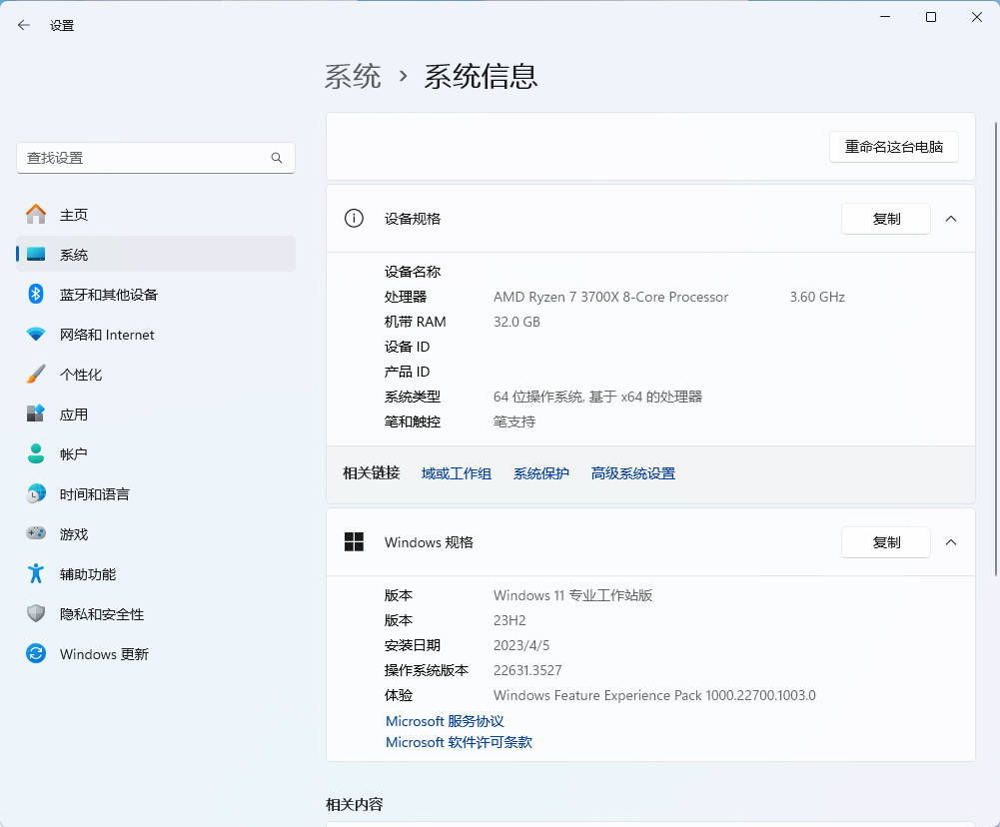

## 确定系统物理内存大小

 
=== "方式一"

    1. 在系统桌面鼠标右键 此电脑。
    2. 在弹出的菜单内点击 属性。
    3. 在 系统 > 系统信息 下 :fontawesome-solid-circle-exclamation: 设备规格 中 机带 RAM 右侧的值为 物理内存的大小。

=== "方式二"

    1. 在任务栏鼠标右键 :fontawesome-brands-windows:。
    2. 在弹出的菜单内点击 系统。
    3. 在 系统 > 系统信息 下 :fontawesome-solid-circle-exclamation: 设备规格 中 机带 RAM 右侧的值为 物理内存的大小。

??? info "点击展开界面截图"
    <figure markdown="span">
    
        <figcaption>Windows 11 系统信息 界面</figcaption>
    </figure>

