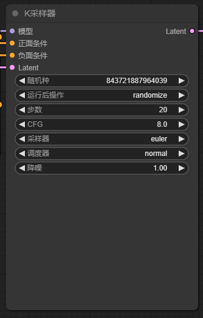
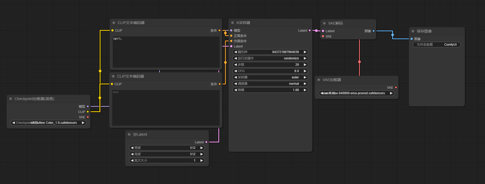

## 基本控制
使用鼠标滚轮或双指捏合放大和缩小。

拖动并按住输入或输出的点以形成连接。您只能在相同类型的输入和输出之间进行连接。

按住并拖动左键可在工作区中移动。

按 Ctrl-0 （Windows） 或 Cmd-0 （Mac） 显示“队列”面板。

## 搜索自定义节点

“添加节点”菜单可能不是查找自定义节点的最佳方式。安装许多自定义节点后，事情只会变得更加困难。

您可以双击任何空白区域以显示用于搜索节点的菜单。

## 节点

节点是矩形块，例如 Load Checkpoint、Clip Text Encoder 等。每个节点执行一些代码。如果你有一些编程经验，你可以把它们看作是函数。每个节点需要三样东西

左侧是数据导入处。

右侧是数据导出处。

参数是节点中心的部分。

## 工作流

工作流是由节点构成的，和SD的流程一样，要填写提示词和调试参数

