# 搭建工作流
下面将展示在 ComfyUI 如何搭建基本的工作流，下面演示的工作流可通过下载工作流图片后导入进 ComfyUI 中。

## 文生图
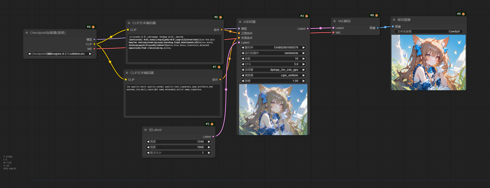

!!!note
    工作流所使用的大模型：[animagine-xl-3.1](https://modelscope.cn/models/licyks/sd-model/resolve/master/sdxl_1.0/animagine-xl-3.1.safetensors)[(Civitai)](https://civitai.com/models/260267)。模型下载后放入`ComfyUI/models/checkpoints`文件夹中。

这是一个简单的文生图工作流。

Checkpoint加载器 节点用于加载大模型，可以看到这个节点有 3 个输出接口，模型、CLIP、VAE，这代表了大模型中主要的 3 个组件。

接下来看看 CLIP文本编码器 节点，这里是用于输入你的提示词的地方，该节点将输入的提示词编码成大模型可以理解的 Token，让大模型知道该如何生成图像。

下一个节点是 K采样器 节点，该节点将模型作为输入，然后从 CLIP文本编码器 节点解析的 Token 将输入到这个节点上，最后通过 空Latent 节点生成一张潜空间图像输入进 K采样器 节点，这时就可以进行图像生成。K采样器 根据种子在潜空间图像上生成噪声，通过采样器在这张噪声图上进行降噪，根据提示词的提示内容逐步降噪，生成想要的图像，降噪完成后通过 Latent 接口输出潜空间图像。

潜空间图像将进入 VAE解码 节点进行解码，再从 Checkpoint加载器中输入 VAE 作为解码器。因为潜空间图像并不是人能够理解的图像，所以需要通过 VAE 将潜空间的图像转换成像素空间的图像，也就是人能够看得懂的图像，

解码完成的图像将输入到 保存图像 节点进行保存，保存好的图像可以在`ComfyUI/output`文件夹中看到，这就是简单的文生图工作流。

## 图片放大
通常情况下使用文生图生成的图像分辨率较小，看起来不是很清晰，所以通过图片放大工作流将生成的图像进行放大，提高图像的清晰度，下面的图片放大工作流将在文生图工作流的基础上修改。

### 潜空间放大

这是潜空间图像放大图像的工作流。

从 K采样器 节点输出的潜空间图像输入到 Latent按系数缩放 节点，该节点将潜空间图像进行放大，再输入到下一个 K采样器 节点中，在这个 K采样器 节点中，要注意调节 降噪 这个参数的值（这和在 Stable Diffusion WebUI 中的重绘幅度一样），使用潜空间放大时降噪值建议 > 0.55。在放大流程中，

因为图片的分辨率变高了，生成图片所需的时间会更长，如果需要减少图片生成时间，可以调节 K采样器 节点的 步数，推荐步数为`文生图使用的步数 x 放大时使用的降噪值 + 1`。

### 放大模型放大

!!!note
    工作流中使用的放大模型：[RealESRGAN_x4plus_anime_6B](https://modelscope.cn/models/licyks/sd-upscaler-models/resolve/master/RealESRGAN/RealESRGAN_x4plus_anime_6B.pth)。模型下载后放入`ComfyUI/models/upscale_models`文件夹。

使用放大模型（ESRGAN）进行图片放大时，因为 ESRGAN 的运行需要在像素空间中进行，所以需要将潜空间图像通过 VAE 转换为像素空间后再进行放大，但是 K采样器 节点只能输入潜空间图像，所以需要将放大后的图像通过 VAE 从像素空间转换为潜空间，再输入进 K采样器 节点。

## 图生图

图生图工作流和文生图的工作流类似，但是 K采样器 节点的 Latent 输入不是通过创建一个空 Latent 后进行输入，而是通过一个 加载图像 节点加载一张图像，再通过 VAE 转换成潜空间图像后再输入进 K采样器 节点中。

把这张图导入到 加载图像 节点中，通过 加载图像 节点导入的图像将保存到`ComfyUI/input`文件夹中。

然后在 K采样器 节点中使用低于 1 的降噪值进行生图，可以发现生成出来的图像和原图保持一定的相似性。

## 局部重绘

局部重绘的工作流和图生图的工作流类似，只是导入 加载图像 节点的图像带有透明通道，也就是绘制蒙版后的图片。蒙版图片可以通过 Photoshop 进行制作，也可以使用 ComfyUI 自带的蒙版编辑器进行制作。

将这张图片导入到 加载图像 节点中，用鼠标右键 加载图像 节点，可以看到右键菜单有个 在遮罩编辑器中打开 选项，点击该选项即可打开遮罩编辑器。

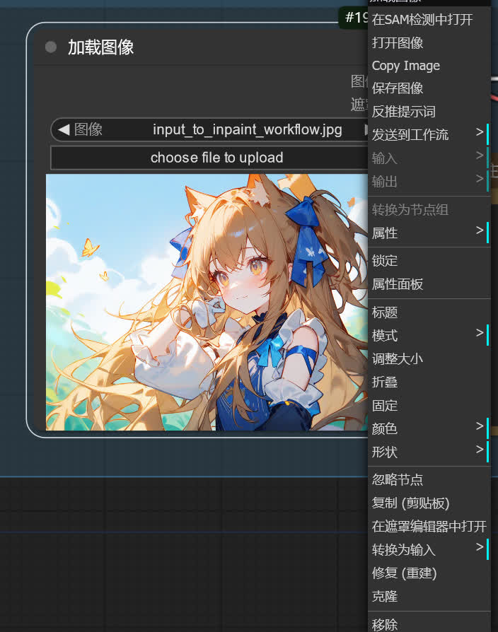

在遮罩编辑器中使用画笔绘制遮罩，绘制遮罩的部分将会被重绘。遮罩绘制完后，点击右下角的 Save to node 选项将绘制遮罩完成的图片保存到该节点中。

调节 K采样器 节点的降噪值，再运行工作流，可以看到遮罩部分已经被重绘成提示词描述的样子了。

## 图片区域扩充
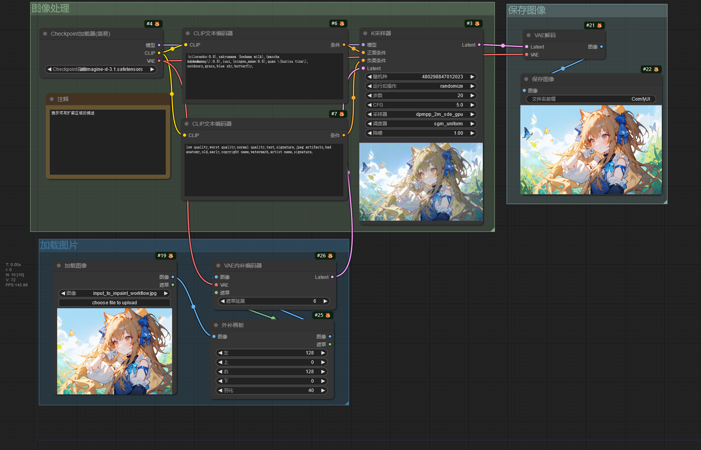

局部重绘也可以用作扩充图像，在 加载图像 节点导入该图像。

将 加载图像 节点的输出连接到 外补画板 节点，该节点的参数改成要往外扩的大小，再将该节点的输出连接到 VAE 内补编码器 节点进行潜空间转换，再输入进 K采样器 节点。注意，K采样器 节点的降噪值需调至 1，提示词改成扩图区域的描述。

运行工作流后可以看到图片的左右区域进行了扩充。

## 使用 LoRA 模型

!!!note
    工作流使用的 LoRA / Lycoris 模型：  
    1. [guzhengSY3](https://modelscope.cn/models/licyks/sd-lora/resolve/master/sdxl/motion/guzhengSY3-000024.safetensors)[(Civitai)](https://civitai.com/models/332501/guzheng)  
    2. [a31_style_koni](https://modelscope.cn/models/licyks/sd-lora/resolve/master/sdxl/style/a31_style_koni-000010.safetensors)[(Civitai)](https://civitai.com/models/393294/famous-nai3-prompts-style)  
    将模型下载后放入`ComfyUI/models/loras`文件夹。

这是一个加载 LoRA 模型的工作流。

LoRA 模型用于大模型的微调，所以 LoRA加载器 节点连接 Checkpoint加载器 节点的模型和 CLIP 输出。

## 使用 Embedding 模型
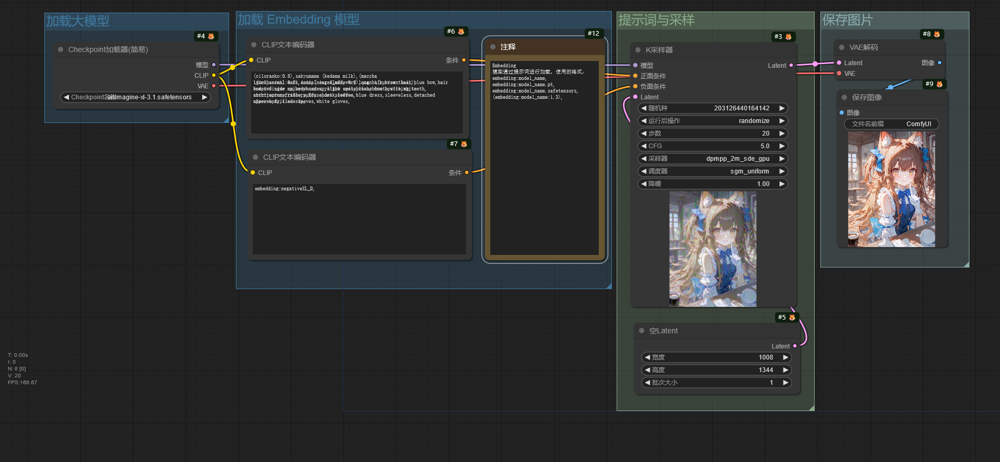

!!!note
    工作流使用的 Embedding 模型：[negativeXL_D](https://modelscope.cn/models/licyks/sd-embeddings/resolve/master/sdxl/negativeXL_D.safetensors)[(Civitai)](https://civitai.com/models/118418/negativexl)。  
    模型下载后放入`ComfyUI/models/embeddings`文件夹。

Embedding 通过提示词进行加载，提示词的格式有以下几种：  
1. `embedding:model_name`  
2. `embedding:model_name.pt`  
3. `embedding:model_name.safetensors`  
4. `(embedding:model_name:1.3)`

## 分区提示词
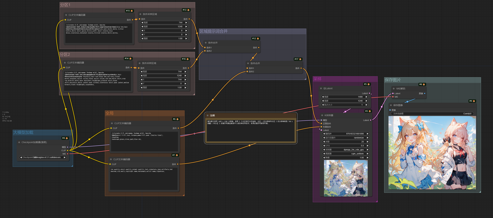

这个工作流通过分区提示词描述画面，分别控制图片区域内的元素。

在这个工作流中，整张图片的分辨率为 1488 x 1248，通过分区把图片分成了两部分，每个分区的分辨率都为 744 x 1248。

分区 1 的提示词描写人物的特征和动作，分区 2 的提示词描写另一个人物的特征和动作。

CLIP文本编码器输出的条件通过 条件采样区域 节点进行控制，该节点的宽度和高度调整分区提示词在整张图片中所控制的分辨率大小，X 和 Y 则是控制分区在整张图片的位置。在 ComfyUI 中，XY 轴的零点位于图片的左上角，从零点向右是 X 轴的正方向，从零点向下为 Y 轴的正方向。所以该工作流中分区 1 控制整张图片的左半部分，分区 2 控制图片的右半部分。

全局的提示词描写图片的背景和其他信息，最后将这些提示词的控制条件通过 条件合并 节点进行合并，再输入进 K采样器 节点中进行图片生成。

## 潜空间合并
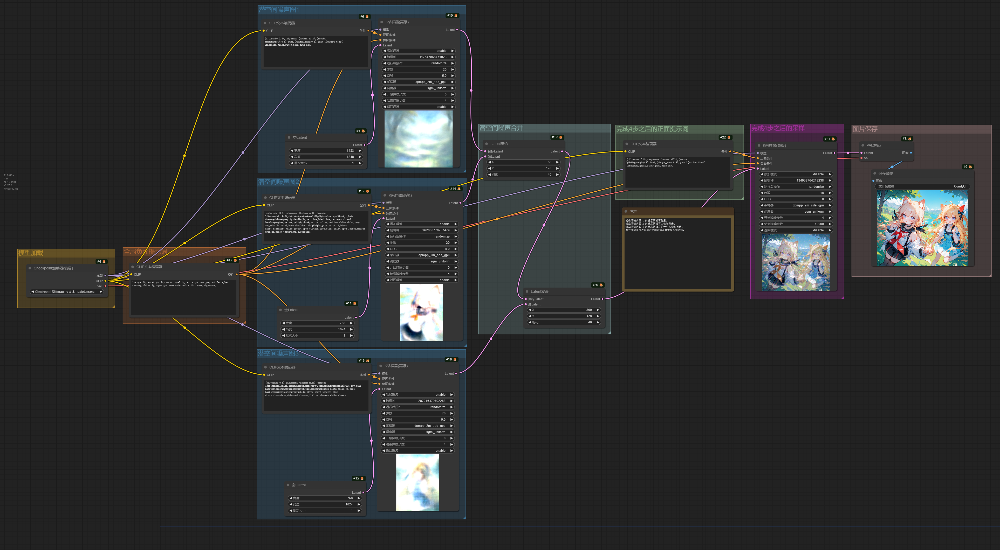

潜空间合并的工作流和分区提示词工作流类似，但是该工作流先通过低步数分区绘制得到不同的潜空间噪声图，把潜空间噪声图合并在一起后再进行最后的采样。

不过这种方法不能很好的区分人物的特征，可能会造成不同人物的特征混在一起。

## ControlNet 应用

!!!note
    工作流使用的 ControlNet 模型：[controlnet-union-sdxl-1.0-promax](https://modelscope.cn/models/licyks/sd_control_collection/resolve/master/xinsir-controlnet-union-sdxl-1.0-promax.safetensors)[(HuggingFace)](https://huggingface.co/xinsir/controlnet-union-sdxl-1.0)。  
    模型下载后放入`ComfyUI/models/controlnet`文件夹。

这个工作流演示了如何在 ComfyUI 使用 ControlNet 模型控制图片生成。

ControlNet 使用图片作为控制条件控制图片的生成，和提示词共同控制图片的生成。在这个工作流中从 CLIP文本编码器 节点输出的条件进入 ControlNet应用 节点，该节点将输入的控制图片（经过 ControlNet 预处理器处理后的图片）作为控制条件，再将条件输出到 K采样器 节点中，此时图片的生成就由提示词和 ControlNet 共同控制，使出图效果更可控。

下面是导入进 ControlNet 的图片。

|||
|---|---|

## 使用 SD 3.5 模型
下面是搭建工作流使用的模型。

|模型下载|放置路径|
|---|---|
|[sd3.5_large_fp8_scaled.safetensors](https://modelscope.cn/models/licyks/sd-3-model/resolve/master/sd3.5_large_fp8_scaled.safetensors)|ComfyUI/models/checkpoints|
|[sd3.5_medium_incl_clips_t5xxlfp8scaled.safetensors](https://modelscope.cn/models/licyks/sd-3-model/resolve/master/sd3.5_medium_incl_clips_t5xxlfp8scaled.safetensors)|ComfyUI/models/checkpoints|
|[sd3_medium.safetensors](https://modelscope.cn/models/licyks/sd-3-model/resolve/master/sd3_medium.safetensors)（不包含文本编码器）|ComfyUI/models/checkpoints|
|[sd3.5_large.safetensors](https://modelscope.cn/models/licyks/sd-3-model/resolve/master/sd3.5_large.safetensors)（不包含文本编码器）|ComfyUI/models/checkpoints|
|[clip_g.safetensors](https://modelscope.cn/models/licyks/sd-3-model/resolve/master/text_encoders/clip_g.safetensors)|ComfyUI/models/clip|
|[clip_l.safetensors](https://modelscope.cn/models/licyks/sd-3-model/resolve/master/text_encoders/clip_l.safetensors)|ComfyUI/models/clip|
|[t5xxl_fp8_e4m3fn_scaled.safetensors](https://modelscope.cn/models/licyks/sd-3-model/resolve/master/text_encoders/t5xxl_fp8_e4m3fn_scaled.safetensors)|ComfyUI/models/clip|
|[t5xxl_fp16.safetensors](https://modelscope.cn/models/licyks/sd-3-model/resolve/master/text_encoders/t5xxl_fp16.safetensors)|ComfyUI/models/clip|
|[sd3.5_large_controlnet_canny.safetensors](https://modelscope.cn/models/licyks/sd3_controlnet/resolve/master/sd3.5_large_controlnet_canny.safetensors)|ComfyUI/models/controlnet|

下面是简单使用 SD 3.5 的工作流，该工作流使用 Stable Diffusion 3.5 完整版模型，如果显存足够可以选择使用 sd3.5_large_fp8_scaled.safetensors，显存较小则使用 sd3.5_medium_incl_clips_t5xxlfp8scaled.safetensors。

Stable Diffusion 3.5 使用提示词或者自然语言都有比较好的效果。

Stable Diffusion 3.5 文本编码器由 CLIP L、CLIP G、T5XXL 组成，但允许自由选择想要的文本编码器，所以可以有以下使用组合：

|文本编码器组合|
|---|
|T5XXL + CLIP L + CLIP G|
|CLIP L + CLIP G|
|T5XXL|
|CLIP L|
|CLIP G|

不同的组合会影响模型对提示词的理解能力，可自行尝试。

建议使用不包含文本编码器的大模型版本，比如 sd3_medium.safetensors，sd3.5_large.safetensors。

Stability AI 官方也发布了适用于 Stable Diffusion 3.5 Large 的 ControlNet 模型，可以在下面的工作流进行使用。

因为 Stable Diffusion 3.5 模型可以不使用负面提示词，所以在负面条件的输入使用了**条件零化**节点。

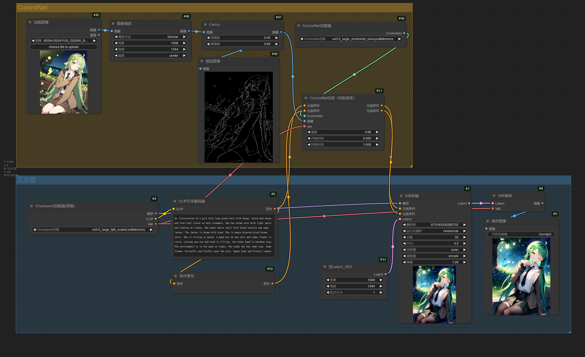

## 使用图片编辑模型
下面是搭建工作流使用的模型。

|模型下载|放置路径|
|---|---|
|[cosxl_edit.safetensors](https://modelscope.cn/models/licyks/sd-model/resolve/master/sdxl_1.0/cosxl_edit.safetensors)|ComfyUI/models/checkpoints|

InstructPix2Pix 模型为图片编辑模型，通过提示词修改图片中的元素但保持整体一致性，

在提示词中只需要写上描述要将修改成的内容即可。

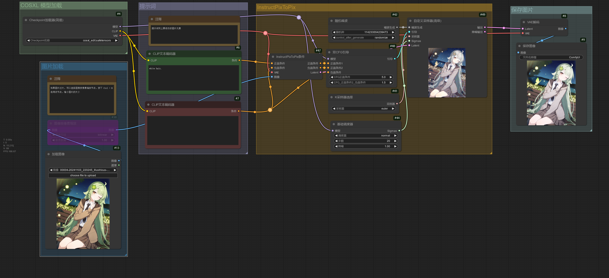

## 使用 FLUX 模型
下面是搭建工作流使用的模型。

|模型下载|放置路径|
|---|---|
|[flux1-dev.safetensors](https://modelscope.cn/models/licyks/flux-model/resolve/master/flux_1/flux1-dev.safetensors)|ComfyUI/models/unet|
|[flux_dev_fp8_scaled_diffusion_model.safetensors](https://modelscope.cn/models/licyks/flux-model/resolve/master/flux_1/flux_dev_fp8_scaled_diffusion_model.safetensors)|ComfyUI/models/unet|
|[flux1-schnell.safetensors](https://modelscope.cn/models/licyks/flux-model/resolve/master/flux_1/flux1-schnell.safetensors)|ComfyUI/models/unet|
|[t5xxl_fp16.safetensors](https://modelscope.cn/models/licyks/flux-model/resolve/master/flux_text_encoders/t5xxl_fp16.safetensors)|ComfyUI/models/clip|
|[t5xxl_fp8_e4m3fn.safetensors](https://modelscope.cn/models/licyks/flux-model/resolve/master/flux_text_encoders/t5xxl_fp8_e4m3fn.safetensors)|ComfyUI/models/clip|
|[clip_l.safetensors](https://modelscope.cn/models/licyks/flux-model/resolve/master/flux_text_encoders/clip_l.safetensors)|ComfyUI/models/clip|
|[ae.safetensors](https://modelscope.cn/models/licyks/flux-model/resolve/master/flux_vae/ae.safetensors)|ComfyUI/models/vae|
|[flux1-dev-fp8.safetensors](https://modelscope.cn/models/licyks/flux-model/resolve/master/flux_1/flux1-dev-fp8.safetensors)|ComfyUI/models/checkpoints|
|[flux1-schnell-fp8.safetensors](https://modelscope.cn/models/licyks/flux-model/resolve/master/flux_1/flux1-schnell-fp8.safetensors)|ComfyUI/models/checkpoints|
|[flux1-canny-dev.safetensors](https://modelscope.cn/models/licyks/flux_controlnet/resolve/master/flux1-canny-dev.safetensors)|ComfyUI/models/unet|
|[flux1-canny-dev-lora.safetensors](https://modelscope.cn/models/licyks/flux_controlnet/resolve/master/flux1-canny-dev-lora.safetensors)|ComfyUI/models/loras|
|[flux1-depth-dev.safetensors](https://modelscope.cn/models/licyks/flux_controlnet/resolve/master/flux1-depth-dev.safetensors)|ComfyUI/models/unet|
|[flux1-depth-dev-lora.safetensors](https://modelscope.cn/models/licyks/flux_controlnet/resolve/master/flux1-depth-dev-lora.safetensors)|ComfyUI/models/loras|
|[flux1-fill-dev.safetensors](https://modelscope.cn/models/licyks/flux_controlnet/resolve/master/flux1-fill-dev.safetensors)|ComfyUI/models/unet|
|[flux1-redux-dev.safetensors](https://modelscope.cn/models/licyks/flux_controlnet/resolve/master/flux1-redux-dev.safetensors)|ComfyUI/models/style_models|
|[sigclip_vision_patch14_384.safetensors](https://modelscope.cn/models/licyks/flux_controlnet/resolve/master/sigclip_vision_patch14_384.safetensors)|ComfyUI/models/clip_vision|

下面的工作流使用的是常规版本 FLUX 模型，即文本编码器、UNet 和 VAE 组件分开加载。

flux1-dev.safetensors、flux_dev_fp8_scaled_diffusion_model.safetensors、flux1-schnell.safetensors 仅包含 UNet，需要另外加载文本编码器和 VAE。

如果出现显存不足的问题，可以将**UNET加载器**节点的剪枝类型修改为 fp8_e4m3fn / fp8_e5m2 / fp8_e4m3fn_fast，或者更换 flux_dev_fp8_scaled_diffusion_model.safetensors 模型。**模型采样算法Flux**节点根据分辨率自动调整偏移值，如果不需要这样做，可以选中该节点，按下 Ctrl + B 跳过该节点。

下面的工作流可以使用 flux1-dev.safetensors / flux1-schnell.safetensors schnell 版本相对于 dev 版本只需要 4 步即可出图（类似 SDXL Turbo）。

t5xxl_fp16.safetensors 通常需要更多的显存，如果显存不足，请使用 t5xxl_fp8_e4m3fn.safetensors。

FLUX 必须将 CFG 设置为 1，CFG 为 1 时负面提示词将被忽略，并且 FLUX 模型不需要负面提示词。如果需要调整 CFG，请使用**Flux引导**进行调整。

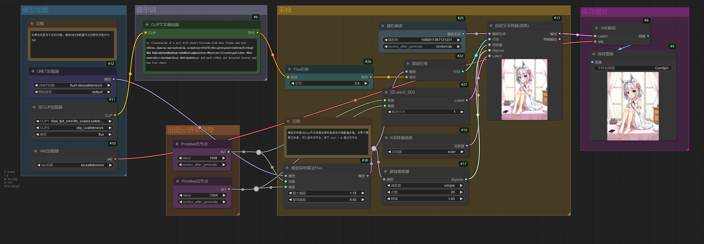

如果需要完整版模型，将文本编码器、UNet 和 VAE 组件打包在一起，可以使用 flux1-dev-fp8.safetensors / flux1-schnell-fp8.safetensors 模型，下面的工作流可用于加载这些完整版模型。

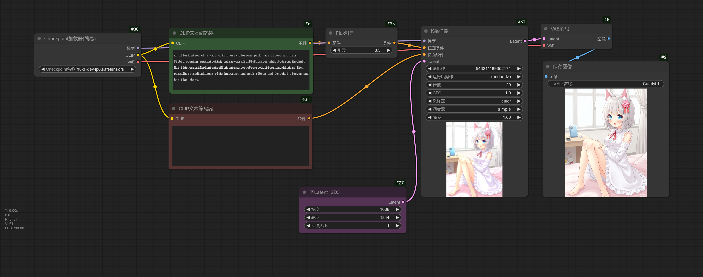

[black-forest-lab](https://blackforestlabs.ai/) 为 FLUX 模型发布了 4 种 ControlNet 模型（Canny、Depth、Fill、Redux），控制效果相对于社区训练出来的 FLUX ControlNet 模型，效果更好。

[black-forest-lab](https://blackforestlabs.ai/) 发布的 ControlNet 模型使用方法和常规的 ControlNet 模型有差别，不使用**ControlNet应用**节点应用 ControlNet。

下面简单演示使用 FLUX Canny ControlNet。

如果不想单独下完整版的 FLUX ControlNet 模型，也可以使用 LoRA 版的 FLUX ControlNet 模型，下面的工作流基于原来的 FLUX Canny ControlNet 工作流进行修改，使用 LoRA 版的 FLUX Depth ControlNet.

FLUX Fill 模型用于图片重绘，下面的工作流简单演示使用方法。

FLUX Fill 模型除了可以用于局部重绘，也可以用于外扩图片。

FLUX Redux 模型使用一张或者多张图片作为提示词，可用于风格迁移。

下面的工作流演示使用单张图片作为提示词。

如果需要使用多张图片作为提示词，可以连接多个**风格模型应用**节点。

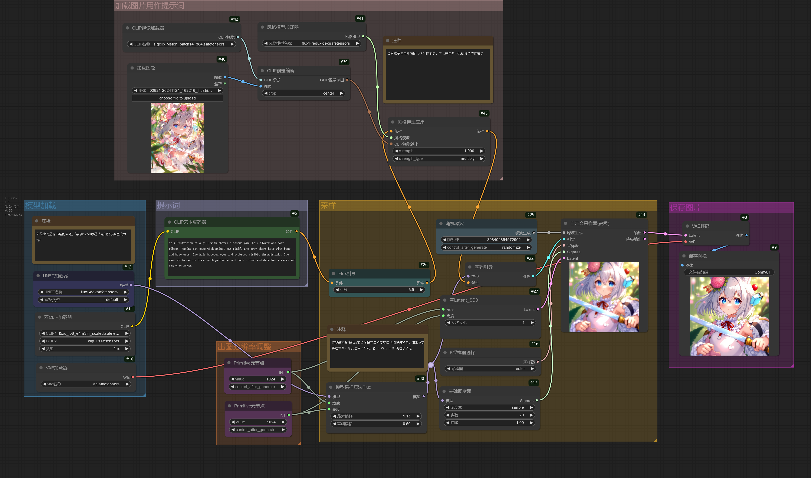

