# 杂项
这里列出 ComfyUI 的其他功能。


<!-- TODO https://github.com/T8star1984/Comfyui-Aix-NodeMap -->

## ComfyUI 中不同模型的放置路径
|模型种类|放置路径|
|---|---|
|Stable Diffusion 模型（大模型）|ComfyUI/models/checkpoints|
|UNet 模型|ComfyUI/models/unet|
|文本编码器模型|ComfyUI/models/clip|
|视觉编码器模型|ComfyUI/models/clip_vision|
|VAE 模型|ComfyUI/models/vae|
|VAE-approx 模型|ComfyUI/models/vae_approx|
|LoRA / Lycoris 模型|ComfyUI/models/loras|
|Embedding 模型|ComfyUI/models/embeddings|
|Hypernetwork 模型|ComfyUI/models/hypernetworks|
|高清修复模型|ComfyUI/models/upscale_models|
|ControlNet 模型|ComfyUI/models/controlnet|
|IP Adapter 模型|ComfyUI/models/ipadapter|
|ControlNet 预处理器模型|ComfyUI/custom_nodes/comfyui_controlnet_aux/ckpts|
|风格模型|ComfyUI/models/style_models|
|AnimateDiff 模型|ComfyUI/models/animatediff_models</br>ComfyUI/models/animatediff_motion_lora|
|TIPO 模型|ComfyUI/models/kgen|
|保存的工作流|ComfyUI/user/default/workflows|


## ComfyUI 共享 SD WebUI 的模型
在 ComfyUI 启动一次后，在 ComfyUI 的根目录会生成一个 extra_model_paths.yaml.example 共享目录示例文件，通过修改这个文件可以使 ComfyUI 共享 SD WebUI 的模型文件。

这是一个例子，我的 SD WebUI 路径在 E:/Softwares/stable-diffusion-webui，则将这个示例文件的 base_path: 后面的路径改成 SD WebUI 的路径。

```yaml
#Rename this to extra_model_paths.yaml and ComfyUI will load it


#config for a1111 ui
#all you have to do is change the base_path to where yours is installed
a111:
    base_path: E:/Softwares/stable-diffusion-webui # 填写 SD WebUI 的路径, 注意冒号后面必须有空格

    checkpoints: models/Stable-diffusion # 大模型
    configs: models/Stable-diffusion # 大模型配置文件
    vae: models/VAE # VAE 模型
    loras: | # LoRA 模型
         models/Lora
         models/LyCORIS
    upscale_models: | # 放大模型
                  models/ESRGAN
                  models/RealESRGAN
                  models/SwinIR
    embeddings: embeddings # Embedding 模型
    hypernetworks: models/hypernetworks # Hypernetwork 模型
    controlnet: models/Controlnet # ControlNet 模型
    ipadapter: models/Controlnet # IP Adapter 模型
    clip_vision: extensions/sd-webui-controlnet/annotator/downloads/clip_vision # clip_vision 模型
    # animatediff模型共享的说明: https://github.com/Kosinkadink/ComfyUI-AnimateDiff-Evolved?tab=readme-ov-file#model-setup
    animatediff_models: extensions/sd-webui-animatediff/model # AnimateDiff 模型
    animatediff_motion_lora: extensions/sd-webui-animatediff/model # AnimateDiff LoRA 模型


#config for comfyui
#your base path should be either an existing comfy install or a central folder where you store all of your models, loras, etc.

comfyui:
#     base_path: path/to/comfyui/
#     checkpoints: models/checkpoints/
#     clip: models/clip/
#     configs: models/configs/
#     controlnet: models/controlnet/
#     embeddings: models/embeddings/
#     loras: models/loras/
#     upscale_models: models/upscale_models/
#     vae: models/vae/
#     classifiers: models/classifiers/
#     clip_vision: models/clip_vision/
#     diffusers: models/diffusers/
#     diffusion_models: models/diffusion_models/
#     gligen: models/gligen/
#     hypernetworks: models/hypernetworks/
#     photomaker: models/photomaker/
#     style_models: models/style_models/
#     unet: models/unet/
#     vae_approx: models/vae_approx/
#     animatediff_models: models/animatediff_models/
#     animatediff_motion_lora: models/animatediff_motion_lora/
#     animatediff_video_formats: models/animatediff_video_formats/
#     ipadapter: models/ipadapter/
#     liveportrait: models/liveportrait/
#     insightface: models/insightface/
#     layerstyle: models/layerstyle/
#     LLM: models/LLM/
#     Joy_caption: models/Joy_caption/
#     sams: models/sams/
#     blip: models/blip/
#     CogVideo: models/CogVideo/
#     xlabs: models/xlabs/
#     instantid: models/instantid/
#     custom_nodes: custom_nodes/


#other_ui:
#    base_path: path/to/ui
#    checkpoints: models/checkpoints
#    gligen: models/gligen
#    custom_nodes: path/custom_nodes
```

修改并保存文件完成后，将 extra_model_paths.yaml.example 文件名改成 extra_model_paths.yaml，重新启动 ComfyUI 后就能看到 SD WebUI 里的模型了。

!!!note
    如果看不到文件名的后缀，需要将显示文件名后缀打开，参看：[杂项 - 显示隐藏的文件和文件后缀名 - SDNote](../../help/other.md#_4)


## 模型融合
下面是搭建工作流使用的模型。

|模型下载|放置路径|
|---|---|
|[animefull-final-pruned.safetensors](https://modelscope.cn/models/licyks/sd-model/resolve/master/sd_1.5/animefull-final-pruned.safetensors)|ComfyUI/models/checkpoints|
|[nai1-artist_all_in_one_merge.safetensors](https://modelscope.cn/models/licyks/sd-model/resolve/master/sd_1.5/nai1-artist_all_in_one_merge.safetensors)|ComfyUI/models/checkpoints|
|[AnythingV5Ink_ink.safetensors](https://modelscope.cn/models/licyks/sd-model/resolve/master/sd_1.5/AnythingV5Ink_ink.safetensors)|ComfyUI/models/checkpoints|
|[sd-v1-5-inpainting.ckpt](https://modelscope.cn/models/licyks/sd-model/resolve/master/sd_1.5/sd-v1-5-inpainting.ckpt)|ComfyUI/models/checkpoints|
|[v1-5-pruned-emaonly.safetensors](https://modelscope.cn/models/licyks/sd-model/resolve/master/sd_1.5/v1-5-pruned-emaonly.safetensors)|ComfyUI/models/checkpoints|
|[cosxl.safetensors](https://modelscope.cn/models/licyks/sd-model/resolve/master/sdxl_1.0/cosxl.safetensors)|ComfyUI/models/checkpoints|
|[sd_xl_base_1.0_0.9vae.safetensors](https://modelscope.cn/models/licyks/sd-model/resolve/master/sdxl_1.0/sd_xl_base_1.0_0.9vae.safetensors)|ComfyUI/models/checkpoints|
|[Illustrious-XL-v0.1.safetensors](https://modelscope.cn/models/licyks/sd-model/resolve/master/sdxl_1.0/Illustrious-XL-v0.1.safetensors)|ComfyUI/models/checkpoints|
|[nai1-artist_all_in_one_6-000032.safetensors](https://modelscope.cn/models/licyks/sd-lora/resolve/master/sd_1.5/style/nai1-artist_all_in_one_6-000032.safetensors)|ComfyUI/models/loras|
|[vae-ft-mse-840000-ema-pruned.safetensors](https://modelscope.cn/models/licyks/sd-vae/resolve/master/sd_1.5/vae-ft-mse-840000-ema-pruned.safetensors)|ComfyUI/models/vae|

下面的工作流可以简单进行模型融合，**融合模型**节点的计算方式为`模型 1 * 比率 + 模型 2 * (1.0 - 比率)`，如果融合的效果不错，可以选中**保存Checkpoint**节点，按下 Ctrl + M 快捷键启用该节点，再次运行工作流时将会把模型保存在`ComfyUI/output/checkpoint`路径中。

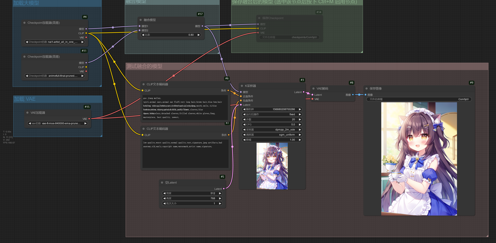

如果想要融合 3 个模型，可以使用下面的工作流，该工作流使用**融合模型(分层)**节点，可以调整 UNet 层的输入、中间和输出块的权重。

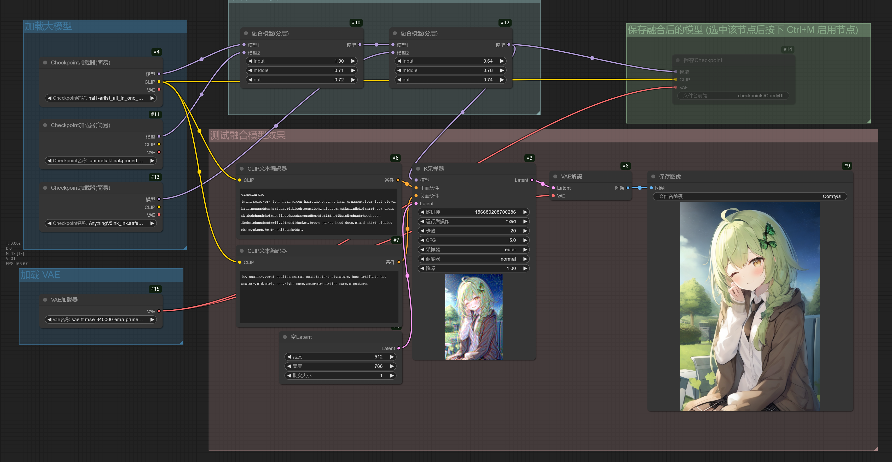

LoRA 模型在训练好后，也可以融入大模型中，对大模型进行微调。

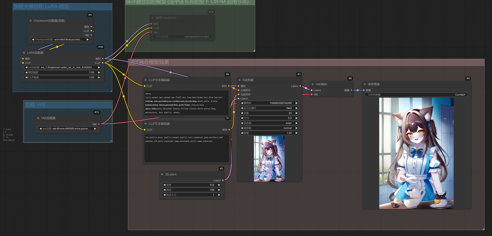

模型权重可以减去再重新添加，下面使用公式`(重绘模型 - 基础模型) x 1.0 + 其他模型`来融合出重绘模型。

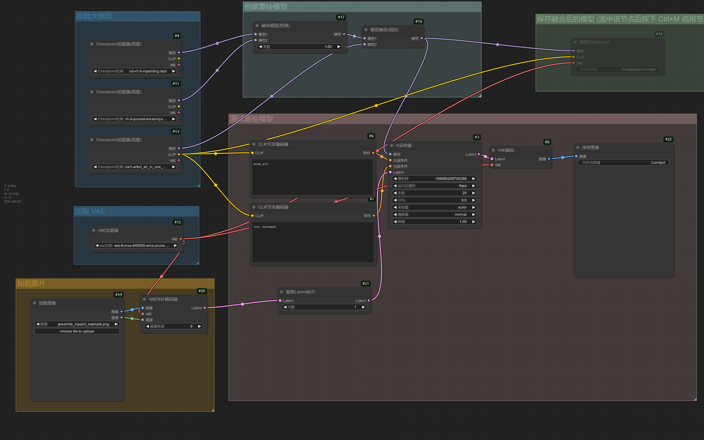

COSXL 模型也可以通过融合模型的方式进行创建，使用的公式为`(COSXL - SDXL 官方模型) + 其他模型`。

在**模型融合(SDXL)**节点调整融合模型的权重，该节点的计算方式为`模型 1 * 比率 + 模型 2 * (1.0 - 比率)`。建议将输出块设置为 0 ~ 4 之间的值使融合后的模型和原来的模型效果更加相似。

**模型连续采样算法EDM**节点可以尝试调整 Sigma 值以达到更好的效果。

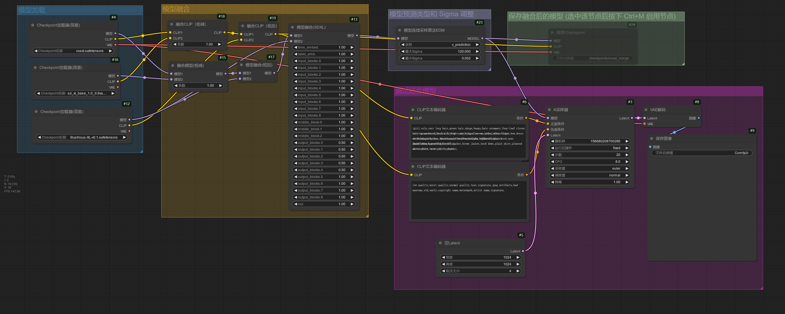


## 设置提示词补全
在 ComfyUI 中可以通过安装 ComfyUI-Custom-Scripts 扩展添加提示词补全功能。安装该扩展后，进入 ComfyUI 设置，找到**自定义脚本**的设置，将**Replace _ with space**启用。

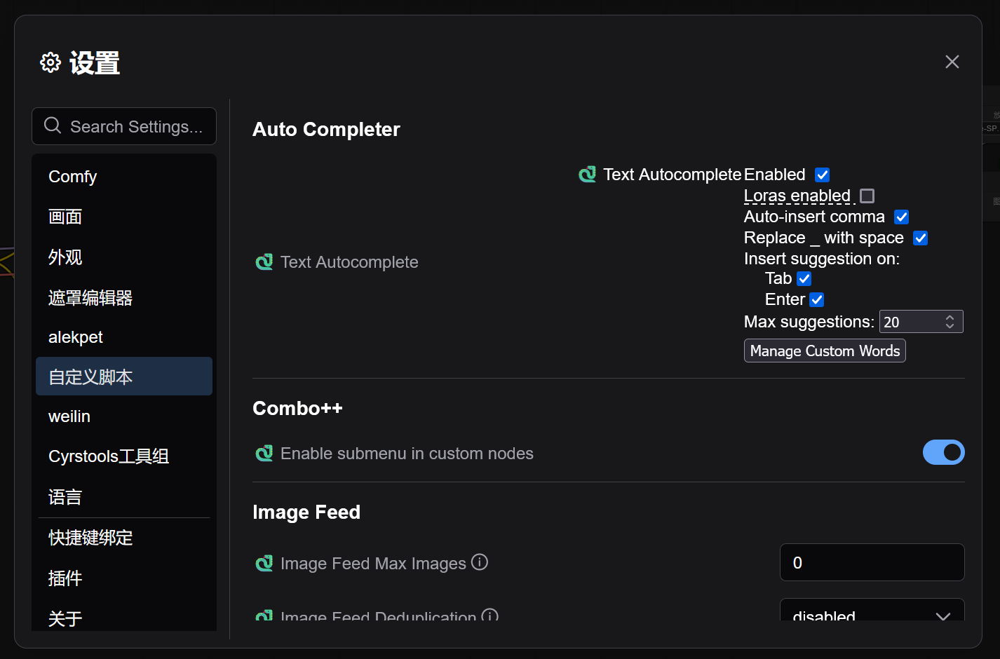

点击 Manage Custom Words 进行提示词库管理，进入管理界面后在上方输入链接的地方将原来的链接替换成下面的链接。

```
https://licyk.github.io/t/tag/tag_pp_zh.csv
```

替换之后点击右边的**加载**将提示词库下载下来，再点击下方的**保存**就能保存提示词库，再点击**关闭**退出提示词库管理。

在提示词框中就可以使用提示词补全功能，并且英文和中文都可以补全提示词。

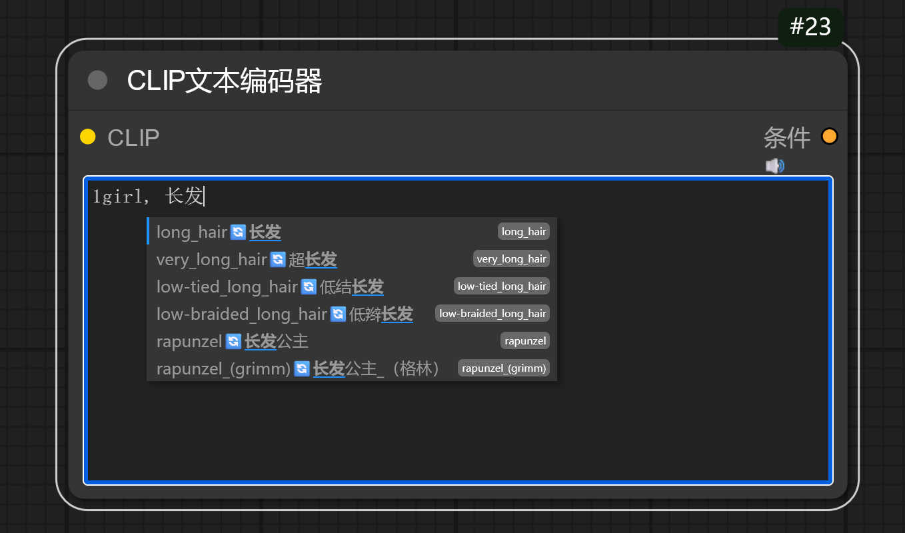

!!!note
    ComfyUI-Custom-Scripts 扩展下载：https://github.com/pythongosssss/ComfyUI-Custom-Scripts

当有提示词翻译和管理提示词的需求时，可以使用 WeiLin-ComfyUI-prompt-all-in-one 扩展。

安装该扩展后，进入 ComfyUI 设置，在 **weilin** 设置选项勾选**显示全局悬浮球**和**将"_"替换为空格**。

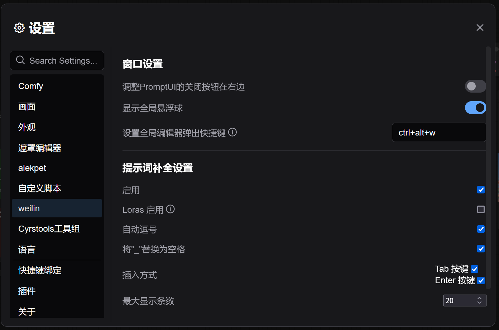

在 ComfyUI 界面的左下角一般就能看到一个标记为 **WeiLin** 的悬浮按钮，点击后可以打开 WeiLin-ComfyUI-prompt-all-in-one 的界面，利用该扩展翻译和管理提示词。

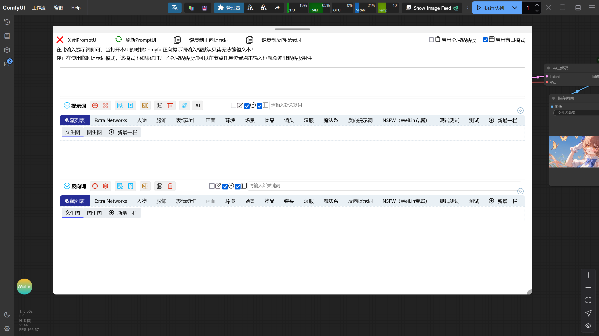

该扩展也提供节点方便输入和调整提示词，下面是使用该扩展书写提示词。

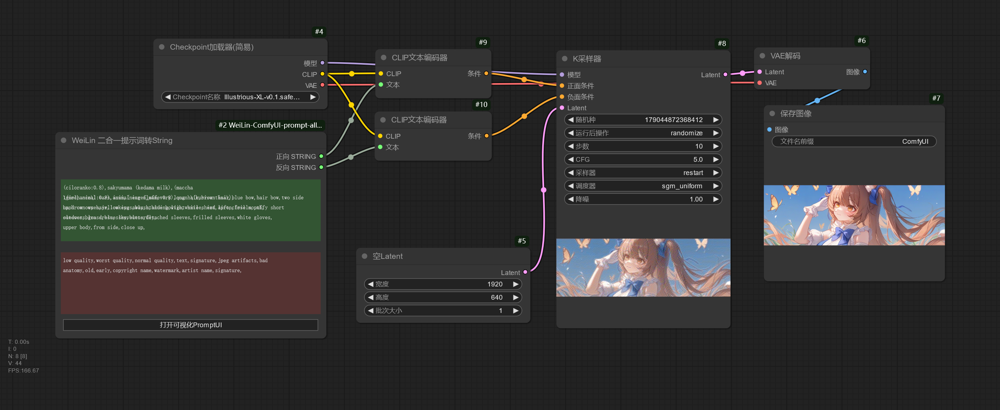

!!!note
    WeiLin-ComfyUI-prompt-all-in-one 扩展下载：https://github.com/weilin9999/WeiLin-ComfyUI-prompt-all-in-one


## 使用提示词调用 LoRA
在 ComfyUI 中通常使用 **LoRA 加载器**节点调用 LORA 模型，但有时候这种调用方式并不方便调用 LoRA 模型，此时可以通过 comfyui_lora_tag_loader 扩展实现 Stable Diffusion WebUI 中使用提示词调用 LoRA 的方式。

下面是搭建工作流使用的模型。

|模型下载|放置路径|
|---|---|
|[Illustrious-XL-v0.1.safetensors](https://modelscope.cn/models/licyks/sd-model/resolve/master/sdxl_1.0/Illustrious-XL-v0.1.safetensors)|ComfyUI/models/checkpoints|
|[ill-xl-01-tyomimas_1-000032.safetensors](https://modelscope.cn/models/licyks/sd-lora/resolve/master/sdxl/style/ill-xl-01-tyomimas_1-000032.safetensors)|ComfyUI/models/loras|

这个工作流演示使用 comfyui_lora_tag_loader 扩展调用 LoRA 模型。

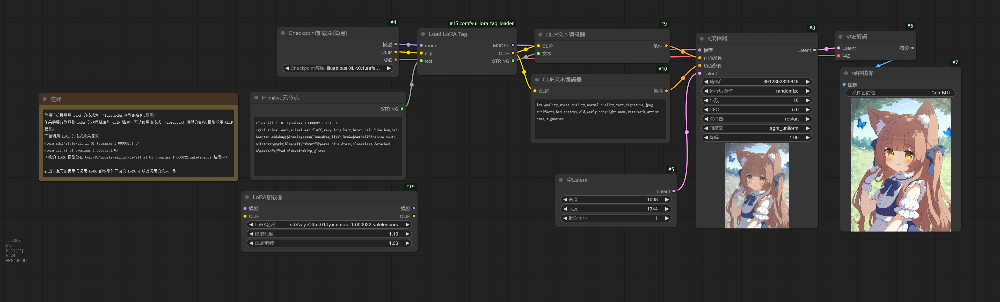

!!!note
    comfyui_lora_tag_loader 扩展下载：https://github.com/badjeff/comfyui_lora_tag_loader

该扩展可以结合 WeiLin-ComfyUI-prompt-all-in-one 一起使用，可以更加方便的调用 LoRA 模型。

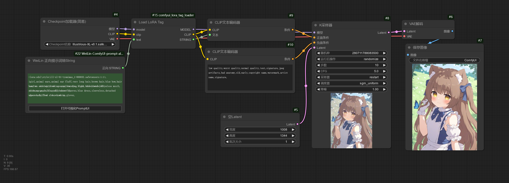

!!!note
    1. WeiLin-ComfyUI-prompt-all-in-one 扩展下载：https://github.com/weilin9999/WeiLin-ComfyUI-prompt-all-in-one
    2. WeiLin-ComfyUI-prompt-all-in-one 其实也提供通过提示词加载 LoRA 模型的功能，可自行尝试。


## 添加性能监测
可以安装 ComfyUI-Crystools 扩展实现该功能，安装后在 ComfyUI 工具栏可以看到实时的性能监测信息。

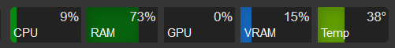

!!!note
    ComfyUI-Crystools 扩展下载：https://github.com/crystian/ComfyUI-Crystools


## 查看图片目录
comfyui-browser 扩展提供一个便捷浏览 ComfyUI 保存的图片的功能。安装该扩展后，点击 ComfyUI 工具栏的📚按钮即可打开。

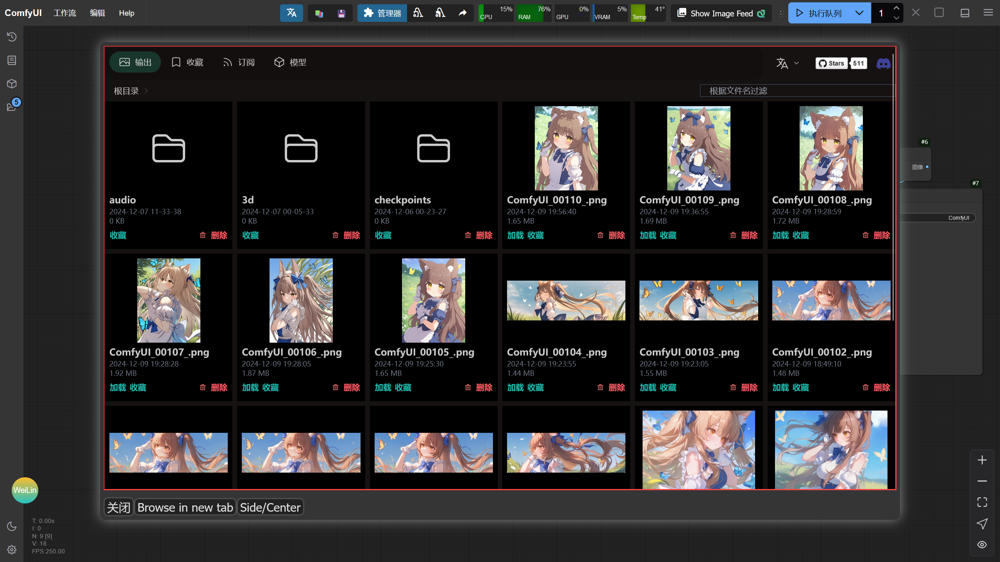

!!!note
    comfyui-browser 扩展下载：https://github.com/talesofai/comfyui-browser


## 使用 ControlNet / IP Adapter
下面是搭建工作流使用的模型。

|模型下载|放置路径|
|---|---|
|[Illustrious-XL-v0.1.safetensors](https://modelscope.cn/models/licyks/sd-model/resolve/master/sdxl_1.0/Illustrious-XL-v0.1.safetensors)|ComfyUI/models/checkpoints|
|[xinsir-controlnet-union-sdxl-1.0-promax.safetensors](https://modelscope.cn/models/licyks/sd_control_collection/resolve/master/xinsir-controlnet-union-sdxl-1.0-promax.safetensors)|ComfyUI/models/controlnet|
|[ip-adapter_sdxl.safetensors](https://modelscope.cn/models/licyks/sd_control_collection/resolve/master/ip-adapter_sdxl.safetensors)|ComfyUI/models/ipadapter|
|[ip-adapter_sdxl_vit-h.safetensors](https://modelscope.cn/models/licyks/sd_control_collection/resolve/master/ip-adapter_sdxl_vit-h.safetensors)|ComfyUI/models/ipadapter|
|[ip-adapter-plus_sdxl_vit-h.safetensors](https://modelscope.cn/models/licyks/sd_control_collection/resolve/master/ip-adapter-plus_sdxl_vit-h.safetensors)|ComfyUI/models/ipadapter|
|[Clip-vit-large-patch14-336.bin](https://modelscope.cn/models/licyks/controlnet_v1.1_annotator/resolve/master/clip_vision/Clip-vit-large-patch14-336.bin)|ComfyUI/models/clip_vision|
|[CLIP-ViT-H-14-laion2B-s32B-b79K.safetensors](https://modelscope.cn/models/licyks/controlnet_v1.1_annotator/resolve/master/clip_vision/CLIP-ViT-H-14-laion2B-s32B-b79K.safetensors)|ComfyUI/models/clip_vision|
|[CLIP-ViT-bigG-14-laion2B-39B-b160k.safetensors](https://modelscope.cn/models/licyks/controlnet_v1.1_annotator/resolve/master/clip_vision/CLIP-ViT-bigG-14-laion2B-39B-b160k.safetensors)|ComfyUI/models/clip_vision|

ComfyUI 自带的 ControlNet 节点可以满足基本 ControlNet 的需求，但是 ComfyUI 缺失很多 ControlNet 的预处理器和部分 ControlNet 功能，并且不支持 IP Adapter，所以需要安装 comfyui_controlnet_aux、ComfyUI-Advanced-ControlNet、ComfyUI_IPAdapter_plus 扩展来实现。

!!!note
    comfyui_controlnet_aux 扩展下载：https://github.com/Fannovel16/comfyui_controlnet_aux  
    ComfyUI-Advanced-ControlNet 扩展下载：https://github.com/Kosinkadink/ComfyUI-Advanced-ControlNet  
    ComfyUI_IPAdapter_plus 扩展下载：https://github.com/cubiq/ComfyUI_IPAdapter_plus

这个工作流简单实现 ControlNet 不同的功能，并且使用 comfyui_controlnet_aux 扩展提供的预处理器节点处理图片，不再需要手动处理图片再导入。通过修改**预处理器选择器**中的预处理器来实现切换不同的控制类型。

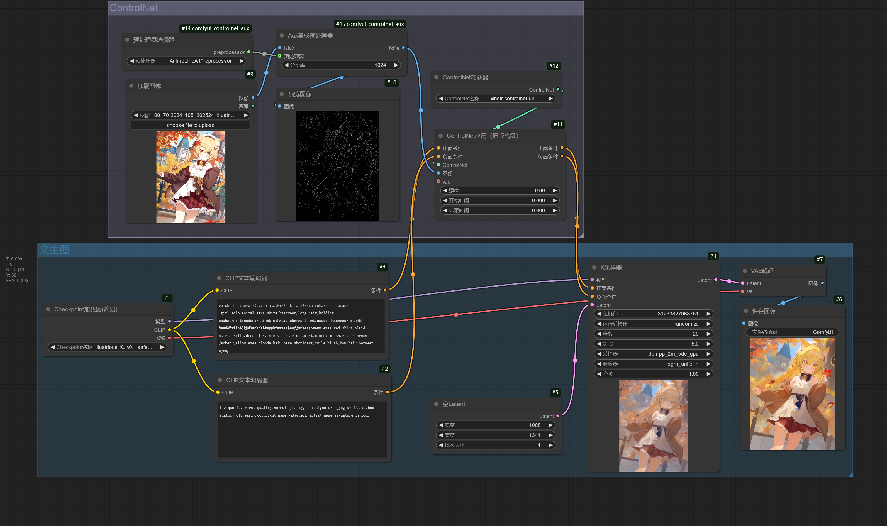

如果需要实现在 Stable Diffusion WebUI 中 ControlNet 扩展中的控制模式，可以通过 ComfyUI-Advanced-ControlNet 提供的节点来实现。

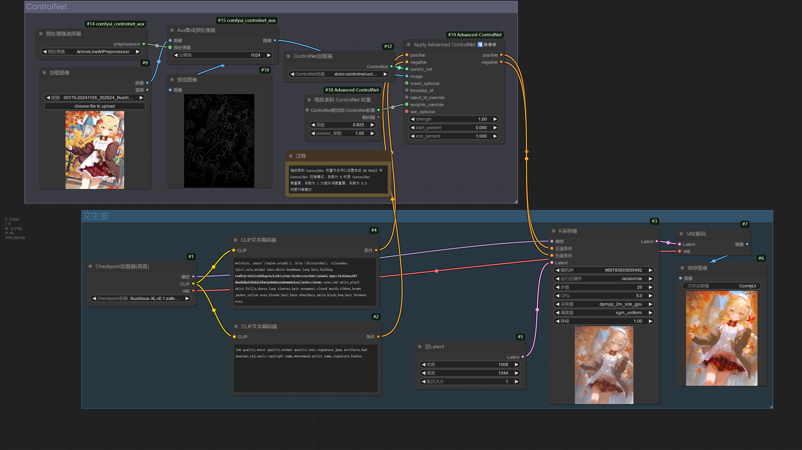

ControlNet Reference 无法通过 ComfyUI 内置节点实现，但是 ComfyUI-Advanced-ControlNet 扩展提供了相关的节点，下面是搭建 ControlNet Reference 的工作流。

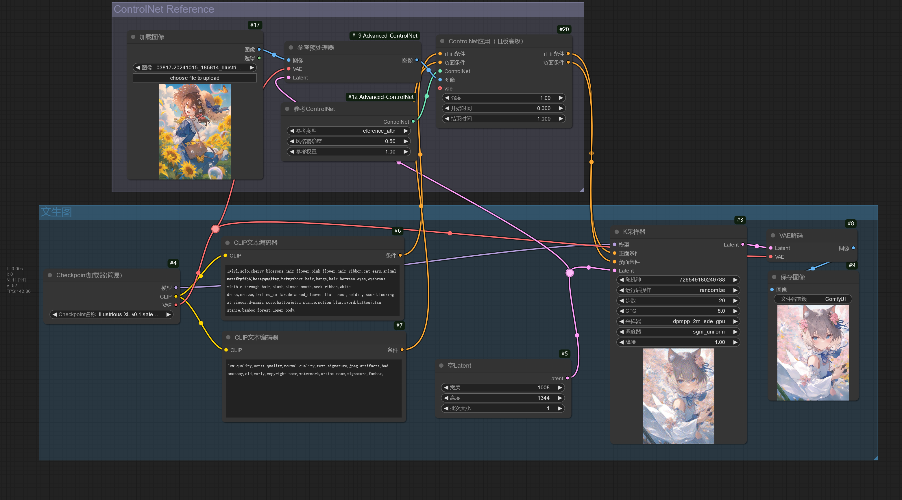

ComfyUI_IPAdapter_plus 扩展提供 IP Adapter 用于迁移画风，下面的工作流简单演示如何进行画风迁移。

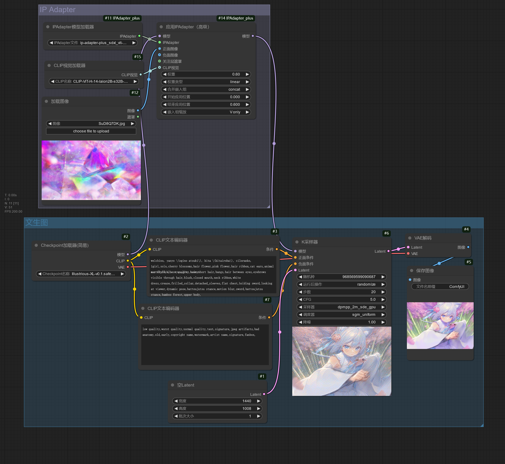


## 查看模型信息
ComfyUI-Custom-Scripts 扩展提供查看模型信息的功能。安装该扩展后，右键模型加载器可以看到菜单中有 **View info** 选项，点击可以查看模型的信息。

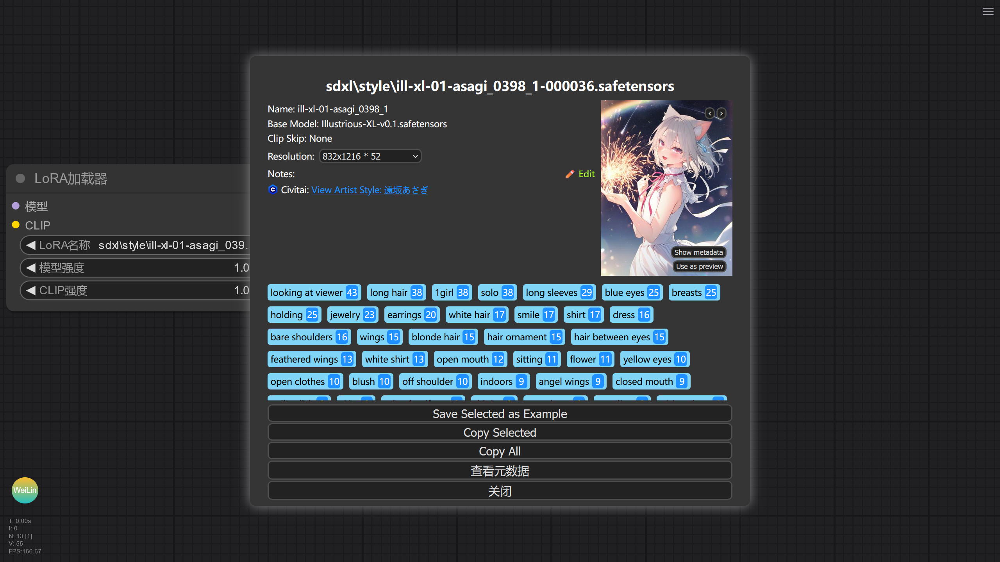

!!!note
    ComfyUI-Custom-Scripts 扩展下载：https://github.com/pythongosssss/ComfyUI-Custom-Scripts


## 将工作流截图导出并附带工作流信息
安装 ComfyUI-Custom-Scripts 扩展后，右键 ComfyUI 界面空白处打开菜单，在**工作流图像 -> 导出 -> PNG**可以导出工作流截图并且图片附带了工作流信息，将图片导入 ComfyUI 可以查看图片附带的工作流。

!!!note
    ComfyUI-Custom-Scripts 扩展下载：https://github.com/pythongosssss/ComfyUI-Custom-Scripts


## 直出高分辨率图
**收缩模型UNET**节点使模型能够直出超过训练分辨率的图但不出现崩坏，下面的工作流简单演示该节点的使用方法。

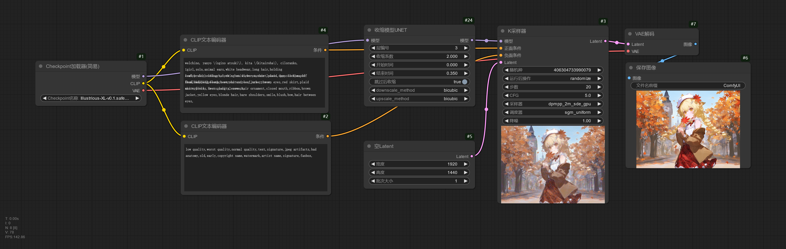


## 提示词反推
ComfyUI-WD14-Tagger 扩展可以用于反推图片的提示词。

下面的工作流使用 ComfyUI-WD14-Tagger 扩展提供的节点反推提示词，再使用 ComfyUI-Custom-Scripts 扩展提供的节点在反推出来的提示词上附加其他提示词。

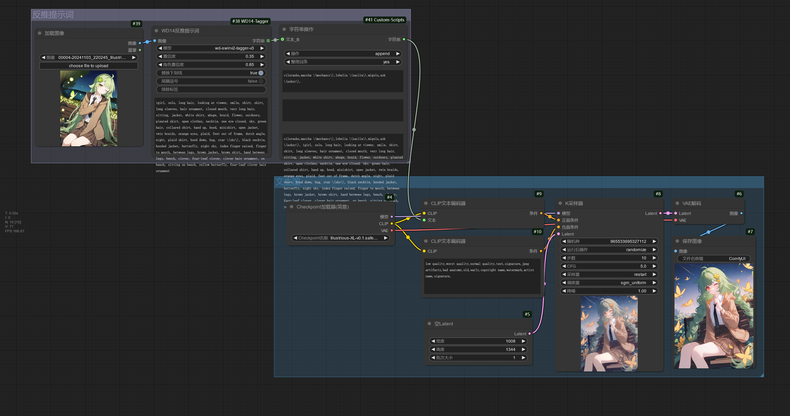

!!!note
    ComfyUI-Custom-Scripts 扩展下载：https://github.com/pythongosssss/ComfyUI-Custom-Scripts  
    ComfyUI-WD14-Tagger 扩展下载：https://github.com/pythongosssss/ComfyUI-WD14-Tagger


## 可视化分区绘制调整
下面是搭建工作流使用的模型。

|模型下载|放置路径|
|---|---|
|[noobaiXLNAIXL_vPred10Version.safetensors](https://modelscope.cn/models/licyks/sd-model/resolve/master/sdxl_1.0/noobaiXLNAIXL_vPred10Version.safetensors)|ComfyUI/models/checkpoints|
|[ill-xl-01-ibara_riato_1-000034.safetensors](https://modelscope.cn/models/licyks/sd-lora/resolve/master/sdxl/style/ill-xl-01-ibara_riato_1-000034.safetensors)|ComfyUI/models/loras|

ComfyUI-Danbooru-Gallery 扩展提供了 多角色编辑器 (Multi Character Editor) 节点，可通过一个可视化编辑器编辑分区绘制的区域。该节点在运行后将生成带有分区控制语法的提示词，此时需要配合 comfyui-prompt-control 扩展提供的 PC: Text Encode (no scheduling) 节点对该提示词进行处理以应用分区绘制。

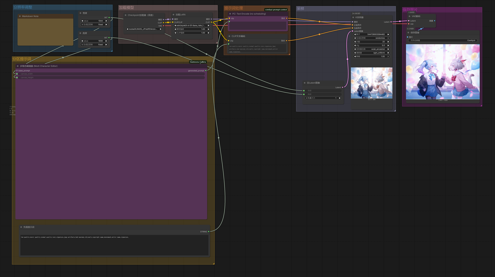

!!!note
    ComfyUI-Danbooru-Gallery 扩展下载：https://github.com/Aaalice233/ComfyUI-Danbooru-Gallery  
    comfyui-prompt-control 扩展下载：https://github.com/asagi4/comfyui-prompt-control
