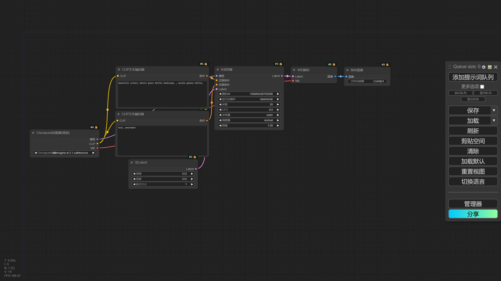
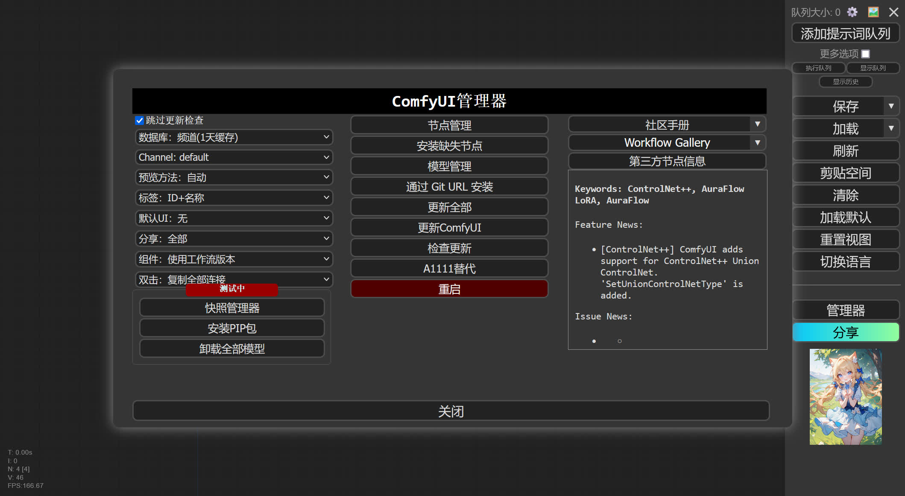

# 简述
ComfyUI 的界面和 Stable Diffusion WebUI 的界面完全不相同，在 ComfyUI 中，每个功能都被拆散成一个个节点，通过连接不同的节点搭建起一个完整的生图流程。




## 前期配置
如果 ComfyUI 未安装扩展管理器和中文翻译扩展，建议通过以下几种方式进行安装。


### 使用绘世启动器安装
打开绘世启动器的 版本管理 -> 安装新扩展，分别搜索 ComfyUI-Manager 和 AIGODLIKE-COMFYUI-TRANSLATION 并下载安装。

### 使用 Git 命令安装
进入 ComfyUI 的 custom_nodes 文件夹中，打开终端，输入以下的命令安装 ComfyUI-Manager 和 AIGODLIKE-COMFYUI-TRANSLATION 扩展。

```
git clone https://github.com/ltdrdata/ComfyUI-Manager
git clone https://github.com/AIGODLIKE/AIGODLIKE-COMFYUI-TRANSLATION
```

安装后重新启动 ComfyUI。


## 设置中文
安装以上的扩展后，在 ComfyUI 界面右侧栏可以看到 Manager 按钮，说明扩展管理器已经成功安装，但是通常情况下 ComfyUI 中文翻译扩展安装后并不会自动设置 ComfyUI 界面为中文，需要手动设置。

在 ComfyUI 侧边栏点击右上角的齿轮按钮进入 ComfyUI 设置，找到 AGLTranslation-language 选项，选择 中文[Chinese Simplified] 后 ComfyUI 将自动重启，此时 ComfyUI 的界面就切换成中文了。


## 快捷键
以下为操作 ComfyUI 界面的快捷键。

|操作|作用|
|---|---|
|鼠标滚轮|缩放工作流的大小。|
|鼠标右键|打开节点列表。|
|鼠标左键双击|打开节点搜索列表。|
|Ctrl + Enter|运行当前的工作流|
|Ctrl + Shift + Enter|将当前的工作流作为运行列表里第一个被运行的工作流|
|Ctrl + Z|撤销工作流更改|
|Ctrl + Y|重做工作流更改|
|Ctrl + S|保存工作流|
|Ctrl + O|导入工作流|
|Alt + C|折叠 / 取消折叠选中的节点。|
|Ctrl + M|禁用 / 激活选中的节点。|
|Ctrl + B|使被选中的节点在工作流运行时被绕过。|
|Delete / Backspace|删除选中的节点。|
|Ctrl + 右 Ctrl + Backspace|清除当前的工作流。|
|Space + 移动鼠标|移动画布。|
|Ctrl + 鼠标左键单击|多选节点。|
|Shift + 鼠标左键长按|拖动选中的多个节点。|
|Ctrl + C / V|复制 / 粘贴选中的节点（不复制节点的连线）。|
|Ctrl + Shift + C / V|复制 / 粘贴选中的节点（同时复制节点的连线）。|
|Ctrl + D|加载默认的工作流。|
|Alt + `+`|放大工作流。|
|Alt + `-`|缩小工作流。|
|Q|显示当前运行的工作流队列。|
|H|显示历史工作流。|
|R|刷新工作流。|

<!-- TODO: 需要更新-->


## 节点操作
在节点的左侧接口为输入点，节点右侧的接口为输出点，鼠标按住接口并向外拖动可以看到延伸出来的线，将线拖到匹配这个线的接口上可完成不同节点之间的连接。

右键节点可以看到该节点的编辑功能。


## 侧边栏
ComfyUI 的侧边栏包含了一些快捷按钮，如 添加提示词队列，这个按钮就类似 Stable Diffusion WebUI 中的生成按钮。


## 扩展管理
安装 ComfyUI-Manager 扩展后，在 ComfyUI 侧边栏可以看到 管理器 按钮，点开后可以看到 ComfyUI-Manager 的界面。



ComfyUI-Manager 包含了管理 ComfyUI 的各种功能，以下是不同功能的描述。


- 节点管理

管理 ComfyUI 的扩展，包含安装 / 卸载 / 禁用 / 启用节点，修复节点缺失依赖的功能。


- 安装缺失节点

当导入一个工作流时，如果 ComfyUI 缺少工作流中节点所需要的扩展，ComfyUI 将弹窗提示有节点缺失，这是可以使用该功能扫描工作流需要的节点并安装。


- 模型管理

模型管理可以下载一些节点所需的模型。


- 通过 Git URL 安装

如果将要安装的插件没有节点管理中搜到，但是知道该节点的 Git 仓库地址，可以通过该功能进行安装。


- 更新全部

点击后将更新所有的 ComfyUI 扩展和 ComfyUI 本体。


- 更新 ComfyUI

仅更新 ComfyUI 本体。


- A1111 替代

下载实现 Stable Diffusion WebUI 部分功能的扩展。


ComfyUI-Manager 还有其他实用的功能，如标签显示功能，启用后可以看到节点是来源于哪个扩展。