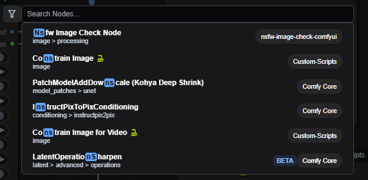
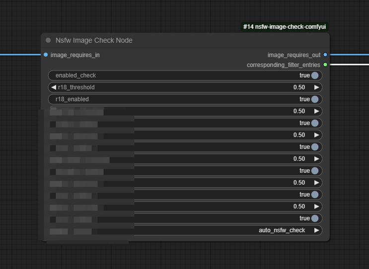

# 简介

如果你发现网络上没有自己需要的插件或者像对一个插件修改，并且自己拥有一定的python编程基础，可以根据指南编写或修改插件。

请注意，这里只提供最基本的编写指南，所以涉及的编程语言只有python。

# 文件结构

插件可以是一个文件夹或者一个单独的文件，但是推荐用文件夹来存放你的插件文件，下面将拿我编写插件举例子。

文件夹结构如下,文件夹名字为插件名字

```
│  img.png （节点的样子）非必要
│  nsfw_image_check.py （主文件,名字替换为自己的插件名字）必要
│  pyproject.toml （配置文件）非必要
│  README.md （使用指南）非必要
│  requirements.txt （插件依赖）必要
│  __init__.py （初始化文件）必要
│
├─data（自己插件需要的文件）非必要
│      encode.py
│      image.py
│      __init__.py
│
├─detect （自己插件需要的文件）非必要
│      censor.py
│      __init__.py
│
├─generic （自己插件需要的文件）非必要
│      classify.py
│      yolo.py
│      __init__.py
│
├─img （自己插件需要的文件）非必要
│      01.jpg 
│      02.jpg
│      03.jpg
│      04.jpg
│      05.jpg
│      06.jpg
│      07.jpg
│      08.jpg
│      09.jpg
│      10.jpg
│      11.jpg
│      12.jpg
│
├─models （自己插件需要的文件）非必要
│  ├─models--deepghs--anime_censor_detection
│  │      model.onnx
│  │
│  ├─models--deepghs--anime_furry
│  │      meta.json
│  │      model.onnx
│  │
│  ├─models--deepghs--anime_rating
│  │      meta.json
│  │      model.onnx
│  │
│  └─models--deepghs--imgutils-models
│          nsfwjs.onnx
│
├─modules （自己插件需要的文件）非必要
│      nsfw_check.py
│      tensor_to_other.py
│      __init__.py
│
├─utils （自己插件需要的文件）非必要
│      cache.py
│      onnxruntime.py
│      __init__.py
│
└─validate （自己插件需要的文件）非必要
        furry.py
        nsfw.py
        rating.py
        __init__.py       
        
```

# 文件内容

注意：带#的代码是非必要的或不需要的
`nsfw_image_check.py` 主文件

```
导入自己的库就行了，没有就不用
# from .modules.nsfw_check import nsfw_detect 
# from .modules.tensor_to_other import tensor_to_pil

# 定义一个类，名字改为自己需要的，这里就用NsfwCheckNode我的这个当示例
class NsfwCheckNode:
    def __init__(self):
        pass

    必要函数，原封不动抄
    @classmethod
    def INPUT_TYPES(cls):
    
        return {
            # Image input
            这里写要接收的数据
            "required": {
                 格式为 "名字": ("类型", {"默认": "没有就空起", "必要输入": True}),如果为False则该输入接口为可选
                "image_requires_in": ("IMAGE", {"default": "", "forceInput": True}),
            },

            # Thresholds for all filtering modes
            参数
            "optional": {
                格式为 "名字": ("类型", {"默认": "根据需求填写"),
                # "enabled_check": ("BOOLEAN", {"default": True}),

                # "r18_threshold": ("FLOAT", {"default": 0.5, "min": 0, "max": 1, "step": 0.01}),

                # "r18_enabled": ("BOOLEAN", {"default": True}),
    

            }
        }

    输出接口类型，字符串只能和字符串连接
    RETURN_TYPES = ("IMAGE", "STRING")
    输出接口名字
    RETURN_NAMES = ("image_requires_out", "corresponding_filter_entries")
    节点触发并传入数据的函数名字
    FUNCTION = "nsfw_image_check"
    节点分类
    CATEGORY = "image/processing"

    节点触发的函数，接收数据为required 和 optional 内所有参数
    def nsfw_image_check(self,
                         image_requires_in,
                         enabled_check,
                         r18_threshold, r18_enabled
                         ):

        # pil_image_info = tensor_to_pil(image_requires_in)

        # image_check_info, check_type = nsfw_detect(pil_image_info,
                                                   enabled_check,
                                                   r18_threshold, r18_enabled,
                                                   hentai_threshold, hentai_enabled,
                                                   furry_threshold, furry_enabled,
                                                   genitalia_threshold, genitalia_enabled,
                                                   porn_threshold, porn_enabled,
                                                   sexy_threshold, sexy_enabled,
                                                   filter_choose)
                                                   
        返回的为RETURN_TYPES = ("IMAGE", "STRING")中需要的两个数据
        return xxx xxx

        # if image_check_info is None:
               比如我这里，要一个图片和字符串，就返回这两个
               return image_requires_in, check_type

        # if image_check_info is not None:
               return image_check_info, f"|{check_type}| is a filtering rule that is triggered"

```

`__init__.py` 初始化文件

```
from .nsfw_image_check import NsfwCheckNode  导入主文件中的类

NODE_CLASS_MAPPINGS = {
    "NsfwCheckNode": NsfwCheckNode     两边都写成类的名字
}

NODE_DISPLAY_NAME_MAPPINGS = {
    "NsfwCheckNode": "Nsfw Image Check Node"  节点在comfyui中显示的名字
}

__all__ = ['NODE_CLASS_MAPPINGS', 'NODE_DISPLAY_NAME_MAPPINGS'] 不需要修改
 
```

# 在comfyui中使用你写的插件
搜索你的插件名字，你就会看见自己的插件也出现在列表中

如果没有，检查加载是否报错

插件也正常被分类到image/processing

CATEGORY = "image/processing"



这就是插件样子

如代码一样，一个输入接口，两个输出接口，自此插件就成功加载到comfyui中了



<!-- TODO: 排版需要优化 -->