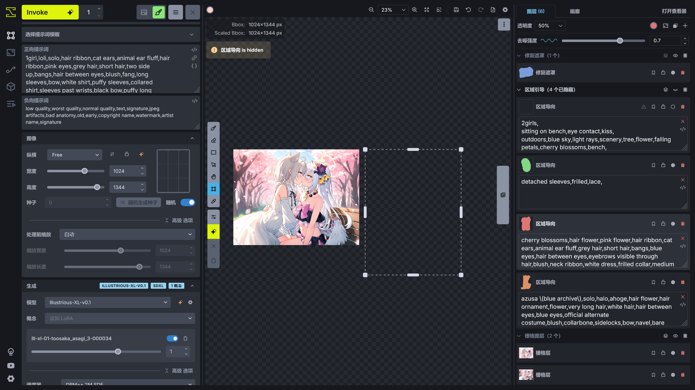

# 统一画布
InvokeAI 的统一画布拥有一个用于绘画的画布，并且包含一个强大的控制层，将 ControlNet、IP Adapter、分区提示词结合起来，和画布共同使用，使创作变得更加简单，下面将介绍 InvokeAI 统一画布的使用。

在使用之前，需要将 **Invoke** 按钮右侧的保存图片方式改为**发送到画布**。

!!!note
    1. 因为 InvokeAI 并没有像 Stable Diffusion WebUI / ComfyUI 那样的显存优化，作者所使用的 RTX 4060 Laptop 8G 无法在 InvokeAI 上运行 Stable Diffusion XL 的 ControlNet / IP Adapter，所以本篇讲解到涉及 ControlNet / IP Adapter 的操作时将使用 Stable Diffusion 1.5 的版本代替 Stable Diffusion XL 的版本。  
    2. InvokeAI 许多功能使用按钮代替，如果不知道该按钮代表的功能，可以将鼠标移动到按钮上将显示按钮缩代表的功能名称。（善用 InvokeAI 的提示功能）


## 画布
在统一画布的中间部分为画布，左侧为生成参数的调整面板，右侧为图层和图库。


左侧和右侧面板可以隐藏，可以按住面板之间的间隔处将左 / 右侧面板隐藏起来，或者按下 T / G 键将左 / 右侧面板隐藏，为画布腾出空间。


在画布的左上角可以调整画笔的颜色、透明度和大小。


因为此时画布中并没有一个栅格层（在 PhotoShop 中为图层），所以无法使用画笔在画布中进行绘制。这时可以在右侧的图层面板创建一个空的栅格层，或者从**画廊**中选择一张图片，右键打开菜单，选择**从图像创建新画布 -> As 栅格层**，此时图片将发送到画布中。

在图层面板的**栅格图层**选择该图片后，此时就可以在新建的栅格层进行绘画。


画布顶部工具栏的两个 🔍︎ 按钮可以放大和缩小画布，或者可以使用鼠标滚轮进行画布的缩放。⛶（使图层适应画布）可以将画布缩放到合适屏幕的大小。⬜︎（将边界框适配到涂层）可以将用于进行 AI 生成的边界框框住所有的栅格层。当图片修改得差不多后，想把图片保存到图库中，可以点击 💾（将画布保存到图库）按钮。如果需要撤销 / 重做对画布内容的修改，可以点击 ↩︎（撤销）/ ↪︎（重做）按钮，或者使用 Ctrl + Z / Ctrl + Shift + Z 快捷键。

在画布的左侧设置了鼠标在画布中的功能，从上到下对应的功能如下。

|功能|作用|对应的快捷键|
|---|---|---|
|刷子|使用画笔在画布中进行绘制。|B|
|橡皮|擦除画布中的内容|E|
|绘制方形|用于快速在画布中绘制方形色块。|U|
|移动模式|进入移动模式，可以移动画布中被选中的元素，如栅格图层中的某个图层或者修复遮罩中某个遮罩。|V|
|浏览模式|进入浏览模式，使用鼠标可以拖动画布的位置。|H / 按住 Space|
|边界框调整|调整边界框的位置，在 AI 进行生成时，将以边界框为界限进行生成。|C|
|吸色笔|吸取画布中某处的颜色并应用到画笔。|I / 按住 Alt|
|开关左侧参数栏|打开 / 关闭左侧的参数栏。|T|
|生成|点击后进行图片生成。|Ctrl + Enter|
|取消当前生成的项目|取消当前正在进行的生图任务。|无|
|清空所有生成项目|取消所有的生图任务。|无|

在右侧的图层选中某一层后，右键画布可以看到处理该层的功能。

## 图层
在统一画布的右侧为图层，图层的选择和 PhotoShop 的图层选择类似，选中其中一层后可以在画布中编辑该层的内容。


每种图层的工具栏包含快捷工具，有**合并可见图层**，**显示 / 隐藏 修复遮罩 / 区域导向 / 栅格图层**，**创建 修复遮罩 / 区域导向 / 栅格图层**。

在每种分类下的图层也包含几个开关，将鼠标移到开关上可以获得提示信息。

图层分为以下几种。


### 全局参考图像
该图层基于 IP Adapter，使用 IP Adapter 的功能对图像生成的画风和元素特征进行画风迁移。

IP Adapter 需要一张图片进行画风迁移，在添加**全局参考图像**图层后，点击 **Upload an image** 可以打开系统的文件管理器用于上传图片。或者从**画廊**的素材中拖动一张图片到画布中，此时 InvokeAI 将提示要发送图片到哪种图层，拖到 **New Global Reference Image**后将自动创建一个新的**全局参考图像**图层并将该图片导入该图层。


### 修复遮罩
该图层用于设置重绘的区域，选中该层后，可以在画布中绘制用于局部重绘的遮罩，在进行生成时将对遮罩部分的内容进行重绘。


如果需要设置遮罩部分的重绘幅度，可以在图层顶上的**去噪强度**选项设置。该值越高，遮罩部分的变化越大。


### 区域导向
这是用于设置分区提示词，对图片的不同部分设置不同的提示词，可以很好解决在全局提示词中无法准确描述各部分的元素导致元素污染的问题，并且该功能可以使 AI 绘制多人图变得简单。

在创建**区域导向**后，可以使用画笔绘制该部分提示词对应的区域。


### 局部参考图像
**局部参考图像**和**全局参考图像**功能类似，都基于 IP Adapter 进行画风迁移，但是该功能仅针对区域进行画风迁移，可控性更高。

在添加**局部参考图像**图层后，点击 **Upload an image** 可以打开系统的文件管理器用于上传图片。或者从**画廊**的素材中拖动一张图片到画布中，此时 InvokeAI 将提示要发送图片到哪种图层，拖到 **New Regional Reference Image**后将自动创建一个新的**局部参考图像**图层并将该图片导入该图层。


导入图像后，选中该图层，并使用画笔在画布中绘制该图层的蒙版，在生成的时候蒙版部分的内容将进行画风迁移。


### 控制层
该层的功能基于 ControlNet，ControlNet 可以通过图像作为控制条件，和提示词一起控制图像的生成。

在添加**控制层**图层后，点击 **Upload an image** 可以打开系统的文件管理器用于上传图片。或者从**画廊**的素材中拖动一张图片到画布中，此时 InvokeAI 将提示要发送图片到哪种图层，拖到 **New Regional Reference Image**后将自动创建一个新的**控制层**图层并将该图片导入该图层。


创建一个控制层后，选择其中一个 ControlNet 模型，此时 InvokeAI 将根据选择的 ControlNet 模型的类型使用对应的 ControlNet 预处理器，对导入控制层的图片进行预处理。


在下方的选择可以点击 **Advanced** 调整更多的预处理图片的参数，调整完成后点击 **Apply** 应用预处理结果，此时将使用处理后的图片作为控制层的控制条件。


借助画布功能，可以对预处理后的图片再次进行编辑。

编辑完成后需要调整边界框的大小，按下 C 键进入边界框调整模式，将边界框包含在控制图片内。或者调整控制图片的大小，右键该图片，选择 **Transfrom** 进入缩放模式，将控制图片调整到在边界框内。


下面是 InvokeAI 支持的 ControlNet 类型和对应的预处理器。

|ControlNet 类型|对应的预处理器|
|---|---|
|Canny|Canny Edge Detection|
|Inpaint|无|
|MLSD|Line Segment Detection|
|Depth|Depth Anything|
|NormalMap|Normal Map|
|Segmentation|无|
|Lineart|Lineart Edge Detection|
|Lineart Anime|Lineart Anime Edge Detection|
|OpenPose|DW Openpose Detection|
|Scribble|Lineart Edge Detection|
|SoftEdge|HED Edge Detection|
|Shuffle|Content Shuffle|
|Tile|无|
|QRCode|无|


### 栅格层
这个就是 PhotoShop 中的图层了，当有不同的**栅格层**时可以选择其中一个**栅格层**进行修改，并且不会影响另一个**栅格层**。

可以创建一个空白的**栅格层**进行绘制，也可以从**画廊**的素材中拖动一张图片到画布中，此时 InvokeAI 将提示要发送图片到哪种图层，拖到 **New Raster Layer**后将使用该图片创建一个新的**栅格层**。


## 图片变换(Transform)
如果需要对画布中某个图层进行大小调整或者方向调整，可以使用**图片变换(Transform)**功能。


## 图片过滤(Filter)
**图片过滤(Filter)**会将图片使用预处理器 / 放大模型进行处理，处理后的图片可以用于控制层。


## 元素选取(Select Object)
**元素选取(Select Object)**基于 Segment Anything，使用标记点对画布中的元素进行选取，绿色标点可以选取要包含在内的元素，红色标点将排除被选中的元素，绿色标点和红色标点可以在 **Point Type** 选项进行切换，标记点可以使用左键单击删除。


将画布中的元素选择出来后，可以选择 **Apply** 将结果保存下来，此时遮罩中的元素将被保存下来，其他部分则被删除。如果只想保留其他部分，可以启用 **Invert Selection**。

除了可以利用这个功能进行抠图，还可以点击 **Save As** 将选择的结果保存为**修复遮罩** / **区域导向**，这样可以快速为画布中的元素绘制遮罩。


## 绘制模式
在画布中拥有一个边界框设置 AI 进行绘制的区域，并且边界框在图层中的所在位置、边界框内的内容和修复遮罩决定 InvokeAI 使用什么绘制模式进行图片生成。


下面是 InvokeAI 不同的绘制模式。


### 文生图


### 图生图


### 局部重绘


### 图片外扩


## 修复遮罩和外扩内容处理
在使用修复遮罩对画布的内容进行局部重绘时，重绘之后的内容需要根据修复遮罩的区域重新补回原画布的内容中，可能重绘部分和非重绘部分会出现接缝的问题，但 InvokeAI 提供了对改部分的处理方法。


通常默认设置就有比较好的效果，但可以根据需求进行调整，将鼠标移动到参数名称上可以显示参数作用的提示。

在外扩模式下，InvokeAI 将对空白区域进行填充，以进行图生图。


下面将**去噪强度**设置为 0 后，观察不同**填充方法**对空白内容的填充。

|填充方法|lama|tile|cv2|color|patchmatch|
|---|---|---|---|---|---|
|效果图||||||

通常使用 **patchmatch** 填充方法效果比较好，具体哪种填充方法效果更好可自行尝试。


## 绘制内容缩放
在左侧面板中有个选项用于设置进行图生图时缩放边界框中的内容。


当**处理前缩放**选择**自动**时，如果边界框的分辨率小于模型的推荐分辨率时，InvokeAI 将对边界框的分辨率缩放到适合模型进行生成的分辨率，进行图片生成后再将图片缩放回原来的分辨率。当边界框的分辨率大于模型的推荐分辨率时，InvokeAI 则不会对边界框的分辨率进行处理。下面举个例子。


在画布的左上角显示了 Bbox 和 Scaled Bbox 的分辨率，此时边界框的分辨率为 384x512，也就是 Bbox 显示的值。当进行生图时，边界框中的图片将进行缩放，分辨率调整为 888x1184，也就是 Scaled Bbox 的值，模型将在 888x1184 这个分辨率下进行图生图。生成结束后，图片将缩放回原来的 384x512 分辨率再拼接回画布中。

通过自动缩放功能，可以使图生图的细节更多，质量更好。所以在使用图生图 / 局部重绘时，可以将边界框缩放到进行图生图的位置，再进行图片生成，这样可以获得更好的效果。


## 统一画布应用
统一画布中大致的功能已经介绍了，下面将演示使用统一画布进行创作。


### 使用统一画布生成一张图
下面是我使用的正向提示词。

```
1girl,solo,
cherry blossoms,hair flower,pink flower,hair ribbon,cat ears,animal ear fluff,grey hair,short hair,bangs,blue eyes,hair between eyes,eyebrows visible through hair,blush,closed mouth,neck ribbon,white dress,crease,frilled_collar,detached_sleeves,flat chest,
open mouth,smile,one eye closed,
standing,v,light smile,looking at viewer,
outdoors,blue sky,light rays,scenery,tree,flower,falling petals,blurry background,
upper body,close-up,
```

使用的反向提示词。

```
low quality,worst quality,normal quality,text,signature,jpeg artifacts,bad anatomy,old ,early,copyright name,watermark,artist name,signature
```

画布的边界框的宽高设置为 1024 x 1472，使用的**调度器**为 **DPM++ 2M SDE**，**步数**为 20，**CFG等级** 为 5。

使用的**模型**为 Illustrious-XL-v0.1，**概念**中添加 ill-xl-01-asagi_0398_1-000036 LoRA 模型。

现在就点击 **Invoke** 进行生成了，可以点几次生成几张图，此时 InvokeAI 在画布的底部提供生成结果选择，挑选一个最好结果后点击 ✓ 保存图片到画布中。


### 修改元素
现在想让人物做出比心的动作，此时可以借助画笔进行简单涂鸦。在右侧的图层选中新的栅格层或者额外创建一个新的栅格层后，使用画笔在画布上简单画出人物比心的动作。

按下 B 键切换到画笔模式后，可以按住 Alt 键快速进入吸色笔模式吸取画面中元素的颜色，松开 Alt 键后自动切换回画笔模式，再进行涂鸦。


涂鸦完成后，在右侧的图层面板添加一个**修复遮罩**并选择，使用画笔在涂鸦的部分绘制**修复遮罩**，遮罩需要把涂鸦的部分覆盖完全，并且范围尽可能大一点。

绘制**修复遮罩**完成后，将**去噪强度**设置为比较大的值，比如 0.7。


提示词中关于人物动作的改成比心的动作。

```
1girl,solo,
cherry blossoms,hair flower,pink flower,hair ribbon,cat ears,animal ear fluff,grey hair,short hair,bangs,blue eyes,hair between eyes,eyebrows visible through hair,blush,closed mouth,neck ribbon,white dress,crease,frilled_collar,detached_sleeves,flat chest,
open mouth,smile,one eye closed, heart hands,
standing,light smile,looking at viewer,
outdoors,blue sky,light rays,scenery,tree,flower,falling petals,blurry background,
upper body,close-up,
```

现在就尝试 **Invoke** 生成图片，可以多次进行生成以挑选出效果比较好的图片。


### 使用分区提示词强化提示词
现在人物的袖子不太对，原来的袖套的蕾丝边没有了。所以需要对袖套的黑边进行重绘。

在画布面板创建一个**区域导向**，在新建的**区域导向**点击**Prompt**添加提示词输入框，填上对蕾丝边的描述。

```
lace trim,lace,black lace trim,
```

选中这个**区域导向**后，使用画笔在袖套上绘制**区域导向**的蒙版，再选择**修复遮罩**并绘制**修复遮罩**。


现在再尝试 **Invoke** 生成图片。


此时蕾丝边的效果就出来了。


### 扩图
现在想让原来的图片从竖图变成横图，此时就可以使用扩图的方式实现。

扩图需要对扩图区域进行画面描述，所以需要修改提示词，但是此时人物的部分还在图片外，所以先把人物通过扩图的方式绘制完整。

按下 C 键进入边界框调整模式，将画框向外移动，**去噪强度**可以适当提高，在左侧面板选项中，**填充方法**选择 patchmatch。


此时尝试几次 **Invoke** 进行图片外扩，选择比较好的结果。


这里选择了一个比较好的结果，但是有些瑕疵，这时可以利用之前的方法进行修复。

同理，画面的右边也是一样的处理方式。


人物通过外扩的方式绘制完整了。现在需要修改提示词描述外扩部分的内容。

```
no humans,
outdoors,blue sky,light rays,scenery,cherry blossoms,tree,flower,falling petals,blurry background,
upper body,close-up,
```

用同样的方法进行图片外扩。


此时原来的竖图通过外扩的方式变成了横图。

### 面部细化
InvokeAI 在边界框小于模型推荐分辨率的时候会进行缩放处理，处理后的细节将会提高。可以利用这个功能的特点进行面部细化。

将边界框缩小到面部的位置，提示词修改为描写边界框内的内容。

```
1girl,solo,
cherry blossoms,hair flower,pink flower,hair ribbon,cat ears,animal ear fluff,grey hair,short hair,bangs,blue eyes,hair between eyes,eyebrows visible through hair,blush,open mouth,lace trim,lace,black lace trim,
```

使用较低的**去噪强度**值，防止原来的画面没有较大的改动。


如果出现接缝问题，在对面部重绘完成后，使用**修复遮罩**在接缝处绘制蒙版，进行一次重绘修复接缝问题。

!!!note
    因为边界框的边界并不会应用**一致性层**的配置效果，所以会导致重绘后出现边界，所以另一种方法是在原来的边界框内绘制**修复遮罩**，但是**修复遮罩**不要画到边界框的边界，此时再进行 **Invoke** 就不容易出现接缝问题了。


现在这张图片就比较完美了，如果在这张图片的外围有涂鸦的痕迹，可以在**栅格图层**中找到涂鸦对应的栅格层并禁用，此时就可以点击画布顶部工具栏的 💾（将画布保存到图库）按钮，将创作的图片保存到图库中。


### 绘制多人图
通常情况下绘制多人图会出现特征混淆的问题，但通过分区提示词（区域导向）就可以很好解决这种问题。

这是左侧面板中的正向提示词，描述了 2 个人的动作和场景。

```
2girls,
sitting on bench,eye contact,kiss,
outdoors,blue sky,light rays,scenery,tree,flower,falling petals,cherry blossoms,bench,
upper body,close-up,
```

在右侧画布中创建 2 个**区域导向**，点击**Prompt**创建正向提示词输入框，分别对人物特征进行描述。

```
cherry blossoms,hair flower,pink flower,hair ribbon,cat ears,animal ear fluff,grey hair,short hair,bangs,blue eyes,hair between eyes,eyebrows visible through hair,blush,neck ribbon,white dress,frilled collar,medium dress,petticoat,detached sleeves,flat chest,legs,
hug,
```

```
azusa \(blue archive\),solo,halo,ahoge,hair flower,hair ornament,flower,very long hair,white hair,hair between eyes,blue eyes,official alternate costume,blush,collarbone,sidelocks,bow,navel,bare shoulders,swimsuit,bikini,frills,strapless,purple bow,frilled bikini,bikini skirt,strapless bikini,multicolored bikini,multicolored clothes,
```

并在画布中绘制 2 个**区域导向**的蒙版。


现在尝试 **Invoke** 几次，选取比较好的生成结果。


现在图片有些小瑕疵，使用**修复遮罩**、**区域导向**进行修复。


调整好参数后多 **Invoke** 几次，选择比较好的效果图。


现在这张图片的效果就比较好了。


### 使用元素选取(Select Object)进行抠图
现在我想这张图上再绘制一个人，此时可以配合**修复遮罩**、**区域导向**和高**去噪强度**进行绘制。但是在 InvokeAI 中还有另一种实现方法，下面就来演示一下。

这里先把边界框移动到画布中空白的部分，绘制第三个人，

正向提示词修改一下。

```
1girl,solo,
long hair,silver hair,blue hair,cute,purple eyes,low twintails,short sleeves,white dress,shirt,blue skirt,blue ribbon,see-through,see-through sleeves,collarbone,frills,small breasts,
peeking out,open mouth,looking away,standing, 
outdoors,blue sky,light rays,scenery,tree,flower,falling petals,cherry blossoms,
upper body,close-up,from side,
```



可以多次 **Invoke** 选择比较好的效果图。


这张人物的角度很合适，就选择这张保存到画布中。

保存后该图片将成为新的**栅格层**，在右侧的图层面板选择该**栅格层**，在右侧的图层面板或者画布内右键，选择**元素选取(Select Object)**。这时使用该功能将该人物选取出来。


现在人物部分被遮罩部分覆盖了，这里点击 **Save As**，选择**新建 栅格层**将结果存为新的**栅格层**，再将**元素选取(Select Object)**的菜单关闭，把原来的栅格层禁用（因为可能再需要原来的图片，而如果直接点击 **Apply** 在这张图片上应用结果会破坏掉原图，所以就单独把结果存到新的**栅格层**中。），此时可以看到抠图出来的人物了。


现在