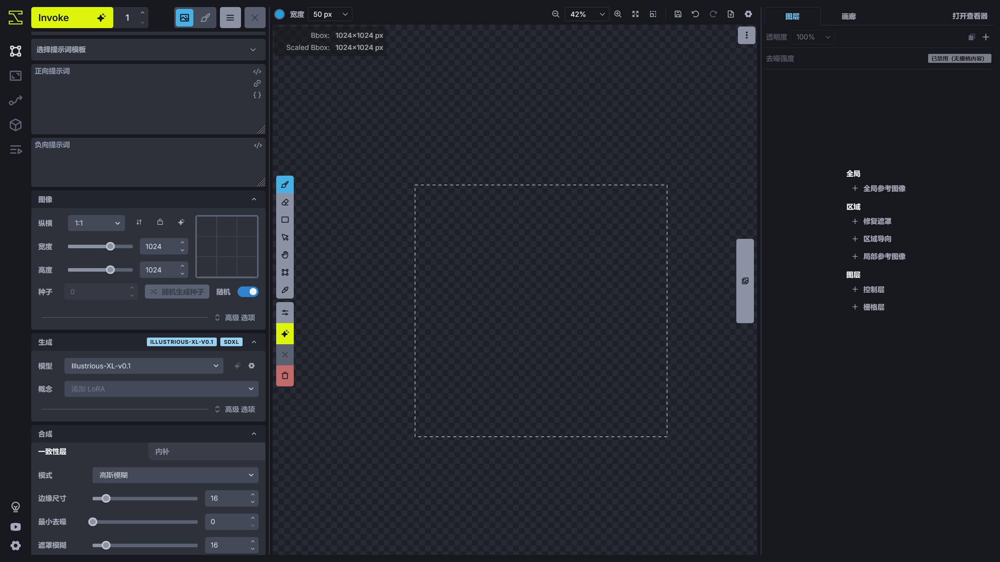

# 界面
在介绍 InvokeAI 的界面前，先调整界面的语言。

在 InvokeAI 界面的左下角点击齿轮图标打开 InvokeAI 设置，在 **User Interface -> Language** 选项选择**简体中文**后 InvokeAI 的界面将切换成中文。

InvokeAI 的界面中有许多功能使用按钮进行代替，可以将鼠标移到按钮上面，InvokeAI 将自动显示按钮对应的功能名称。

下面介绍 InvokeAI 的界面。

!!!note
    可以利用浏览器的全屏功能使 InvokeAI 的界面最大化以获得最佳体验，按下键盘的 F12 键将进入浏览器的全屏模式，再次按下 F12 键将退出全屏。

## 统一画布
InvokeAI 的核心功能，也是 InvokeAI 最有特色的功能。统一画布将文生图、图生图、画布，ControlNet、IP Adapter、分区提示词结合起来，使创作变得简单。

在统一画布的左侧为图片生成参数的调整，如提示词、模型、采样器等。

中间部分为画布，可以在上面进行图片创作，在画布的边缘为画布的工具栏，可以调整画笔的颜色，移动画布内容等。

右侧为统一画布的控制层，提供 ControlNet、IP Adapter、分区提示词的设置，还有图库浏览器，用于查看保存下来的图片。

## 图片放大功能
InvokeAI 提供简便的图片放大功能，基于 Tiled Diffusion 和 ControlNet Tile 实现放大图片。

## 工作流系统
InvokeAI 还提供类似 ComfyUI 的工作流系统，部分无法在统一画布中实现的功能可以通过工作流来实现。

## 模型管理器
模型管理器可以管理 InvokeAI 中已有的模型，也可以用于下载模型或者添加模型到 InvokeAI 中，还可以调整模型的配置。

## 队列系统
这里显示 InvokeAI 执行图片生成或者其他操作的信息。

