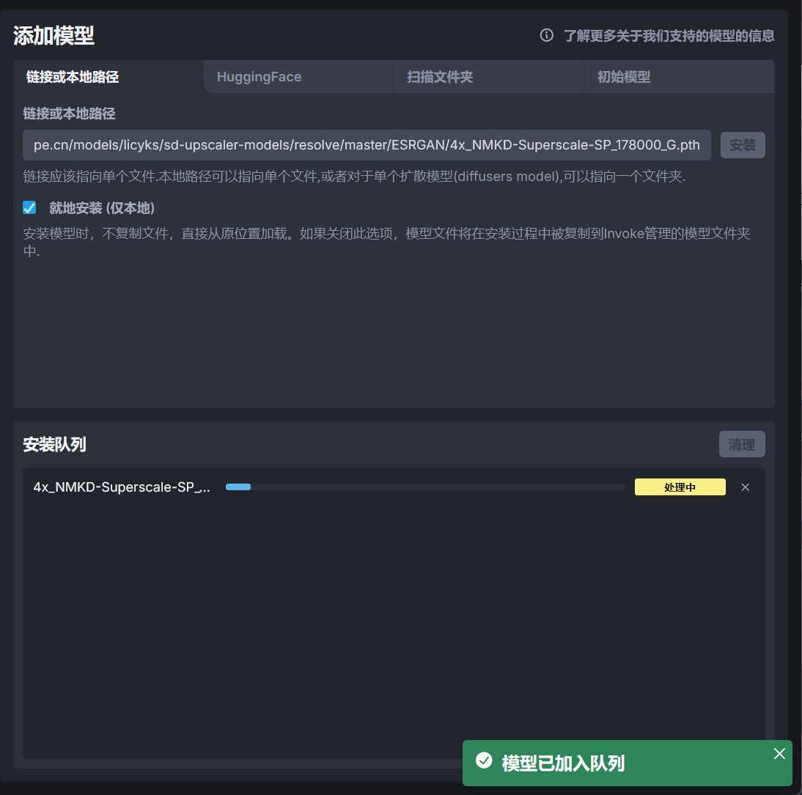

# 模型管理
InvokeAI 提供模型管理器用于管理 InvokeAI 的模型，下面介绍模型管理器中不同的功能和使用方法。

!!!note
    在之后的章节中可能会用到以下模型：  
    [Illustrious-XL-v0.1.safetensors](https://modelscope.cn/models/licyks/sd-model/resolve/master/sdxl_1.0/Illustrious-XL-v0.1.safetensors)[(Civitai)](https://civitai.com/models/795765?modelVersionId=889818)  
    [nai1-artist_all_in_one_merge.safetensors](https://modelscope.cn/models/licyks/sd-model/resolve/master/sd_1.5/nai1-artist_all_in_one_merge.safetensors)[(Civitai)](https://civitai.com/models/964916/artist-all-in-one-for-novelai-1)  
    [ill-xl-01-asagi_0398_1-000036.safetensors](https://modelscope.cn/models/licyks/sd-lora/resolve/master/sdxl/style/ill-xl-01-asagi_0398_1-000036.safetensors)[(Civitai)](https://civitai.com/models/629526/artist-style)  
    [ill-xl-01-Blue_Archive_Official_3-000036.safetensors](https://modelscope.cn/models/licyks/sd-lora/resolve/master/sdxl/style/ill-xl-01-Blue_Archive_Official_3-000036.safetensors)[(Civitai)](https://civitai.com/models/642656/style-blue-archive-flat-color)  
    [ill-xl-01-rurudo_2-000032.safetensors](https://modelscope.cn/models/licyks/sd-lora/resolve/master/sdxl/style/ill-xl-01-rurudo_2-000032.safetensors)[(Civitai)](https://civitai.com/models/624428/artist-style-rurudo)  
    [ill-xl-01-tyomimas_1-000032.safetensors](https://modelscope.cn/models/licyks/sd-lora/resolve/master/sdxl/style/ill-xl-01-tyomimas_1-000032.safetensors)[(Civitai)](https://civitai.com/models/626902/artist-style)  
    [4x_NMKD-Superscale-SP_178000_G.pth](https://modelscope.cn/models/licyks/sd-upscaler-models/resolve/master/ESRGAN/4x_NMKD-Superscale-SP_178000_G.pth)[(ESRGAN |N00MKRAD)](https://nmkd.de/?esrgan)  
    [licyk/lora_for_invokeai](https://huggingface.co/licyk/lora_for_invokeai)  
    在阅读完本篇关于模型管理的介绍后，请尝试将这些模型添加到 InvokeAI 中。

## 模型列表
在模型管理器的左侧列出已经添加到 InvokeAI 中的模型，并且使用不同的版本标签和类型标签进行分类。

## 模型信息
在模型列表里选中其中一个模型后将展示该模型的信息，

## 模型配置
模型信息下方可以设置使用该模型时使用的默认设置，设置后可以在统一画布和放大功能中通过一个按钮应用该模型的默认设置。

右上角的**🧨转换**按钮可以将 checkpoint 格式的模型转换为 diffusers 格式的模型，因为 InvokeAI 的推理后端基于 diffusers，支持使用 diffusers 格式的模型。在早期的 InvokeAI 的版本，直接使用 checkpoint 格式的模型将会被 InvokeAI 自动转换为 diffusers 格式的模型，但是到 InvokeAI 5.0 之后的版本，InvokeAI 支持直接使用 checkpoint 格式的模型，所以没有必要将 checkpoint 格式的模型转换为 diffusers 格式的模型。

**编辑**按钮可以编辑模型的配置。部分模型需要修改模型配置才能正常使用，比如 [NoobAI-XL](https://civitai.com/models/833294/noobai-xl-nai-xl) 模型的 V 预测版本，需要将模型的预测类型修改为 v_prediction。

## 添加模型
如果需要添加模型，在模型列表的右上角点击**添加模型**即可进入模型添加功能中。

在**链接或本地路径**选项支持使用模型的下载链接或者模型的本地路径添加模型到 InvokeAI 中，如果使用链接下载模型，请确保模型的下载链接为直链。

**HuggingFace**选项可以从 HuggingFace 仓库中下载模型，填写 HuggingFace 仓库 ID 后点击安装仓库即可安装仓库中的模型。

比如一个模型的 HuggingFace 仓库的地址为 https://huggingface.co/licyk/sd-lora，则该仓库的 ID 为`licyk/sd-lora`，填写 ID 并点击**安装仓库**即可安装该仓库中的模型。因为该仓库中包含多个模型，所以 InvokeAI 不会直接安装该仓库中所有的模型，而是在**可用模型**中展示仓库中的模型，点击 **+** 号可以安装该仓库中其中一个模型。

如果在本地安装了 Stable Diffusion WebUI、ComfyUI 或者其他基于 Stable Diffusion 的 WebUI，可以使用**扫描文件夹**功能从这些 WebUI 的模型文件夹添加模型。

比如我的 Stable Diffusion WebUI 的模型路径在`E:\Softwares\stable-diffusion-webui\models`，将该路径填写到**本地文件夹路径**后点击**扫描文件夹**可以将该路径中所有模型扫描出来，再根据自己的需求添加模型到 InvokeAI 中。

在**初始模型**选项包含了一些常用的模型，比如大模型、放大模型、ControlNet 模型、IP Adapter 模型等，根据自己的需求下载即可。

