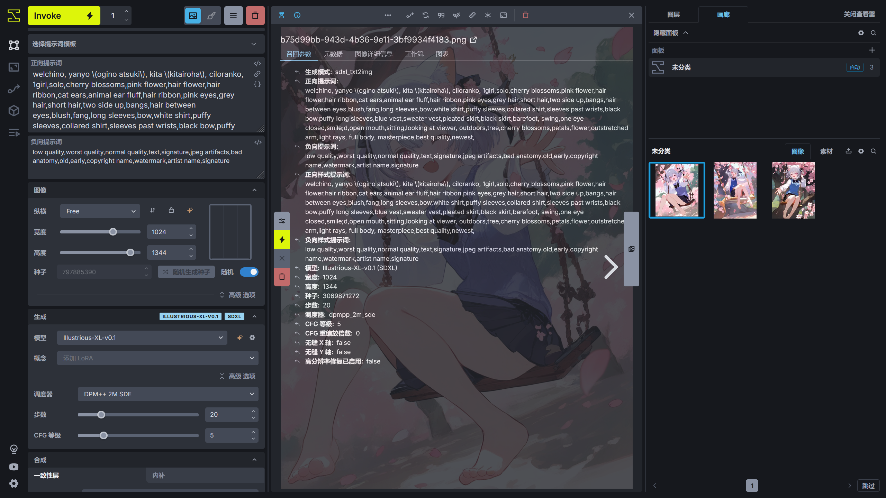
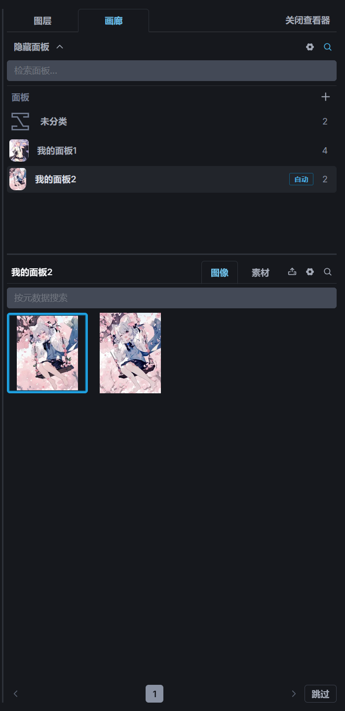

# 文生图
在了解 InvokeAI 的模型管理器并添加模型后，下面就介绍如何在 InvokeAI 中生成图片。

!!!note
    在 InvokeAI 的设置中，建议勾选**用户界面**选项中的**启用信息弹窗**，启用后将鼠标移动到某个参数上时 InvokeAI 将显示该参数的作用。如果需要详细的生成进度显示，可以启用**显示进度详情**。


## 快捷键
InvokeAI 为了方便操作，支持使用快捷键打开某些功能，在 InvokeAI 左下角的设置选项可以看到**快捷键**，打开后可以查看 InvokeAI 的快捷键对应的功能。


## 提示词
正向提示词填写想要 AI 生成的内容，并且尽量详细，使 AI 生成的图片更加准确，下面是一段完整描述画面的提示词。

```
welchino, yanyo \(ogino atsuki\), kita \(kitairoha\), ciloranko,
1girl,solo,cherry blossoms,pink flower,hair flower,hair ribbon,cat ears,animal ear fluff,hair ribbon,pink eyes,grey hair,short hair,two side up,bangs,hair between eyes,blush,fang,long sleeves,bow,white shirt,puffy sleeves,collared shirt,sleeves past wrists,black bow,puffy long sleeves,blue vest,sweater vest,pleated skirt,black skirt,barefoot,
swing,one eye closed,smile;d,open mouth,sitting,looking at viewer,
outdoors,tree,cherry blossoms,petals,flower,outstretched arm,light rays,
full body,
masterpiece,best quality,newest,
```

第一行为画师串，用于调整画风，画师串是否生效由模型决定。第二行描写了人物的特征，第三行描写人物的动作，第四行描写的环境，第五行描写了镜头，最后一行为质量提示词。通常这样详细的提示词描述可以让出图效果更好。

负面提示词描写不想让 AI 画出来的东西，下面是比较通用的负面提示词，在大部分情况下都可以使用。如果有其他不想让 AI 画出来的东西，可以在这段负面提示词的基础上进行修改。

```
low quality,worst quality,normal quality,text,signature,jpeg artifacts,bad anatomy,old,early,copyright name,watermark,artist name,signature
```


## 高级提示词使用
如果需要让某个提示词的影响效果增强或者降低提示词的影响效果，可以调整提示词权重，下面是一段例子。

```
flower sea, tree++, river-,
```

**\+ / -** 符号可以增加 / 减少提示词的权重，每加一个**+**号将为提示词的权重乘以 1.1，每加一个**-**号将为提示词的权重除以 0.9。

则上面的提示词中`flower sea`的权重为 1.0，`tree`的权重为 1.21，`river`的权重为 0.9。

使用符号调整提示词权重并不直观，所以可以使用数字设置提示词的权重，则上面的提示词可以修改为下面的形式。

```
flower sea, (tree)1.21, (river)0.9,
```

如果想要将某部分的提示词含义混合在一起，可以使用提示词混合功能，下面是一段使用提示词混合的提示词。

```
("landscape painting, trees++", "sunset scene, warm tones++").blend(1,1)
```

上面的提示词将会使`landscape painting`以`trees`为主，`sunset scene`以`warm tones`为主，两个部分提示词的影响效果相同。


## 生成参数
**纵横**可以选择预设的宽高比，**宽度**和**高度**设置生成图片的分辨率，通常根据模型适合生成的分辨率进行设置，这里使用的模型是 Illustrious-XL-v0.1，属于 Stable Diffusion XL 模型，适合的分辨率为 1024 x 1024，使用接近该分辨率或者比这个分辨率大一些的分辨率通常会有比较好的效果，比如使用 1024 x 1344 的分辨率。

**种子**设置初始的噪声形状，通常保持随机即可。当种子相同时，并且其他参数相同时，每次生成的图片将相同。

**模型**设置使用的大模型，这里选择前面下载的 Illustrious-XL-v0.1，**概念**设置要使用的 LoRA 模型，这里先跳过该选项。

点开**生成**选项的**高级选项**可以看到**调度器**、**步数**、**CFG 等级**设置。InvokeAI 和 Stable Diffusion WebUI、ComfyUI 有些区别，在 InvokeAI 中采样器选项和调度器选项是合为一起的。

不同的**调度器**需要不同的**步数**，并且出图的效果也有一些差别，可自行测试。这里使用 DPM++ 2M SDE，步数设置为 20。

**CFG 等级**控制图像和提示词的匹配程度。这个值越高，出图更接近提示词（不同的模型效果不同），过高的值可能会导致出图的质量下降，不同的模型需要不同的提示词引导系数，需要自行测试。Illustrious-XL-v0.1 模型设置 **CFG 等级**为 5 即可。

在**高级**选项中可以设置 **VAE**，通常该选项选择**默认 VAE** 即可，即使用大模型自带的 VAE。**VAE 精度**建议设置为 **FP16**降低 VAE 阶段显存的消耗，在 VAE 阶段出现 NaN 的情况下再尝试使用 **FP32**。

**CFG 重缩放倍数**适用于使用零终端信噪比训练的模型，通常保持默认即可。

**无缝平铺 X / Y 轴**通常不需要使用。


## 生成


左上角为 InvokeAI 的生成选项，点击 **Invoke** 按钮可以进行图片生成，如果该按钮为灰色，可以将鼠标移到按钮上，InvokeAI 将展示哪些参数不满足生成的要求并根据提示进行修改。如果需要生成多张图片，可以多次点击 **Invoke** 按钮。

**Invoke** 按钮旁边的数字用于设置**迭代数**，也就是生成图片的数量。

**迭代数**右边的选项设置生成结束后图片保存的位置，可选择**发送到图库**或者**发送到画布**，这里就选择**发送到图库**。

如果想要取消当前生成图片的任务，点击**取消当前项目**即可。


## 查看生成结果
在前面选择了**发送到图库**，所以查看生成的进度需要在查看器中查看，点击右上角的**打开查看器**将从画布切换到查看器。

点击**画廊**可以查看保存下来的图片。


## 图片信息查看
如果需要查看 InvokeAI 生成的图片的参数时，点击查看器上方的**信息**按钮或者按下 I 键可以查看图片的生成信息。



在不同信息的左侧有个箭头，点击后可以将图片的参数发送到左侧对应的图片生成参数选项中。


## 画廊
画廊可以查看 InvokeAI 保存的图片，如果需要对比画廊中的两张图片的差别时，可以在画廊中选中一张图片，并按住 Alt 键，选择另一张图片，此时将打开图片对比功能。


画廊支持对图片进行分类，当图片数量过多时，可以创建不同的分类对图片进行分类存放，点击面板选项里的**+**号可以创建新的分类，将鼠标移动到分类面板的名称上将显示一个按钮用于修改名称。

创建分类面板后，用鼠标拖动分类面板下的图片可以将图片移动到另一个分类面板中。

||||
|---|---|---|

画廊还支持搜索图片，点击图片列表右上角的🔍︎按钮，输入关键词并回车后即可进行搜索，搜索功能将根据关键词查找图片中的元数据是否有匹配关键词的并展示出来。

|||
|---|---|

!!!note
    图片的元数据可在查看器中查看，点击 InvokeAI 右上角的**打开查看器**后，在画廊中选择一张图片，再按下 I 键打开图片信息，选择**元数据**即可查看图片的元数据。元数据包含图片的生成参数，如提示词，分辨率等。

画廊还支持导入图片素材用于创作，点击画廊中的📤︎按钮可以打开系统的文件管理器上传图片，或者将图片从系统的文件管理器拖动一张图片到 InvokeAI 的界面中，图片将自动添加到素材中。


