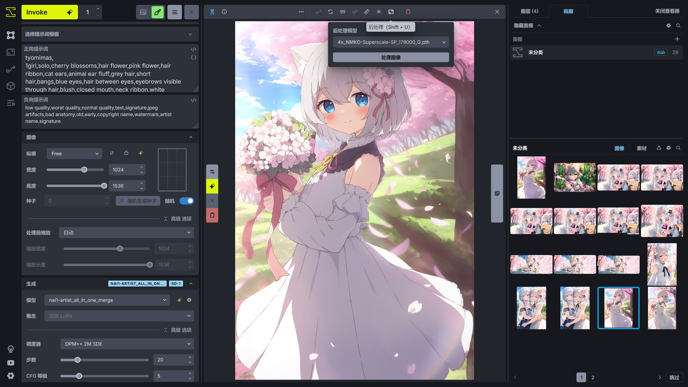
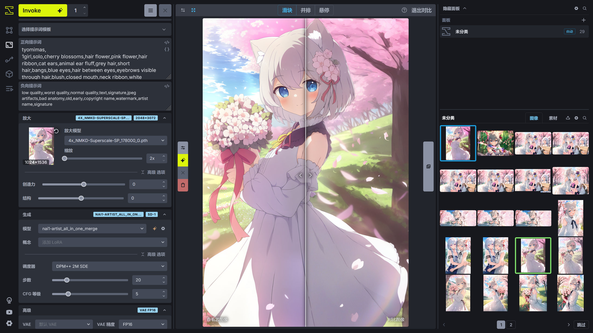

# 放大
InvokeAI 提供了两种放大功能用于图像放大，可以将**画廊**中的图片进行放大，下面简单介绍放大功能的使用。

## 后处理放大
在右上角打开 InvokeAI 的查看器后，可以查看**画廊**中的图片，选择其中一张图片后，在查看器顶部的工具栏可以选择**后处理**进行放大，该功能使用 GAN 模型对图片进行简单放大，但是图片的细节可能不会得到比较好的提升。

## 图片放大功能
InvokeAI 的图片放大功能提供了专门用于放大图片的功能，可通过 InvokeAI 的左侧栏进入。该放大功能基于 GAN + Tiled Diffusion + ControlNet Tile 进行放大，放大时先使用 GAN 模型提升图片的分辨率，再进行一次图生图，使用 Tiled Diffusion + ControlNet TIle 对图片进行重采样，提升图片的细节。

**放大模型**用于选择要使用的 GAN 模型。

**创造力**控制向图片添加的细节量。值越高，添加到画面的细节越多，但提示词对画面的影响越大。该参数实际上控制的是图生图中的**去噪强度**。

**结构**用于控制原图的一致性，保证放大后图片原有的画面结构不被改变。值越高，保持一致性的效果越强。该参数实际上控制的是 ControlNet Tile 的**控制强度**。

通常使用默认的参数就有不错的放大效果，可以根据自己的需求调整放大参数。

图片放大完成后，可以在画廊中选择原来的图片，再按住 Alt 键，选择另一张图片，此时将打开查看器的图片对比模式。

