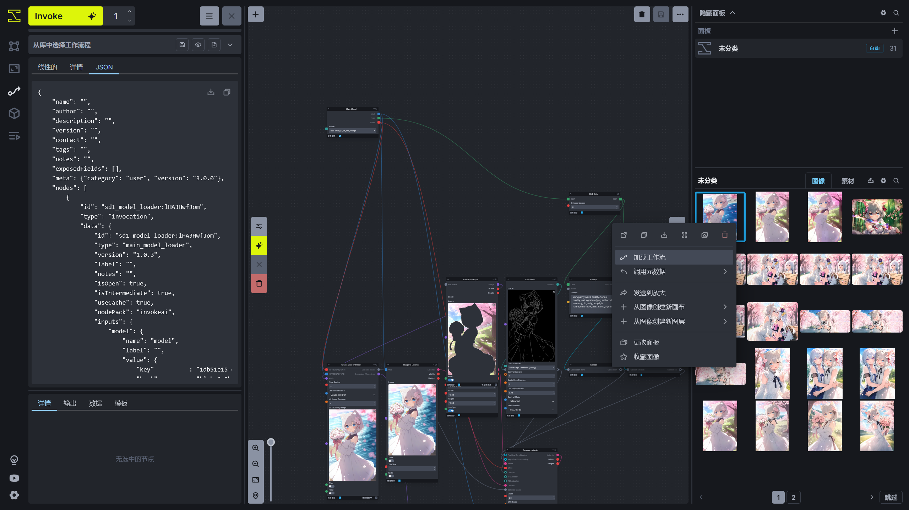
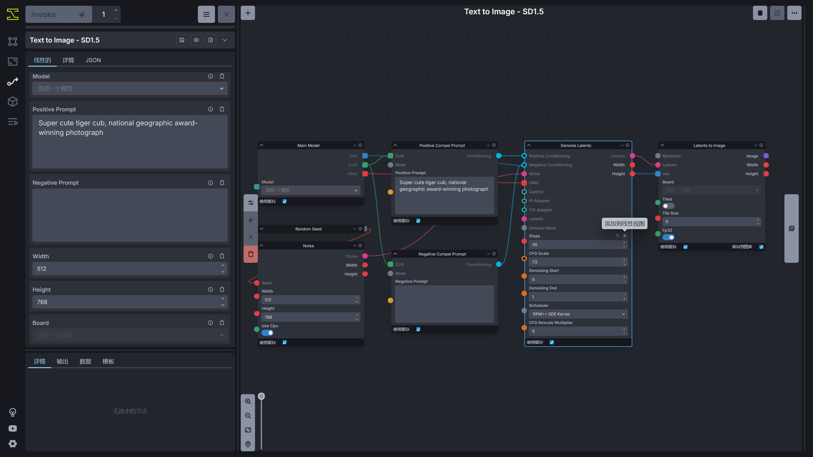

# 工作流
InvokeAI 除了提供统一画布进行图片创作，还提供了类似 ComfyUI 的工作流系统进行图片创作。

InvokeAI 的节点和 ComfyUI 的节点有一些差别，如果需要找到 ComfyUI 节点在 InvokeAI 中对应哪个节点，可在该文档中查看：[ComfyUI to InvokeAI - Invoke](https://invoke-ai.github.io/InvokeAI/nodes/comfyToInvoke)。


## 扩展节点
InvokeAI 允许为 InvokeAI 安装自定义节点扩充工作流系统的节点库。

在启动 InvokeAI 时可以看到下面的加载信息。

```
[2024-12-18 17:07:05,693]::[InvokeAI]::INFO --> Patchmatch initialized
[2024-12-18 17:07:06,629]::[InvokeAI]::INFO --> Using torch device: NVIDIA GeForce RTX 4060 Laptop GPU
[2024-12-18 17:07:08,136]::[InvokeAI]::INFO --> cuDNN version: 90100
[2024-12-18 17:07:08,219]::[uvicorn.error]::INFO --> Started server process [7840]
[2024-12-18 17:07:08,219]::[uvicorn.error]::INFO --> Waiting for application startup.
[2024-12-18 17:07:08,219]::[InvokeAI]::INFO --> InvokeAI version 5.4.3
[2024-12-18 17:07:08,219]::[InvokeAI]::INFO --> Root directory = E:\Softwares\InvokeAI\invokeai
[2024-12-18 17:07:08,226]::[InvokeAI]::INFO --> Initializing database at E:\Softwares\InvokeAI\invokeai\databases\invokeai.db
[2024-12-18 17:07:08,541]::[InvokeAI]::INFO --> Pruned 3 finished queue items
[2024-12-18 17:07:10,401]::[InvokeAI]::INFO --> Cleaned database (freed 0.12MB)
[2024-12-18 17:07:10,401]::[uvicorn.error]::INFO --> Application startup complete.
[2024-12-18 17:07:10,401]::[uvicorn.error]::INFO --> Uvicorn running on http://0.0.0.0:9090 (Press CTRL+C to quit)
```

在这个信息中可以看到`Root directory`，这时 InvokeAI 的数据目录，此时为`E:\Softwares\InvokeAI\invokeai`，则 InvokeAI 的扩展节点需要安装在`E:\Softwares\InvokeAI\invokeai\nodes`。

此时可以打开终端，输入命令进入这个目录。

```
cd E:\Softwares\InvokeAI\invokeai\nodes
```

此时就可以通过 Git 命令安装扩展，比如安装 [licyk/invoke_tipo](https://github.com/licyk/invoke_tipo) 扩展，则运行 Git 命令将扩展下载到扩展目录中。

```
git clone https://github.com/licyk/invoke_tipo
```

下载成功后就可以在 InvokeAI 的工作流节点库看到安装的扩展提供的节点了。

InvokeAI 官方文档收录的一部分的扩展：[Community Nodes - Invoke](https://invoke-ai.github.io/InvokeAI/nodes/communityNodes)

作者自己写的 InvokeAI 扩展：

- [licyk/invoke_tipo](https://github.com/licyk/invoke_tipo)
- [licyk/invoke_wd14_tagger](https://github.com/licyk/invoke_wd14_tagger)

其他 InvokeAI 扩展可在 [Github](https://github.com)，[Google](https://www.google.com) 中进行搜索。


## 基础工作流
在工作流界面中，点击左上角工作流的标题栏可以看到自己保存的工作流和 InvokeAI 官方提供的实例工作流，点击其中一个可以打开工作流。


## 将图片转换为工作流
使用统一画布生成的图片（并且保存图片的模型选择为**发送到图库**）还有使用放大功能生成的图片支持转换为工作流。

打开**画廊**后，右键图片可以看到**加载工作流**的按钮，点击后将自动读取图片中的信息加载工作流。




## 设置线性视图
如果工作流中某些参数经常需要调整，可以将参数添加到**线性视图**中，在参数的右上角点击 **+** 号即可添加。




## 导入工作流
在 InvokeAI 工作流界面的右上角点击菜单按钮，选择**从文件加载**可以导入工作流。


## 其他工作流
InvokeAI 官方视频不定期分享一些工作流，可自行查看：[Invoke - YouTube](https://www.youtube.com/@invokeai)。
