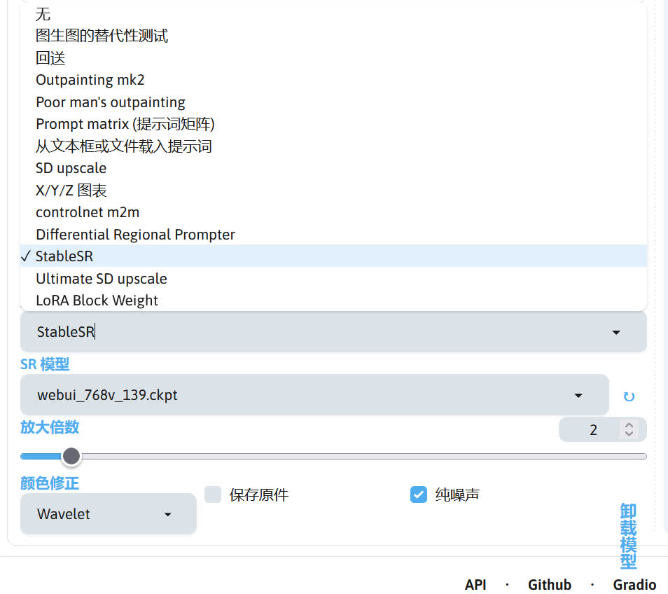

## StableSR 放大
sd-webui-stablesr 扩展提供的 StableSR 放大方法也可以提供不错的放大效果，使用前需要下载相关模型。

|模型|放置路径|
|---|---|
|[v2-1_768-ema-pruned](https://modelscope.cn/api/v1/models/licyks/sd-model/repo?Revision=master&FilePath=sd_2.1%2Fv2-1_768-ema-pruned.safetensors)|stable-diffusion-webui/models/Stable-diffusion|
|[webui_768v_139](https://modelscope.cn/api/v1/models/licyks/sd-extensions-model/repo?Revision=master&FilePath=sd-webui-stablesr%2Fwebui_768v_139.ckpt)|stable-diffusion-webui/extensions/sd-webui-stablesr/models|

!!!note
    sd-webui-stablesr 扩展：https://github.com/pkuliyi2015/sd-webui-stablesr

使用时需要在 SD WebUI 界面的左上角将 Stable Diffusion 模型切换成 v2-1_768-ema-pruned 模型，接下来将重绘幅度调至 0.2~0.4之间的值（推荐 0.4），翻到 SD WebUI 界面的最下面，在脚本选项选择 StableSR，SR 模型选择 webui-768v_139，再设置放大倍数，这时候点击生成就可以进行图片放大了。

