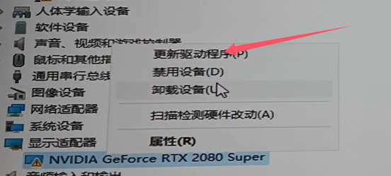
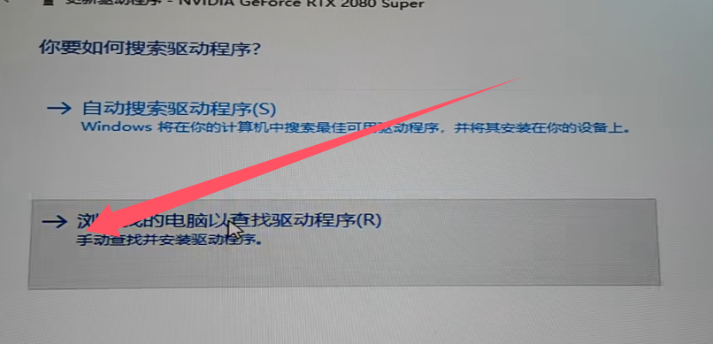

# 起步配置推荐
!!!note
	推荐的硬件要求并非 SD WebUI 能够运行的实际下限，但越低的硬件环境下使用体验越糟糕，这里列举的起步配置为能够比较舒服的使用 SD WebUI 软件时的 系统 / 硬件 要求。

## Windows 系统版本
最低 Windows 10 专业版。

## 内存
最低 16 GB，建议 32 GB 及以上。

!!!note
	越少的物理内存需要设定越多的虚拟内存来维持 SD WebUI 软件运行。

## 储存
最低 64 GB。

!!!note
    1. 建议使用 固态硬盘 作为存储介质，即便只是 QLC 的 SATA 固态硬盘，因为 SD WebUI 程序本体为大量零碎文件，在启动时十分考验硬盘的iops，使用 机械硬盘 在程序启动时需要更长的等待时间，如果您的 固态硬盘 容量比较紧张，可以考虑将 SD WebUI 程序本体放置在 固态硬盘 内，模型文件夹放置在 机械硬盘，然后模型文件夹通过系统 mklink（Windows环境）指令链接到 SD WebUI 程序文件夹内。
	2. 如果您准备购买 固态硬盘，则建议至少购买 TLC 颗粒的 固态硬盘（ SATA / M.2 不限）。

## 显卡

### 显卡选择
个人建议选择显卡核心的优先级：Nvidia > AMD ≈ Intel

### Nvidia 显卡
最低20系起步，如果您准备购买显卡，建议30系起步.

### AMD 显卡
建议 **能使用 ZLUDA** 的显卡(新发布版显卡)，如果您准备购买显卡，并不推荐 AMD 核心的显卡。

### Intel 显卡
Intel Arc A770，如果您准备购买显卡，并不推荐 Intel 核心的显卡。

### 魔改 Nvidia 显卡
需求：新版驱动，压缩软件，驱动卸载软件 Display Driver Uninstaller

官网驱动下载地址: https://www.nvidia.cn/geforce/drivers/

1.选择对应的产品系列，产品然后下载驱动安装程序，在下载完后右键解压 exe 文件到一个文件夹中。

2.启动驱动卸载软件，卸载驱动并重启电脑后右键此电脑，选择管理然后选择设备管理器点击显示设备。

3.右键点击更新驱动程序

4.点击浏览我的电脑以查找驱动程序

5.点击让我从计算机上可用驱动程序列表表中选取

6.点击从磁盘安装

7.点击浏览

8.进入你解压的驱动文件夹里面选择Display.Driver文件夹的第一个用.inf结尾的文件

9.去掉检查兼容硬件

10.在型号里面寻找并安装 NVIDIA GeFoRce GTX 1660 忽略警告并安装（所有显卡都先进行这一步）

11.安装成功后，重复 3~9 步骤然后按照自己显卡的对应版本安装对应型号，名称相同的最上面的为最新。

<!-- TODO: 图片需要更换 -->

### 显存要求
Nvidia：最低 8 GB，建议 12 GB 及以上。
AMD / Intel：最低 12 GB，建议 16 GB 及以上。

!!!note
	如果您主要使用 SDXL 模型，Nvidia 建议 12 GB 起步，AMD / Intel 建议 16 GB 起步。

### 显卡驱动
建议使用最新的显卡驱动，以下为不同显卡的公版驱动下载地址。

- Nvidia：https://www.nvidia.cn/geforce/drivers
- AMD：https://www.amd.com/zh-hans/support
- Intel：https://www.intel.cn/content/www/cn/zh/download-center

!!!note
	笔记本电脑用户并不建议从笔记本电脑品牌官网下载显卡驱动，除非笔记本电脑品牌发布的显卡驱动包含了公版驱动没有但又对电脑使用很有影响的功能。

## 网络
涉及到的部分网站在国内的访问性不佳，建议自备加速工具，如 [Watt Toolkit](https://steampp.net/)。