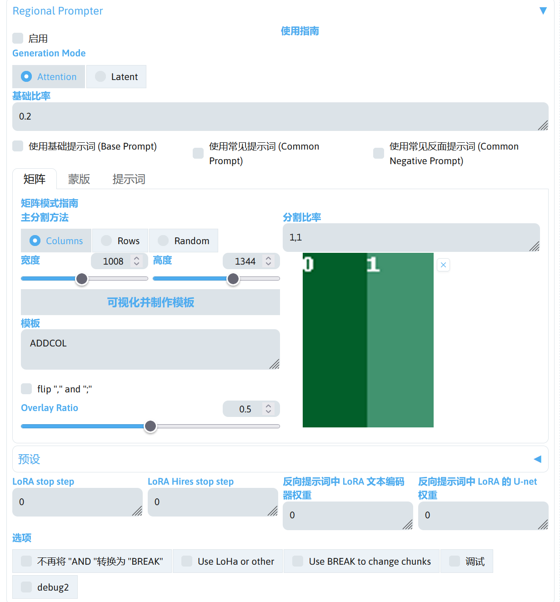
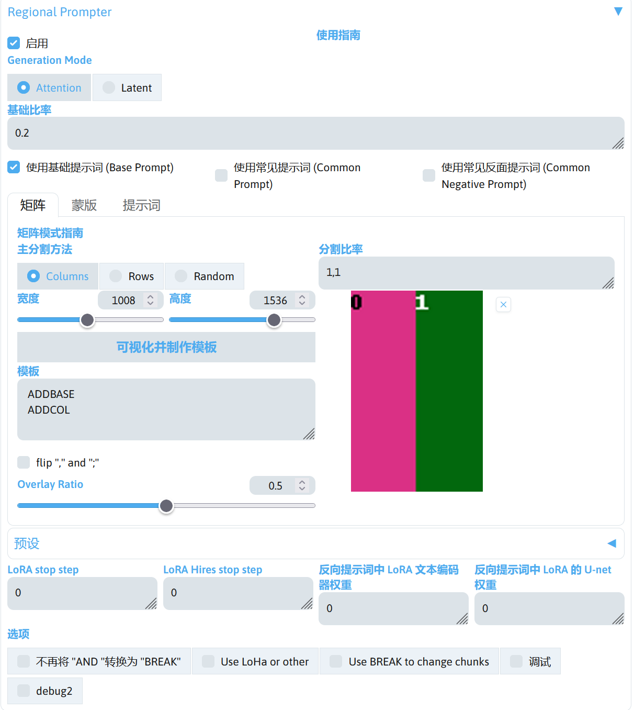
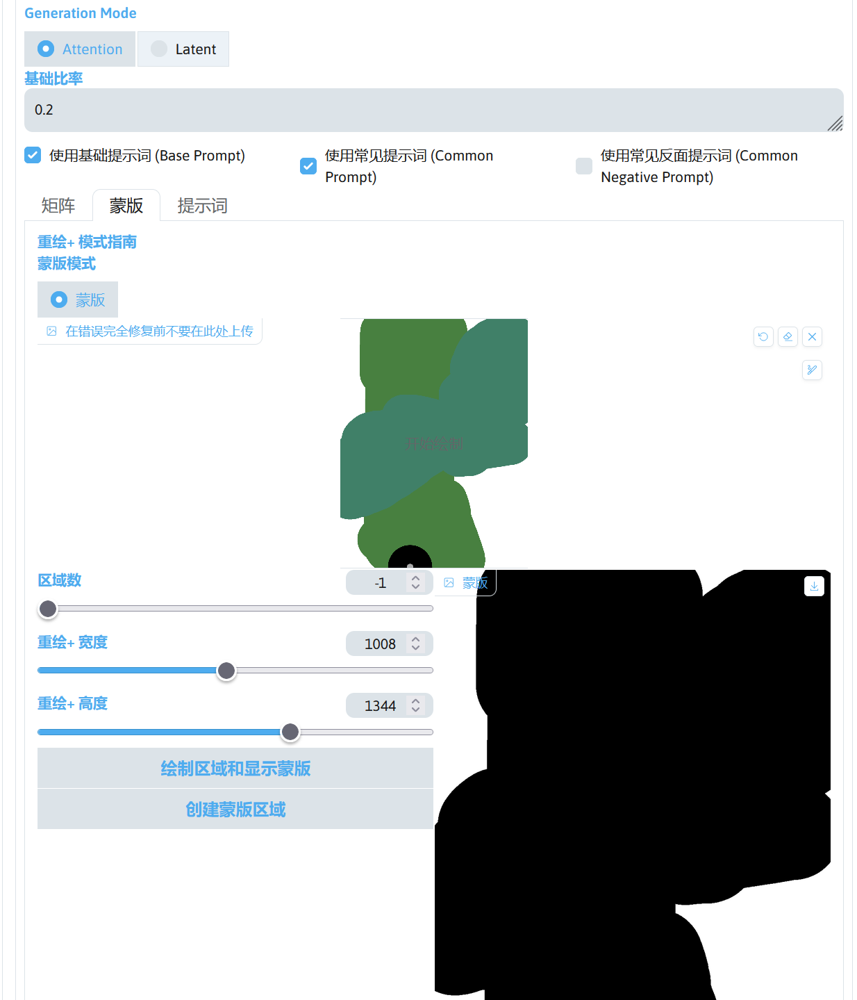
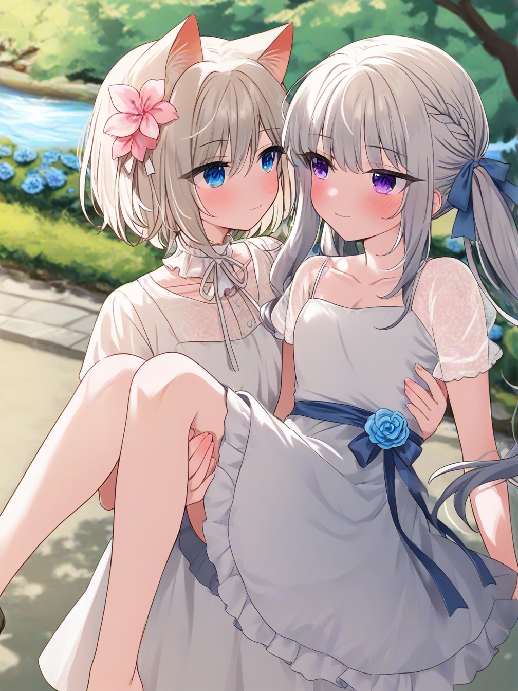

# 提示词高级用法

在 SD WebUI 中，不仅可以用简单句子或者单词来写提示词，也可以用高级的提示词用法来写提示词，实现不同的效果。


## 符号权重
`( )`英文的括号为加权，`[ ]`为减权重。`( )`的用法是指如果一个提示词在画面中的占比过少，或影响过低，或者干脆没出现那么可以通过加权解决但是有部分情况无法通过加权来解决。`[ ]`为减权，和加权相反可以减少在画面中的影响或占比。

`(提示词)`是将提示词的权重增加 1.1 倍，`((提示词))`是将提示词的权重增加 1.1×1.1 倍（1.21 倍），`[提示词]`是将提示词的权重降低 1.1 倍。

除了`( ) [ ]`能影响权重以外还有就是提示词的顺序，Tag 越靠前权重会越大，这点无法通过加权来更改，还有就是部分提示词自带权重（收模型自身的影响），通常情况下场景的权重会大于人物，但是通常情况下人物的权重会大于场景。

这句话不是冲突，这里涉及到权重的另一个知识点，就是对一个物体的描述的提示词的数量，这个也会直接影响提示词的权重，比如我对人物的描写提示词大于场景太多，那么场景的权重就会过小，并且这个属性是可以影响先后顺序的权重。

总结就是提示词描写越细致权重越高。


## 数字权重
例如`(hanfu:1.2)`就是强化 hanfu 这个提示词再画面中的重要程度，背景和人物之间的配平也会用到数字权重但是最好不要超过 1.5。

我发现人物和背景之间的调平过程有点像和面：面多了加水，水多了加面直到调到合适为止，有条件的可以选择分布式可以轻松解决画面的调平问题当然这个轻松是相对的。

比如我一个画面运气好那么 2 小时就能调平，运气不好坐牢一天都是常有的事，例如`(场景:1.2)，(人物1.2)`，这个人物直接在 1girl 处调整即可，如果场景多了那么就下调场景的权重`(场景:1.1)`，人物占多了那么就要调整`(人物:1.1)`。


## 其他
反向提示词也和正向提示词的属性类似，越前面权重也会越重，正反提示词顺序的权重值均受到提示词引导系数影响。

提示词是讲究逻辑的，比如要先有女孩才能有皮肤的描述，有了皮肤的描述才能有身材的描述，以此类推这种方法写出来的提示词稳定而且好看。

写提示词的一些小习惯，把一类东西放到一起后用行来隔开，如

```
hair, silver long hair, hair bun, hair tie,
beautiful and delicate eyes, red eyes, bright eyes,
red Hanfu, red ribbons,
```

这种写法后期改提示词会非常方便。


## 特殊符号转义
这是一个例子：

```
1girl, klee \(genshin impact\), white background,
```

上述的提示词例子中可以看到`\`这个符号，这是将括号从功能符号转义为普通的符号，作为普通的提示词。

如果不使用转义符号，SD WebUI 将会把括号当做加权符号进行处理。

!!!note
    `klee \(genshin impact\)`这个提示词中，`genshin impact`是为了提示`klee`是属于`genshin impact`的。因为在 Danbooru 中的提示词标注中，`klee`这个提示词在很多游戏，IP 中出现，所以需要通过在提示词后面再加上`(其他标注)`对这类东西进去区分。


## 分步绘制
这是分步描绘的提示词写法。

- `[from:to:step]`from 和 to 都包含。
- `[from::step]`：to 为空。
- `[:to:step]`：from 为空。
- `[to:step]`：不推荐的写法。

这种提示词写法的作用是让提示词在达到 step 前视为 from，达到后视为 to，留空则为无对应元素。

在 SD WebUI 1.6.0 前后的版本，step 的效果有不同。

在 SD WebUI 1.6.0 之前，分布绘制的 step 在文生图阶段和高分辨率修复阶段效果相同，step 小于 1 时代表步数的占比，大于 2 时代表绝对步数。

在 SD WebUI 1.6.0 之后，分布绘制的 step 在文生图阶段和高分辨率修复阶段效果有了区别，step 在 0.0~1.0 的范围设置的是文生图的阶段的分布绘制， 在 1.0~2.0 的范围设置高分辨率修复阶段的分布绘制。

下面举个例子。

|提示词|1.6.0 之前的文生图|1.6.0 之前的高分辨率修复|1.6.0 之后的文生图|1.6.0 之后的高分辨率修复|
|---|---|---|---|---|
|[red:green:0.25]|25% 的迭代步数为`red`，75% 的迭代步数为`green`。|和前面相同|25% 的迭代步数为`red`，75% 的迭代步数为`green`。|`green`|
|[red:green:1.25]|第 1 步为`red`，其他步步骤为`green`。|和前面相同|`red`|25% 的迭代步数为`red`，75% 的迭代步数为`green`。|
|[red:green:5]|前 5 个步骤为`red`，其他步骤为`green`。|和前面相同|前 5 个步骤为`red`，其他步骤为`green`。|`green`|
|[red:green:5.0]|前 5 个步骤为`red`，其他步骤为`green`。|和前面相同|`red`|`red`|

!!!note
    有关分布绘制的更改说明：[Seed breaking changes - 1.6.0 2023-08-24 - prompt editing timeline has separate range for first pass and hires-fix pass · AUTOMATIC1111/stable-diffusion-webui Wiki](https://github.com/AUTOMATIC1111/stable-diffusion-webui/wiki/Seed-breaking-changes#160-2023-08-24---prompt-editing-timeline-has-separate-range-for-first-pass-and-hires-fix-pass)。


## 融合描绘
融合描绘的提示词写法：`[A | B]`  
在 SD WebUI 中，这种写法的作用是在第一步的时候画 A，第二步的时候画 B，第三步的时候画 A，以此循环往复的进行。


## 特殊提示词
在 SD WebUI 中，AND 提示词可以 AND 前面的提示词和 AND 后面的提示词融合效果更好。

而 BREAK 提示词将会打断 BREAK 前面的提示词和 BREAK 后面的提示词之间的关联，可以用于解决前面部分的提示词对后面部分的提示词污染。


## 其他提示词参考
更详细的提示词写法可阅读 [元素同典：确实不完全科学的魔导书](https://docs.qq.com/doc/DWFdSTHJtQWRzYk9k)。


## 使用 Region Prompter 扩展进行分区绘制
下面使用 sd-webui-regional-prompter 扩展进行分区绘制，这是 sd-webui-regional-prompter 扩展的界面。



简单介绍该扩展中的参数。


### Generation Mode
设置分区绘制的工作模式，可选择 Attention 或者 Latent 模式。

Attention 模式作用于模型的注意力上，在分区绘制上画面协调性更高，推荐使用。

Latent 模式通过分别绘制潜空间图像并重新合并，可以分离 LoRA 的效果，但画面协调性较差。


### 基础比率
设置分区提示词的权重，启用**使用基础提示词**时生效。例如设置为 0.2 时，生成图像的提示词为 **0.2 权重的基础提示词 + 0.8 权重的分区提示词**。

如果输入多个数字并使用逗号隔开则是分别设置权重。当分割比率为`1,1`，基础比率为`0.1,0.5,0.8`时，基础提示词权重为 0.1，两个分区的权重分别为 0.5 和 0.8。


### 提示词模式
使用分区提示词时可以设置提示词的模式，


#### 使用基础提示词
启用后，当设置的分区为 2 个时，提示词需要输入基础提示词和两个分区的提示词，使用 BREAK 分隔，即：

```
基础提示词
BREAK
分区提示词 1
BREAK
分区提示词 2
```

并根据基础比率设置基础提示词和分区提示词的权重。


#### 使用常见提示词
启用后，当设置的分区为 2 个时，提示词需要输入常见提示词和两个分区的提示词，使用 BREAK 分隔，即：

```
常见提示词
BREAK
分区提示词 1
BREAK
分区提示词 2
```

但常见提示词将会合并进行分区提示词中，最后的提示词结果将变成：

```
常见提示词, 分区提示词 1
BREAK
常见提示词, 分区提示词 2
```

!!!warning
    如果在常用提示词中写了调用 LoRA 的提示词，请将 LoRA 的权重降低。如果使用的 LoRA 权重为 1，分区有 2 个，则建议 LoRA 的权重为 0.5（原 LoRA 的权重除以分区数量），否则将会造成 LoRA 权重过大导致画面崩坏。


### 使用常见反面提示词
将常见提示词模式应用于反向提示词中，通常不需要使用。


### 主分割方法
对区域进行分割的方法，Columns 为按列分割，Rows 为按行分割，Random 为随机分割。


### 宽度 / 高度
设置可视化模板图片的宽度和高度，不影响出图效果，保持默认即可，


### 分割比率
设置区域分割的数量和比率大小，使用`,`进行分割，`;`分割符则和`,`的分割方向相反。

例如主分割方法为 Columns，则`,`按列分割，`,`按行分割。

数字的大小决定分割的比率大小。


### 模板
显示特殊提示词分隔符。


### flip "," and ";"
交换`,`和`;`符号的作用，通常不需要使用。


### Overlay Ratio
设置不同分区之间的重叠比率，如果想要保持不同分区之间的重叠较低，保持更高的独立性，则降低该值。

### 蒙版模式
和矩阵模式不同，蒙版模式可以使用画笔绘制分区，自由度更高。

宽度和高度设置为出图使用的宽度和高度后，点击创建蒙版区域，此时将生成蒙版区域用于绘制蒙版。

使用画笔绘制一个区域后，点击**绘制区域和显示蒙版**即可保存绘制的区域，此时再使用画笔绘制另一个区域，再点击**绘制区域和显示蒙版**，通过该方式可以创建多个区域。

### 分区绘制应用
下面使用一些例子演示分区绘制如何使用。为了下面所使用的 LoRA 模型能达到最好效果，Stable Diffusion 模型选择的是 Illustrious-XL v0.1。

!!!note
    Illustrious-XL v0.1 下载：[Illustrious-XL-v0.1.safetensors](https://modelscope.cn/models/licyks/sd-model/resolve/master/sdxl_1.0/Illustrious-XL-v0.1.safetensors)[(Civitai)](https://civitai.com/models/795765?modelVersionId=889818)，

启用 Region Prompter 后，Generation Mode 选择 Attention 模式，勾选**使用常见提示词**，其他参数使用 Region Prompter 扩展的默认值，此时点击**可视化并制作模板**查看分区的情况。

，模型下载好后放在`stable-diffusion-webui/models/Stable-diffusion`路径中。

使用的提示词如下：

```
2girls,eye contact,affectionate,kiss,
masterpiece,best quality,newest,<lora:ill-xl-01-lanubis_2:0.6>,
BREAK
cherry blossoms,hair flower,pink flower,hair ribbon,cat ears,animal ear fluff,grey hair,short hair,bangs,blue eyes,hair between eyes,eyebrows visible through hair,blush,white shirt,white sailor collar,red bow,pink cardigan,very long sleeves,red bowtie,light blue skirt,pleated skirt,flat chest,white thighhighs,
light smile,standing,
blue background,
BREAK
cute,ahoge,silver hair,blue hair,gradient hair,sidelocks,single drill,side ponytail,straight hair,blue scrunchie,hair ornament,scrunchie,purple eyes,collared shirt,white shirt,blue cardigan,blue sweater,blue jacket,black jacket,open jacket,long sleeves,sleeves past wrists,pleated skirt,black skirt,
open mouth,smile,standing,
pink background,
```

!!!note
    提示词中的 Artist Style: LanuBis LoRA 模型：[ill-xl-01-lanubis_2-000036.safetensors](https://modelscope.cn/models/licyks/sd-lora/resolve/master/sdxl/style/ill-xl-01-lanubis_2-000036.safetensors)[(Civitai)](https://civitai.com/models/786440/artist-style-lanubis)，模型下载好后放在`stable-diffusion-webui/models/Lora`路径中。

生成的图片效果如下：


现在把**使用常见提示词**取消勾选，勾选**使用基本提示词**。



再修改一下提示词。

```
2girls,yuri,forehead-to-forehead,heads together,interlocked fingers,eye contact,hands up,
masterpiece,best quality,newest,<lora:ill-xl-01-lanubis_2:1>,
BREAK
cherry blossoms,hair flower,pink flower,hair ribbon,cat ears,animal ear fluff,grey hair,short hair,bangs,blue eyes,hair between eyes,eyebrows visible through hair,blush,white shirt,white sailor collar,red bow,pink cardigan,very long sleeves,red bowtie,light blue skirt,pleated skirt,flat chest,white thighhighs,
light smile,standing,
blue background,
BREAK
cute,ahoge,silver hair,blue hair,gradient hair,sidelocks,single drill,side ponytail,straight hair,blue scrunchie,hair ornament,scrunchie,purple eyes,collared shirt,white shirt,blue cardigan,blue sweater,blue jacket,black jacket,open jacket,long sleeves,sleeves past wrists,pleated skirt,black skirt,
open mouth,smile,standing,
pink background,
```

修改完成后进行生图。


!!!note
    这段提示词绘制的是双人图，但是使用**使用基本提示词**时，在基础提示词的部分写`2girls`还无法稳定的出双人，还需要在每个分区中写上`2girls`才能比较稳定出双人，具体需要自己多尝试修改提示词。

现在对**基础比率**修改一下，分别对分区的提示词权重进行修改，修改为`0.2,0.4,0.6`。


提示词保持原来的。

```
2girls,yuri,forehead-to-forehead,heads together,interlocked fingers,eye contact,hands up,
masterpiece,best quality,newest,<lora:ill-xl-01-lanubis_2:1>,
BREAK
cherry blossoms,hair flower,pink flower,hair ribbon,cat ears,animal ear fluff,grey hair,short hair,bangs,blue eyes,hair between eyes,eyebrows visible through hair,blush,white shirt,white sailor collar,red bow,pink cardigan,very long sleeves,red bowtie,light blue skirt,pleated skirt,flat chest,white thighhighs,
light smile,standing,
blue background,
BREAK
cute,ahoge,silver hair,blue hair,gradient hair,sidelocks,single drill,side ponytail,straight hair,blue scrunchie,hair ornament,scrunchie,purple eyes,collared shirt,white shirt,blue cardigan,blue sweater,blue jacket,black jacket,open jacket,long sleeves,sleeves past wrists,pleated skirt,black skirt,
open mouth,smile,standing,
pink background,
```

再进行一次生图。


通过上面的例子可以了解这些参数不同的作用和效果。

现在尝试使用蒙版模式绘制分区，在 Region Prompter 扩展界面中选择**蒙版**进入蒙版模式，将**重绘 + 宽度**和**重绘 + 高度**设置为和出图参数一致的宽度和高度，再点击**创建蒙版区域**创建一个空白蒙版，此时可以通过画笔绘制分区，绘制完成一个分区后，点击**绘制区域和显示蒙版**保存分区信息，此时再绘制一个蒙版，再点击**绘制区域和显示蒙版**，这里就创建 2 个分区进行演示，将**区域数**设置为 -1 后点击**绘制区域和显示蒙版**可以显示所有蒙版占整张图的区域大小。

接下来将**使用基本提示词**和**使用常见提示词**都勾选。



再修改提示词的内容。

```
2girls,
princess carry,yuri,
masterpiece,best quality,newest,<lora:ill-xl-01-mmafu_1:0.5>,
BREAK
outdoors,park,flower,path,river,blue flower,
upper body,close-up,
BREAK
cherry blossoms,hair flower,pink flower,hair ribbon,cat ears,animal ear fluff,grey hair,short hair,bangs,blue eyes,hair between eyes,eyebrows visible through hair,blush,neck ribbon,white dress,frilled collar,medium dress,petticoat,detached sleeves,flat chest,legs,barefoot,
light smile,standing,holding person,eye contact,affectionate,
BREAK
hair bow,blue bow,twintails,low twintails,braid,long hair,grey hair,purple eyes,short sleeves,white dress,shirt,blue skirt,blue ribbon,see-through,see-through sleeves,collarbone,frills,small breasts,eye contact,smile,
```

!!!note
    提示词中的 Artist Style: まふゆ LoRA 模型：[ill-xl-01-mmafu_1-000030.safetensors](https://modelscope.cn/models/licyks/sd-lora/resolve/master/sdxl/style/ill-xl-01-mmafu_1-000030.safetensors)[(Civitai)](https://civitai.com/models/980505/artist-style)，模型下载好后放在`stable-diffusion-webui/models/Lora`路径中。

此时点击生成查看效果。


现在图片中的元素根据蒙版的内容进行了绘制。

但是提示词中的**基础提示词**和**常见提示词**到底属于哪个区域并不清楚，此时可以通过调整 LoRA 模型的调用提示词所在的提示词区域找出，现在调整一下提示词。

```
2girls,
princess carry,yuri,
masterpiece,best quality,newest,
BREAK
<lora:ill-xl-01-mmafu_1:0.5>,outdoors,park,flower,path,river,blue flower,
upper body,close-up,
BREAK
cherry blossoms,hair flower,pink flower,hair ribbon,cat ears,animal ear fluff,grey hair,short hair,bangs,blue eyes,hair between eyes,eyebrows visible through hair,blush,neck ribbon,white dress,frilled collar,medium dress,petticoat,detached sleeves,flat chest,legs,barefoot,
light smile,standing,holding person,eye contact,affectionate,
BREAK
hair bow,blue bow,twintails,low twintails,braid,long hair,grey hair,purple eyes,short sleeves,white dress,shirt,blue skirt,blue ribbon,see-through,see-through sleeves,collarbone,frills,small breasts,eye contact,smile,
```

调整后进行一次生成。


可以发现画风明显淡了许多，结合**基础提示词**和**常见提示词**的特点可以知道当同时启用了**基础提示词**和**常见提示词**时，**常见提示词**在提示词的第一部分，**基础提示词**在第二部分。

现在再次调整提示词，调整提示词中 LoRA 的权重。

```
2girls,
princess carry,yuri,
masterpiece,best quality,newest,
BREAK
<lora:ill-xl-01-mmafu_1>,outdoors,park,flower,path,river,blue flower,
upper body,close-up,
BREAK
cherry blossoms,hair flower,pink flower,hair ribbon,cat ears,animal ear fluff,grey hair,short hair,bangs,blue eyes,hair between eyes,eyebrows visible through hair,blush,neck ribbon,white dress,frilled collar,medium dress,petticoat,detached sleeves,flat chest,legs,barefoot,
light smile,standing,holding person,eye contact,affectionate,
BREAK
hair bow,blue bow,twintails,low twintails,braid,long hair,grey hair,purple eyes,short sleeves,white dress,shirt,blue skirt,blue ribbon,see-through,see-through sleeves,collarbone,frills,small breasts,eye contact,smile,
```

再次进行生图。



画风恢复了正常，通过上面的例子可以了解**基础提示词**和**常见提示词**的区别和使用 LoRA 时该如何设置权重。

除了 sd-webui-regional-prompter 扩展可以进行分区绘制，stable-diffusion-webui-two-shot 扩展（使用 Attension 模式）和 multidiffusion-upscaler-for-automatic1111 扩展（使用 Latent 模式）也可以进行分区绘制，只是效果可能不如 sd-webui-regional-prompter 扩展，可自行尝试。

!!!note
    1. 扩展下载：
    sd-webui-regional-prompter：https://github.com/hako-mikan/sd-webui-regional-prompter  
    stable-diffusion-webui-two-shot：https://github.com/ashen-sensored/stable-diffusion-webui-two-shot
    multidiffusion-upscaler-for-automatic1111：https://github.com/pkuliyi2015/multidiffusion-upscaler-for-automatic1111
    2. 有关 Region Prompter 扩展的使用教程：[How to Generate Multiple Different Characters, Mix Characters, and/or Minimize Color Contamination | Regional Prompt, Adetailer, and Inpaint | My Workflow - 3. Regional Prompt (Mask) | Stable Diffusion Workflows | Civitai](https://civitai.com/models/339604)、[Overview - hako-mikan/sd-webui-regional-prompter: set prompt to divided region](https://github.com/hako-mikan/sd-webui-regional-prompter?tab=readme-ov-file#overview)。
