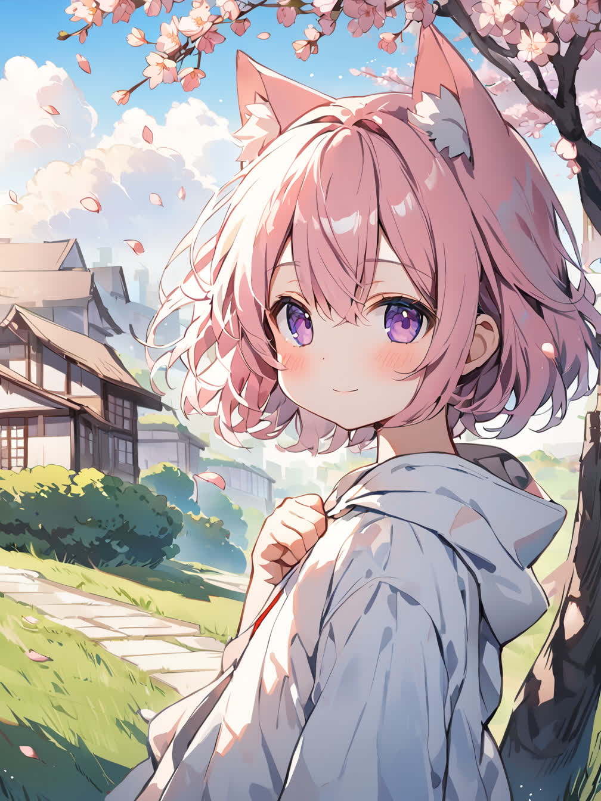
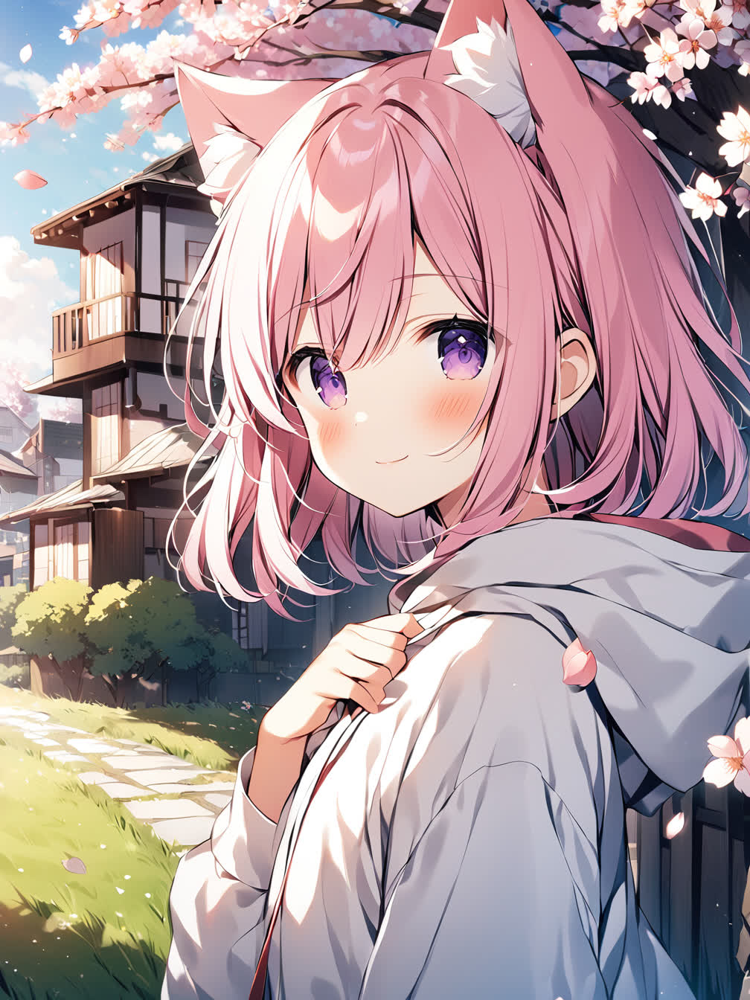
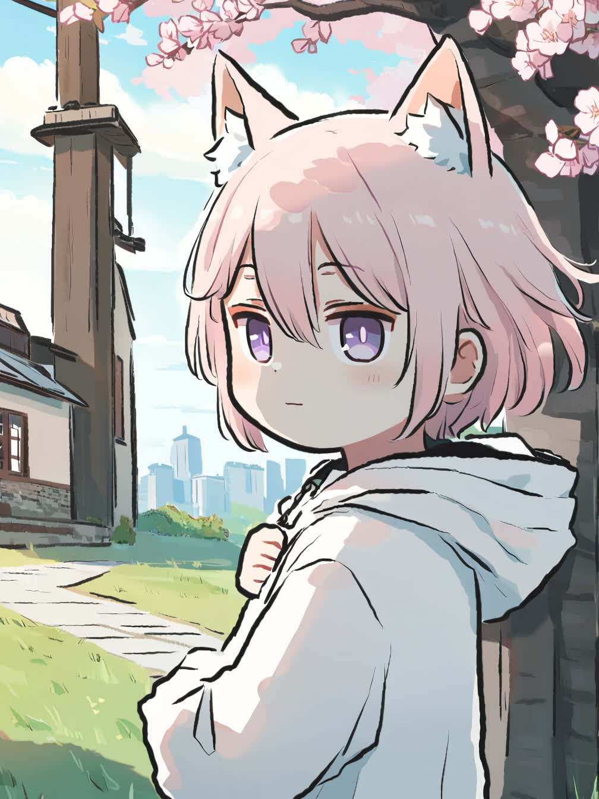

# 画师提示词应用
在 SDXL 模型中，模型的泛化能力大大的增强，仅靠提示词就可以实现比 SD 1.5 模型更多的效果。在基于 SDXL 的 [NovelAI 3](https://novelai.net) 中，就可以通过画师提示词来调整画面的画风。

当然在开源社区中有一些模型也能通过画师提示词来调整画风，比如 [Animagine XL 3](https://huggingface.co/cagliostrolab/animagine-xl-3.0)，[Kohaku XL Epsilon](https://huggingface.co/KBlueLeaf/Kohaku-XL-Epsilon)，[Illustrious-XL](https://civitai.com/models/795765/illustrious-xl)，[NoobAI-XL](https://civitai.com/models/833294/noobai-xl-nai-xl)。

在 [Danbooru](https://danbooru.donmai.us) 的提示词标注中，图片标注了画师的名字，在模型使用 Danbooru 的数据进行训练时，只要训练集的标注中包含的画师名字的标注，就可以让模型学会通过画师名字区分对应的画风，在使用该模型时就可以通过画师提示词调整模型的出图画风。


## 画师提示词来源
画师的名字有中文 / 英文 / 日文等，但 在 Stable Diffusion 中只认英文的提示词，所以需要寻找对应的英文提示词。在模型的介绍页可能会说明支持的一些画师提示词，比如 [Kohaku XL Epsilon](https://huggingface.co/KBlueLeaf/Kohaku-XL-Epsilon)，或者去数据集来源站点，如 [Danbooru](https://danbooru.donmai.us/artists) 来寻找。

!!!note
    其实有支持中文或者日文的 SDXL 模型，[华为](https://www.huawei.com)出了支持中文提示词的 [SDXL](https://pangu-draw.github.io) 模型，[Stability AI](https://stability.ai) 出了支持日文提示词的 [SDXL](https://huggingface.co/stabilityai/japanese-stable-diffusion-xl) 模型。


## 怎么用
请确保 SD WebUI 的版本大于 1.5 以支持 SDXL 模型，现在使用 Animagine XL 3.0 模型进行演示。

|模型（点击即可下载）|放置路径|
|---|---|
|[Animagine XL 3.0](https://modelscope.cn/api/v1/models/licyks/sd-model/repo?Revision=master&FilePath=sdxl_1.0%2Fanimagine-xl-3.0.safetensors)|stable-diffusion-webui/models/Stable-diffusion|
|[sdxl_fp16_fix_vae](https://modelscope.cn/api/v1/models/licyks/sd-vae/repo?Revision=master&FilePath=sdxl_1.0%2Fsdxl_fp16_fix_vae.safetensors)|stable-diffusion-webui/models/VAE|
|[vaeapprox-sdxl](https://modelscope.cn/api/v1/models/licyks/sd-vae/repo?Revision=master&FilePath=vae-approx%2Fvaeapprox-sdxl.pt)|stable-diffusion-webui/models/VAE-approx|
|[model](https://modelscope.cn/api/v1/models/licyks/sd-vae/repo?Revision=master&FilePath=vae-approx%2Fmodel.pt)|stable-diffusion-webui/models/VAE-approx|

!!!note
    将大模型换成 SDXL 后，VAE 模型也要换成对应 SDXL 版本的，否则将出现花图。

这里先尝试不用画师提示词的写法。

```
1girl,animal ears,animal ear fluff,cat ears,pink hair,short hair,bangs,blush,closed mouth,light smile,purple eyes,hair between eyes,white hoodie,flat chest,
looking at viewer,under the tree,hand on own chest,fist,
landscape,grass,flower,blue sky,cirrocumulus,moody lighting,sunlight,day,building,house,path,wind,cherry blossoms tree,falling petals,
close-up,upper body,from side,
```


在不加任何画风提示词下，模型生成的图片即为模型默认的画风。现在在原来的提示词上加风格提示词。

- watercolor,pastel color

```
watercolor,pastel color, 
1girl,animal ears,animal ear fluff,cat ears,pink hair,short hair,bangs,blush,closed mouth,light smile,purple eyes,hair between eyes,white hoodie,flat chest,
looking at viewer,under the tree,hand on own chest,fist,
landscape,grass,flower,blue sky,cirrocumulus,moody lighting,sunlight,day,building,house,path,wind,cherry blossoms tree,falling petals,
close-up,upper body,from side,
```


- monochrome
```
monochrome, 
1girl,animal ears,animal ear fluff,cat ears,pink hair,short hair,bangs,blush,closed mouth,light smile,purple eyes,hair between eyes,white hoodie,flat chest,
looking at viewer,under the tree,hand on own chest,fist,
landscape,grass,flower,blue sky,cirrocumulus,moody lighting,sunlight,day,building,house,path,wind,cherry blossoms tree,falling petals,
close-up,upper body,from side,
```


- chibi,deformed,watercolor
```
chibi,deformed,watercolor,
1girl,animal ears,animal ear fluff,cat ears,pink hair,short hair,bangs,blush,closed mouth,light smile,purple eyes,hair between eyes,white hoodie,flat chest,
looking at viewer,under the tree,hand on own chest,fist,
landscape,grass,flower,blue sky,cirrocumulus,moody lighting,sunlight,day,building,house,path,wind,cherry blossoms tree,falling petals,
close-up,upper body,from side,
```



可以看到模型生成的图片的画风有了改变。

现在把风格提示词换成画师提示词。

- weri

```
weri,
1girl,animal ears,animal ear fluff,cat ears,pink hair,short hair,bangs,blush,closed mouth,light smile,purple eyes,hair between eyes,white hoodie,flat chest,
looking at viewer,under the tree,hand on own chest,fist,
landscape,grass,flower,blue sky,cirrocumulus,moody lighting,sunlight,day,building,house,path,wind,cherry blossoms tree,falling petals,
close-up,upper body,from side,
```



- maccha \(mochancc\)
```
maccha \(mochancc\),
1girl,animal ears,animal ear fluff,cat ears,pink hair,short hair,bangs,blush,closed mouth,light smile,purple eyes,hair between eyes,white hoodie,flat chest,
looking at viewer,under the tree,hand on own chest,fist,
landscape,grass,flower,blue sky,cirrocumulus,moody lighting,sunlight,day,building,house,path,wind,cherry blossoms tree,falling petals,
close-up,upper body,from side,
```


使用画师提示词也能和风格提示词能够改变模型生成图片的画风。

现在尝试多个画师提示词进行组合。

- ciloranko,maccha \(mochancc\),quan \(kurisu tina\)
```
ciloranko,maccha \(mochancc\),quan \(kurisu tina\),
1girl,animal ears,animal ear fluff,cat ears,pink hair,short hair,bangs,blush,closed mouth,light smile,purple eyes,hair between eyes,white hoodie,flat chest,
looking at viewer,under the tree,hand on own chest,fist,
landscape,grass,flower,blue sky,cirrocumulus,moody lighting,sunlight,day,building,house,path,wind,cherry blossoms tree,falling petals,
close-up,upper body,from side,
```


- quansarcake,hxxg,chiaroscuro,atdan
```
quansarcake,hxxg,chiaroscuro,atdan,
1girl,animal ears,animal ear fluff,cat ears,pink hair,short hair,bangs,blush,closed mouth,light smile,purple eyes,hair between eyes,white hoodie,flat chest,
looking at viewer,under the tree,hand on own chest,fist,
landscape,grass,flower,blue sky,cirrocumulus,moody lighting,sunlight,day,building,house,path,wind,cherry blossoms tree,falling petals,
close-up,upper body,from side,
```


通过不同的画师提示词组合，可以得到新的画风。

风格提示词也可以和画师提示词一起使用。

- meme,chibi,jazz_jack,xinzoruo
```
meme,chibi,jazz_jack,xinzoruo,
1girl,animal ears,animal ear fluff,cat ears,pink hair,short hair,bangs,blush,closed mouth,light smile,purple eyes,hair between eyes,white hoodie,flat chest,
looking at viewer,under the tree,hand on own chest,fist,
landscape,grass,flower,blue sky,cirrocumulus,moody lighting,sunlight,day,building,house,path,wind,cherry blossoms tree,falling petals,
close-up,upper body,from side,
```



通过组合不同的画师提示词就可以达到画出不同画风的图片，并且可以适当加上风格提示词，通过提示词的方式就可以轻松得到自己想要的画风。
