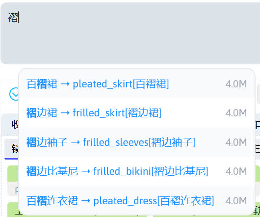
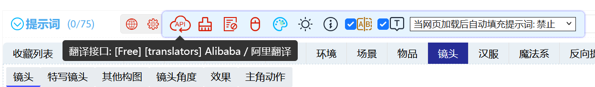

# 前期配置
在第一次生图前先了解一些功能和优化一些设置。

## 安装扩展
Stable Diffusion WebUI 扩展可为 Stable Diffusion WebUI 提供更多便捷的功能，在接下来的教程中将会使用到 Stable Diffusion WebUI 扩展，所以下面介绍如何为 Stable Diffusion WebUI 安装扩展。

### 使用 Git 命令
打开终端后，进入 Stable Diffusion WebUI 的扩展目录，比如我的 Stable Diffusion WebUI 安装在`E:/Softwares/stable-diffusion-webui`，则扩展目录在`E:\Softwares\stable-diffusion-webui/extensions`，下面就输入命令进入扩展文件夹中。

```
cd "E:\Softwares\stable-diffusion-webui/extensions"
```

!!!note
    1. 如果使用的终端为 Windows 系统的 CMD，上面的命令可能会出现无法切换目录的情况，此时将上面的命令改成`cd /d "E:\Softwares\stable-diffusion-webui/extensions"`即可正常切换目录。  
    2. 如果环境中没有 Git，需要安装 Git 后才能使用 Git 命令，Git 下载：[Git](https://git-scm.com/)。

此时就可以使用 Git 命令安装扩展，比如一个扩展的下载地址为`https://github.com/DominikDoom/a1111-sd-webui-tagcomplete`，输入下面的命令就可以安装这个扩展。

```
git clone https://github.com/DominikDoom/a1111-sd-webui-tagcomplete
```


### 使用 Stable Diffusion WebUI 扩展管理
进入 Stable Diffusion WebUI 后，在**扩展 -> 从网址安装 -> 扩展的 git 仓库网址**，输入扩展的下载地址后点击**安装**即可安装扩展。

Stable Diffusion WebUI 自带一个扩展列表，在**扩展 -> 可下载**中点击**加载扩展列表**就可以看到可以安装的扩展，选择其中一个扩展后点击**安装**即可安装扩展。


### 使用绘世启动器
绘世启动器提供了扩展安装功能，在绘世启动器的**版本管理 -> 安装新扩展**中可以进行扩展安装。


## SD WebUI 语言设置
SD WebUI 的**设置 -> 用户界面 -> 本地化**中进行设置，英文界面对应的位置为**Setting -> User interface -> Localization**。

如果界面不是中文，需要安装 stable-diffusion-webui-localization-zh_Hans 扩展。

安装该扩展后，在 SD WebUI 的`Settings`->`User interface`，在`Localization`选项选择`zh-hans (Stable)`，然后点击`Apply settings`保存设置，再点击`Reload UI`使设置生效。

!!!note
    stable-diffusion-webui-localization-zh_Hans 扩展下载：https://github.com/hanamizuki-ai/stable-diffusion-webui-localization-zh_Hans


## 为提示词补全扩展添加词库和中文翻译
a1111-sd-webui-tagcomplete 扩展可以提供提示词补全功能，在 SD WebUI 设置中和该扩展有关的设置中可以更换提示词补全的词库，也可以添加中文翻译，下面是更全的提示词补全词库和对应的中文翻译的下载地址。

[Tag++ 下载](https://modelscope.cn/models/licyks/sdnote/resolve/master/tag/tags%2B%2B.zip)

将这个文件下载到本地并解压后，放进`stable-diffusion-webui/extensions/a1111-sd-webui-tagcomplete/tags`文件夹中，然后在 SD WebUI 的`设置`->`标签自动补全`中，在`选择使用的标签文件名`选择`tag++.csv`，`翻译文件名`选择`tag++_zh_new.csv`，再勾选**展示所有候选标签**，最后点击上方的保存设置使设置生效。



这样不仅可以看补全的提示词对应的翻译，也可以使用中文来触发提示词补全。

!!!note
    a1111-sd-webui-tagcomplete 扩展：https://github.com/DominikDoom/a1111-sd-webui-tagcomplete

sd-webui-prompt-all-in-one 扩展可以用于翻译和管理输入的提示词，使用前建议调整设置，将鼠标移动到 sd-webui-prompt-all-in-one 扩展工具栏的设置图标，此时将自动显示二级菜单。



再点击二级菜单中的翻译接口设置按钮进入设置，在设置中建议将**翻译接口**默认使用的百度翻译更换掉，使用别的翻译接口，比如阿里翻译，有道翻译等。

**TagComplete**可以设置本地翻译，加快翻译速度，点击翻译文件选择框右边的刷新按钮，再选上前面下载好的**tag++_zh_new.csv**，选中后勾选**自动翻译只使用CSV翻译（不使用网络翻译），手动点击翻译按钮才使用CSV加网络翻译**，再保存设置。


!!!note
    sd-webui-prompt-all-in-one 扩展：https://github.com/Physton/sd-webui-prompt-all-in-one


### 优化提示词权重模式
在之后使用 SDXL 模型时，默认的提示词权重模式可能会导致 SDXL 模型出图异常，可通过修改提示词权重模式解决。在 SD WebUI 的`设置`->`SD`->`强调模式`，选择 No norm 后保存设置即可。


### 优化显存占用
如果显存比较小，在使用 SDXL 或者其他参数比较大的模型时，可能会遇到显存不足的问题，但是可以通过降低精度的方式降低显存的占用。

启用 FP8 前需要 PyTorch 版本大于 2.1，SD WebUI 版本大于或等于 1.8。

确保这些条件满足后，在 SD WebUI 的`设置`->`优化设置`->`FP8 权重`，选择对 SDXL 模型启用，保存设置后即可启用，4G 显存也能运行 SDXL 模型。
