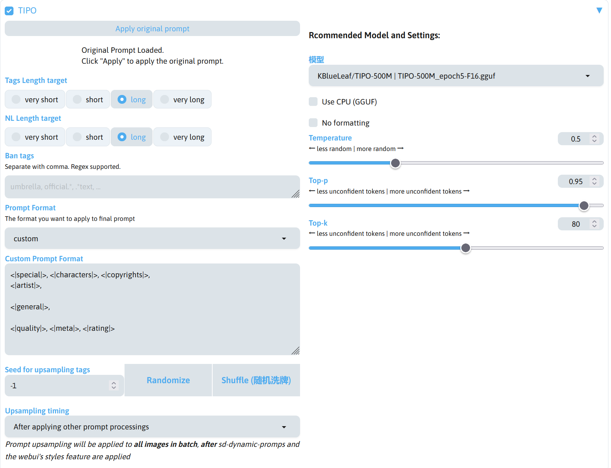

# 概述
提示词在 AI 绘画中是很重要的一部分，接下来将教学如何书写提示词。

写提示词其实很简单，你想让 AI 画什么，你就写什么，详细的提示词可以获得更好的出图效果。


## 写什么
### 自然语言

用一些简单的句子描述要让 AI 画的内容，尽量不用太复杂的语法，这对出图效果并不会有太大的提升。

这是一个简单的例子：
```
1 girl with blue eyes and yellow hair wearing white clothes and red skirt with black leggings
```

### 单词
用一些常见的单词来描述画面，单词最好来源于数据集来源站点）（如 [Danbooru](https://danbooru.donmai.us)），单词的风格最好也要和你想要画的图像风格相匹配。很多时候单词描述比自然语言描述效果更好，因为在多数 Stable Diffusion 1.5 / Stable Diffusion XL 模型中，训练使用的标注更多是单词而不是自然语音，并且提示词更简短。

这是一个简单的例子：

```
1girl, blue eyes, yellow hair, white clothes, red skirt, black leggings
```


### Emoji
Emoji 可以作为提示词，并且可能会获得不一样的效果。想要画烟花背景，用🎇就能解决。想画手部动作，✋或者其他的 Emoji。


### 颜文字
颜文字仅支持西方的颜文字，如`>-<`，`:o`，`:-/`等。


## 反向提示词
负面提示词就是写你不想让 AI 画出来的东西，一般可以用下面的通用负面提示词。

```
lowres,bad anatomy,bad hands,text,error,missing fingers,extra digit,fewer digits,cropped,worst quality,low quality,normal quality,jpeg artifacts,signature,watermark,username,blurry,bad feet,
```

当然这个通用反向提示词并不是完全通用的，需要根据你要画的东西来增删。比如不想让画面出现猫，那就在反向提示词中写上`cat`。


## 描述什么
想想要画什么，外貌，衣服，表情，动作，场景，场景，镜头，主题，艺术风格，然后参考数据集标签表，将想要描写画面内容的提示词组合在一起，使用英文逗号隔开。

因为 AI 读取提示词是按顺序读取的，所以需要按照重要性进行排列，重要的排在前面，不重要的排在后面。


## 提示词关联性
在考虑到了顺序的大关系之后，词与词之间的距离这一更细节的构成也是十分重要的。距离较近的词的确更容易产生关联、进行叠加，而更远的则倾向于降低互相的关联性、进而互相隔离。


## 占位提示词
占位词可以用于进一步调整词与词的距离，从而加强切割某些不希望绑定在一起的元素，是**元素污染**情况的解决方案。

!!!note
    元素污染：如`1girl`和`flower`，当这两个单词过近时，此时花就会画在女孩的头发上（这里 AI 把花当做了花发饰处理了）。

词与词之间也不能毫无节制地加入占位词来降低关系。词与词之间的关联度似乎和距离有着一定程度上的反比例关系或保底关联度，因此加入过多占位词不会有额外的好处，适量添加即可。

在 SD WebUI 中，每 75 个单词为一段，每两段描述之间几乎是弱关联或者无关联，通常使用这个特性来防止元素混乱。

而 BREAK 为 SD WebUI 的标准占位符，意思是占满75个单词的剩余所有位置。BREAK 打断的是整体的关联，BREAK后面的部分跟前面的部分不会有强关联。


## 提示词的联想关系
许多提示词有着逻辑上合理的**前置**关系，比如存在 sword 这个提示词的作品往往还存在 weapon 这个提示词、存在 sleeves past finger 这个提示词的作品往往还存在 sleeve past wrists 这个提示词。

这样在训练集中往往共存且有强关联的提示词，最终会让模型处理包含它的咒语时产生一层联想关系。

在出现联想关系的情况下，词与被联想的词的距离是最小的。

联想词之间极易互相强化，进而提高画面的稳定性。例如给人物稳定添加一把剑的最好做法不是仅加上 sword，而是加上 weapon, sword。同理，其他存在强联想且希望出现的元素也推荐同时在咒语内连续出现。

为了在画面内取消两个词之间的联想，最简单但不一定有效的做法是将被联想词写入负面咒语并加上较高权重。如果没有效果，那么不妨试一试在咒语内加上被联想词的对立面，比如用 aged up 对抗 flat chest 对于 child 的强联想。


## 通过 TIPO 辅助书写提示词
如果不知道提示词该写什么，只会写 1girl，可以通过 [z-tipo-extension](https://github.com/KohakuBlueleaf/z-tipo-extension) 扩展辅助书写提示词。

!!!note
    z-tipo-extension 扩展下载：https://github.com/KohakuBlueleaf/z-tipo-extension

安装 z-tipo-extension 后，在 SD WebUI 界面的提示词输入框部分就可以看到 TIPO 的界面。


Tag Prompt 为输入给 TIPO 的提示词框，Natural Language Prompt 为输入给 TIPO 的自然语言框。

通常使用的是提示词，所以在 Tag Prompt 输入框写提示词即可，现在尝试填入下面的提示词。

```
1girl,azusa \(blue archive\),
viclim-monou,yoneyama mai,torino aqua,fuzichoco,
```

!!!note
    1. 这里按照默认的 TIPO 格式进行输入，第一行写了 1girl，因为我想要得到我想要的角色，所以后面加上了角色名，第二行为画师提示词，用于调整画风，在下一章节中将会进行介绍。
    2. 为了保证角色能够出现，并且画师提示词能够生效，这里将大模型换成 [noobaiXLNAIXL_epsilonPred10Version](https://modelscope.cn/models/licyks/sd-model/resolve/master/sdxl_1.0/noobaiXLNAIXL_epsilonPred10Version.safetensors)[(Civitai)](https://civitai.com/models/833294?modelVersionId=1022833)，下载后模型放在`stable-diffusion-webui/models/Stable-diffusion`路径中。

填写提示词后，点击左下角的 Generate Prompt 即可使用 TIPO 扩写提示词，扩写完成后可以在正向提示词框看到已经扩写好的提示词，可以根据自己的需求对提示词进行修改。

如果想要点右边的生成按钮就自动扩写提示词并使用，可以启用提示词框下方的 TIPO 选项。



在 TIPO 的配置界面中可以调整 TIPO 扩写提示词时使用的配置。

|选项|作用|
|---|---|
|Tags Length target|调整扩写提示词后提示词的长度。|
|NL Length target|调整扩写自然语言后自然语言的长度。|
|Ban tags|设置提示词黑名单，TIPO 在扩写提示词后，将会移除在黑名单中的提示词。|
|Prompt Format|调整 TIPO 生成提示词的格式。|
|Seed for upsampling tags|设置 TIPO 模型的随机数种子。|
|Upsampling timing|调整 TIPO 扩展的运行方式，以使 TIPO 扩展能够和其他提示词扩展更好的配合。|
|模型|调整使用的 TIPO 模型。|
|Use CPU (GGUF)|如果使用 GGUF 格式的 TIPO 模型，启用该选项后，在使用 TIPO 扩展时将使用 CPU 加载 TIPO 模型。|
|No formatting|禁用 TIPO 扩展对 TIPO 扩写的提示词的格式化。|
|Temperature / Top-p / Top-k|调整 TIPO 模型的参数。|

如果需要调整输入给 TIPO 扩展的提示词格式，可以在 Prompt Format 选项选择 custom，这样就能看到 TIPO 输入的提示词格式，可以根据自己的需求进行修改。

下面是 TIPO 扩展的提示词格式。

|格式|内容|
|---|---|
|<\|special\|>|1girl, 1boy, 1other, ...|
|<\|characters\|>|角色名|
|<\|copyrights\|>|版权提示词（系列名称）|
|<\|artist\|>|画师提示词|
|<\|general\|>|普通提示词，描述动作，环境......|
|<\|meta\|>|highres / lowres / absurdres 之类的 meta 标签。|
|<\|quality\|>|score_xxx, masterpiece, best quality...|
|<\|rating\|>|safe, sensitive, nsfw, explicit ...|
|<\|generated\|>|扩写的自然语言。|
|<\|extended\|>|扩展的自然语言。如果未提供自然语言，则 extended 部分将填充生成自然语言。如果 extended 部分和 generated 部分的格式均为该格式，但未提供自然语言，则 TIPO 将生成 2 个部分的自然语言。|

!!!note
    更多的说明请阅读 [z-tipo-extension](https://github.com/KohakuBlueleaf/z-tipo-extension) 扩展的说明：[KohakuBlueleaf/z-tipo-extension - Options](https://github.com/KohakuBlueleaf/z-tipo-extension)。


## 图片提示词反推
想知道一张图片的提示词怎么写，可以通过 sd-webui-wd14-tagger 扩展将提示词反推出来。将图片导入后扩展将自动反推提示词，反推完成后最好点一下卸载所有反推模型来释放显存。


!!!note
    sd-webui-wd14-tagger 扩展：https://github.com/Akegarasu/sd-webui-wd14-tagger
