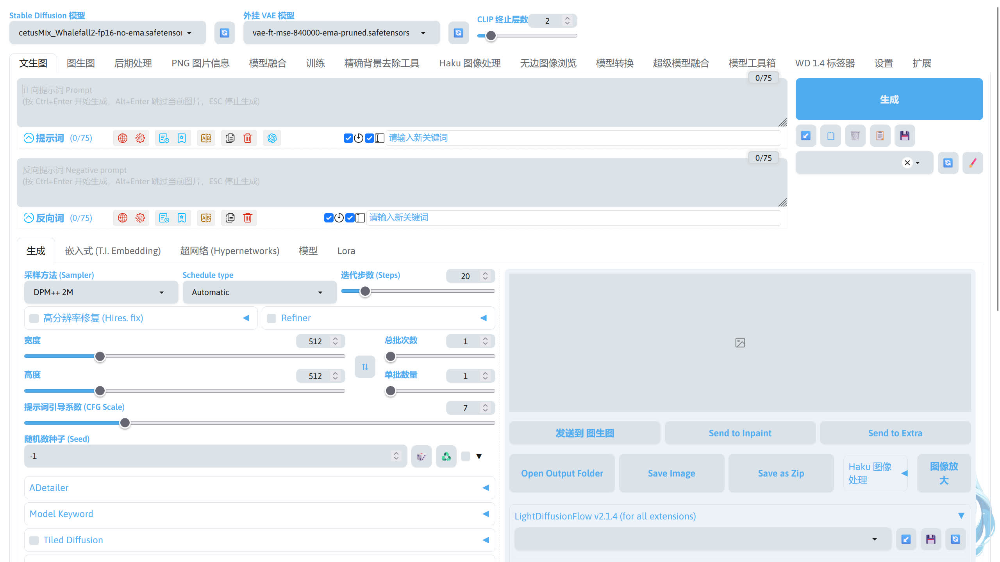
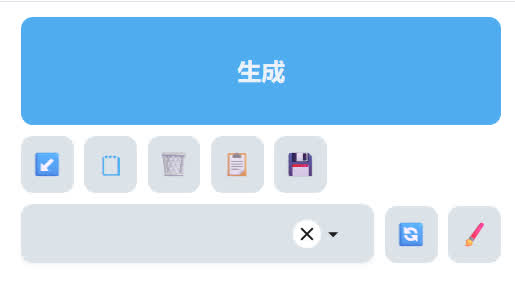
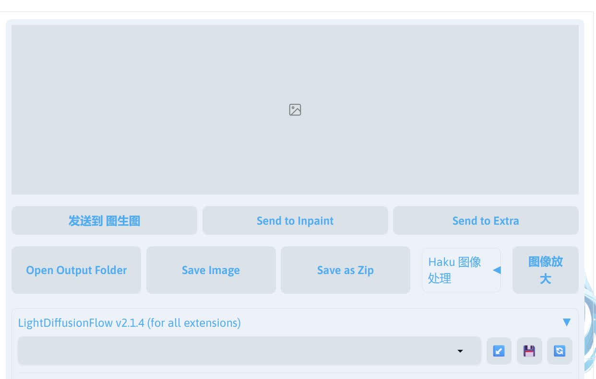
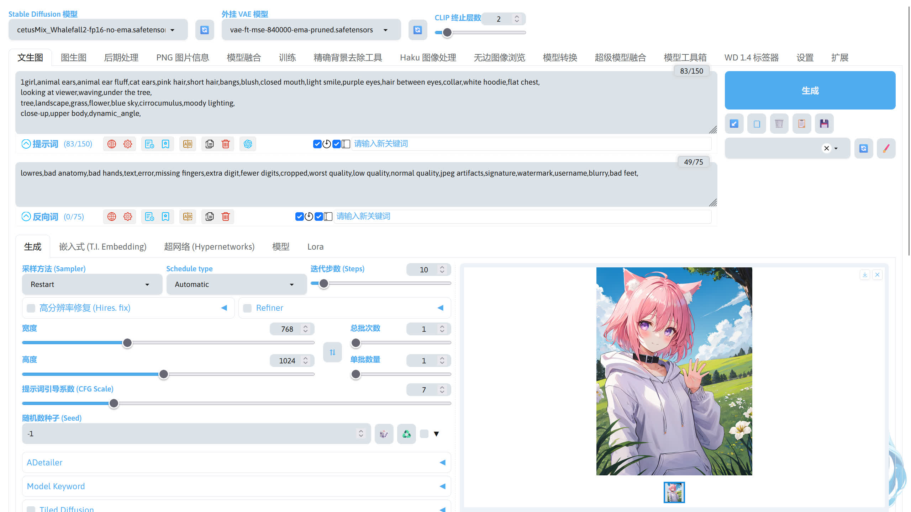

# 文生图
这里我使用以下模型进行演示。

!!!note
	演示界面包含外置扩展，您的界面可能与我的有一定的区别。

|模型（点击即可下载）|放置路径|
|---|---|
|[cetusMix_Whalefall2](https://modelscope.cn/api/v1/models/licyks/sd-model/repo?Revision=master&FilePath=sd_1.5%2FcetusMix_Whalefall2.safetensors)|stable-diffusion-webui/models/Stable-diffusion|
|[vae-ft-mse-840000-ema-pruned](https://modelscope.cn/api/v1/models/licyks/sd-vae/repo?Revision=master&FilePath=sd_1.5%2Fvae-ft-mse-840000-ema-pruned.safetensors)|stable-diffusion-webui/models/VAE|

将模型放置到对应的路径后，启动 SD WebUI，启动完成后浏览器将会跳转到 SD WebUI 的界面，在界面最上方的模型选择切换成刚刚放进去的模型。



## 界面介绍
SD WebUI 的界面大致分为几个部分。

- 模型切换


- 提示词输入


- 参数调整


- 生成按钮和其他按钮


- 图片预览


!!!note
    如果你的界面不是中文，可以安装 stable-diffusion-webui-localization-zh_Hans 扩展。  
    stable-diffusion-webui-localization-zh_Hans 扩展下载：https://github.com/hanamizuki-ai/stable-diffusion-webui-localization-zh_Hans  
    安装该扩展后，在 SD WebUI 的`Settings`->`User interface`，在`Localization`选项选择`zh-hans (Stable)`，然后点击`Apply settings`保存设置，再点击`Reload UI`使设置生效。

## 提示词输入
大致认识了界面后，现在来调整生成图片的参数。

在正面提示词中输入你想要 AI 生成的东西（必须是英文），这里我们可以利用 a1111-sd-webui-tagcomplete 扩展来辅助我们输入提示词。使用方向键选择要补全的提示词，++tab++ 键 / ++enter++ 键补全提示词。


!!!note
    a1111-sd-webui-tagcomplete 扩展：https://github.com/DominikDoom/a1111-sd-webui-tagcomplete

如果对英文不熟悉，也可以通过 sd-webui-prompt-all-in-one 扩展输入提示词。点击左下角的按钮即可展开提示词列表，单击列表中的其中一个提示词就可以把输入到提示词框中。


右侧的小框是 sd-webui-prompt-all-in-one 扩展的输入翻译框，这里可以输入中文并由扩展翻译成英文。


回车后中文被输入到提示词框中并自动翻译成英文。


!!!note
    sd-webui-prompt-all-in-one 扩展：https://github.com/Physton/sd-webui-prompt-all-in-one

下面是我输入的正向提示词，描写了人物、动作、场景、镜头。

```
1girl,animal ears,animal ear fluff,cat ears,pink hair,short hair,bangs,blush,closed mouth,light smile,purple eyes,hair between eyes,collar,white hoodie,flat chest,
looking at viewer,waving,under the tree,
tree,landscape,grass,flower,blue sky,cirrocumulus,moody lighting,
close-up,upper body,dynamic_angle,
```

接下来输入反向提示词，反向提示词用于描述不想让 AI 画出来的东西。下面的反向提示词在大部分情况下通用，无需修改直接使用。如果有什么不想出现的东西可以在这个反向提示词的基础上进行修改。

```
lowres,bad anatomy,bad hands,text,error,missing fingers,extra digit,fewer digits,cropped,worst quality,low quality,normal quality,jpeg artifacts,signature,watermark,username,blurry,bad feet,
```


## 生图参数调整
填完了提示词，我们还需要调整一下左下角的生图参数。

采样方法用于控制对噪声进行降噪的方法。生成图片时，根据随机数种子生成一张噪声图送入潜空间中，采样器在潜空间中将噪声图进行降噪，最终得到想要的图像。

调度器用于控制 Stable Diffusion 模型在扩散过程噪声如何进行变化。

不同的采样方法和调度器搭配所需要的采样步数不同，出图的效果也不同。

!!!note
	1. SD WebUI 1.9 版之前的版本没有独立的调度器选择框。  
    2. 有关调度器的说明：[Diffusers - Schedulers - HuggingFace](https://huggingface.co/docs/diffusers/api/schedulers/overview)。  
    3. 不同采样算法和调度器的简单效果对比：[SD WebUI 采样算法和调度器对比](https://github.com/licyk/README-collection/blob/main/sampler-contrast/README.md)。


迭代步数控制降噪的步数。更多的步骤意味着从噪声到图像的更小、更精确的步骤。增加这一点直接增加了生成图像所需的时间。每一步的速度取决于采样器。

下面是我比较喜欢的参数搭配。

|采样方法（Sampler）|调度器（Schedule type）|迭代步数（Step）|
|---|---|---|
|Eular a|Uniform / Exponential|20|
|DPM++ 系|Exponentia|20|
|Restart|Karras / SGM Uniform|10|
|Unipc|Autumatic|13|

宽度和高度控制生成图片的分辨率，如果需要将宽带和高度交换，点击 ⇅ 即可。当宽度和高度的值越高，生成图片所需的显存越多。图片的分辨率有比较合适的范围，和模型在训练的时候使用的分辨率有关，通常使用的分辨率接近模型训练时所使用的分辨率将会得到比较好的效果。

个人建议 SD 1.5 的模型使用 512~1024 的值，SDXL 的模型使用 1024~1536 的值（SD 1.5 模型在 512x512 的基础上训练，SDXL 模型在 1024x1024 的基础上训练）。

如果想要生成一张高分辨率的图片，建议通过高分辨率修复 / 图生图来完成，这个在后面的章节再进行介绍。

现在我使用的 cetusMix_Whalefall2 模型为 SD 1.5 的模型，适合的分辨率范围为 512 ~ 1024，所以我把宽度和高度分别设置为 768 和 1024。

总批次数调整总共进行几次图片生成，而单批数量调整在一次图片生成中同时生成图片的数量。注意，单批数量对显存的消耗较大，而总批次数对显存的消耗无影响。

提示词引导系数（CFG Scale）控制图像和提示词的匹配程度。这个值越高，出图更接近提示词（不同的模型效果不同），过高的值可能会导致出图的质量下降，不同的模型需要不同的提示词引导系数，需要自行测试。这里我使用的 cetusMix_Whalefall2 模型使用默认的 7 比较适合。

随机数种子决定噪声。当种子保持不变，其他参数也保存不变时，每次生成都会生成几乎一致的图片。

CLIP 终止层数设置 CLIP 处理到哪一层终止，通常设置为 2 即可，也就处理到倒数第 2 层，跳过最后一层。这个值越高，跳过的 CLIP 层数越多，AI 对提示词的响应程度越低。


## 生图
调整完这些参数后，点击右侧的生成按钮就开始生图了，生成完成后即可在图片预览区域看见生成好的图片。


