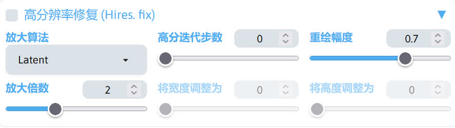
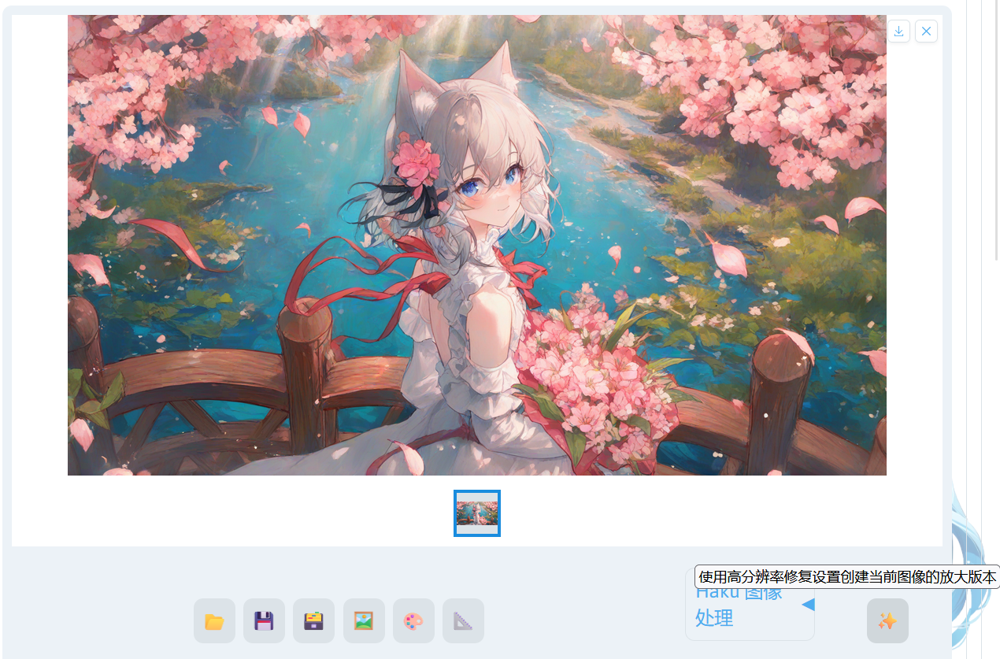
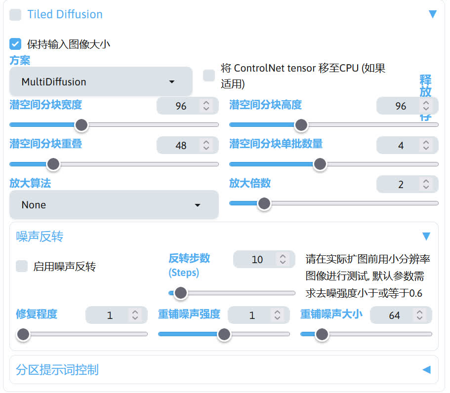

# 图片放大
一般 Stable Diffusion 生成出来的图片因为分辨率太低（768x1024 之类的），造成图片比较糊，观感，此时就可以通过放大的方式来提高图片的清晰度。这里介绍几种放大图片的方式。

## 高分辨率修复
该功能使用图生图的方式对图片进行放大。启用该功能后，在文生图结束时，根据所选的放大算法对图片进行放大，再根据降噪强度对图片进行加噪再进行图生图，最终得到高清的图像。

因为高分辨率修复的本质是图生图，所以这个选项只会在文生图的选项中出现，在图生图选项中就看不到这个选项。

启用后一般只用调整`放大算法`、`重绘幅度`、`放大倍数`这三个选项。

放大算法总共分三类，Latent 算法、传统 OpenCV 算法和 GAN 算法。在放大算法中带 Latent 的算法都属于 Latent 算法，Lanczos 算法和 Nearest 算法属于传统 OpenCV 算法，其他算法都属于 GAN 算法。

Latent 放大算法在潜空间中将潜空间图像进行放大，但是放大之后原来的潜空间出现的偏移，不再是原来的潜空间，所以需要更高的重绘幅度使其回到原来的状态，通常需要大于 0.55 的重绘幅度。

传统 OpenCV 算法和 GAN 算法是在像素空间对图片进行放大，不会出现使用 Latent 算法放大导致的问题。一般使用 0.2~0.4 的重绘幅度即可。

放大倍数决定了放大之后图片的分辨率，但该值越高，需要的显存越多，所以建议启用 Tiled VAE 来降低显存的占用，降低爆显存的概率。

!!!note
    TIled VAE 由 multidiffusion-upscaler-for-automatic1111 扩展提供：https://github.com/pkuliyi2015/multidiffusion-upscaler-for-automatic1111

放大算法和重绘幅度的选择可以参考下面的表格：

|放大算法|重绘幅度|放大模型文件存放路径|
|---|---|---|
|Latent|> 0.55|无需下载|
|Lanczos|0.2~0.4|无需下载|
|[SwinIR_4x](https://modelscope.cn/api/v1/models/licyks/sd-upscaler-models/repo?Revision=master&FilePath=SwinIR%2FSwinIR_4x.pth)|0.2~0.4|stable-diffusion-webui/models/SwinIR|
|[R-ESRGAN 4x+](https://modelscope.cn/api/v1/models/licyks/sd-upscaler-models/repo?Revision=master&FilePath=RealESRGAN%2FRealESRGAN_x4plus.pth)|0.2~0.4|stable-diffusion-webui/models/RealESRGAN|
|[R-ESRGAN 4x+ Anime6B](https://modelscope.cn/api/v1/models/licyks/sd-upscaler-models/repo?Revision=master&FilePath=RealESRGAN%2FRealESRGAN_x4plus_anime_6B.pth)|0.2~0.4|stable-diffusion-webui/models/RealESRGAN|
|[4x_NMKD-Superscale-SP_178000_G](https://modelscope.cn/api/v1/models/licyks/sd-upscaler-models/repo?Revision=master&FilePath=ESRGAN%2F4x_NMKD-Superscale-SP_178000_G.pth)|0.2~0.4|stable-diffusion-webui/models/ESRGAN|
|[DAT_x4](https://modelscope.cn/api/v1/models/licyks/sd-upscaler-models/repo?Revision=master&FilePath=DAT%2FDAT_x4.pth)|0.2~0.4|stable-diffusion-webui/models/DAT|

如果在文生图中出了一张比较好的图，但是没启用高分辨率修复，也可以在高分辨率的选项卡调整好参数后，在图片预览框下面的功能按钮点击 ✨ 按钮，这时将会根据高分辨率修复的选项对当前的图片进行放大。

不过这个方法有也有局限性，因为直接文生图出来的图并不一定达到自己想要的效果，需要使用图生图里的局部重绘来修改图片，这时候放大就没太大意义，不过只是单纯的文生图抽卡可以忽略。

!!!note
    1. 个人觉得图片放大这个步骤应该放在制作图片的最后一个阶段，因为用高分辨率的图片来进行重绘会占用大量的显存，这时又不得不缩小图片的分辨率，所以显得这么早就放大就没有太大意义。当然你可以启用 Tiled VAE 来降低显存占用，只不过高分辨率图片的重绘会比低分辨率图片的重绘慢很多。  
    2. 如果发现实现的迭代步数和设置的迭代步数不一致，这是因为默认设置下`实际的迭代步数 = 设定的迭代步数 x 重绘幅度 + 1`，如果想要实际的迭代步数和设置的迭代一致，可以在 SD WebUI 设置  -> 图生图，将`图生图时，准确执行滑块指定的迭代步数 (正常情况下越小的重绘幅度需要的迭代步数更少)`选项勾选上并保存 SD WebUI 设置。

## 后期处理的放大
在 SD WebUI 的后期处理选项卡中，也有一个放大功能。

不过这个放大功能使用的仅仅是 GAN 算法进行放大，并没有用到 Stable Diffusion，所以直接用这个功能来放大低分辨率的图片，放大后效果不是很行。如果去放大高分辨率的图片（比如从 1080p 放大到 4k），效果就会比较好。

!!!note
    下面介绍的放大方法都在图生图选项卡中进行。

## 图生图直接放大
在图生图界面中，可以直接调整重绘尺寸或者重绘尺寸倍数来实现图片放大。

不过在 SD WebUI 的默认设置下，放大后的图片效果可能不如意，此时可以在 SD WebUI 的`设置`->`放大`->`图生图放大算法`，选择一个算法，这样出图的效果就会比较好。

## Tiled Diffusion 放大
multidiffusion-upscaler-for-automatic1111 扩展提供了 Tiled Diffusion 功能用于图片放大，不过该功能必须搭配 Tiled VAE 一起使用。下面为 Tiled Diffusion 的设置界面。

使用 Tiled Diffusion 进行图片放大时，勾选 Tiled Diffusion 选项，设置参数可以照抄下面的

- 方案：Mixture of Diffusers
- 潜空间分块宽度:128
- 潜空间分块高度:128
- 潜空间分块重叠:16
- 潜空间分块单批数量:8
- 放大算法：R-ESRGAN 4x+ Anime6B

正面提示词建议删去具体描述的部分（如人物，场景），减少放大后图片出现鬼影的概率。重绘幅度调至 0.2~0.4（推荐0.4），并启用 TIled VAE，调整好后就可以点击生成进行图片放大了。

如果想要放大后获得比较干净的画面，可以勾选 Tiled Diffusion 选项卡下方的噪声反转。

!!!note
    1. 噪声反转会导致一些笔触被破坏，比如你的图片是厚涂风格的，放大时启用噪声反转后，图片那些涂抹风格就会被抹干净。  
    2. multidiffusion-upscaler-for-automatic1111 扩展关于图片放大的具体说明：https://github.com/pkuliyi2015/multidiffusion-upscaler-for-automatic1111/wiki/%E5%88%86%E7%89%87%E6%89%A9%E6%95%A3  
    3. 因为 Tiled Diffusion 是将潜空间图像进行分块，并对每个分块分别进行采样，但是每个分块的提示内容都是完整图片的提示内容而不是只属于那个分块的提示内容，所以这会导致在对分块进行采样时，模型总会尝试在分块上绘制完整的图片内容，这就导致了放大后鬼影的产生，可以通过降低重绘幅度 / 删除提示词中具体描述画面的提示词 / 使用 ControlNet 保持一致性来减少鬼影的产生。

## StableSR 放大
sd-webui-stablesr 扩展提供的 StableSR 放大方法也可以提供不错的放大效果，使用前需要下载相关模型。

|模型|放置路径|
|---|---|
|[v2-1_768-ema-pruned](https://modelscope.cn/api/v1/models/licyks/sd-model/repo?Revision=master&FilePath=sd_2.1%2Fv2-1_768-ema-pruned.safetensors)|stable-diffusion-webui/models/Stable-diffusion|
|[webui_768v_139](https://modelscope.cn/api/v1/models/licyks/sd-extensions-model/repo?Revision=master&FilePath=sd-webui-stablesr%2Fwebui_768v_139.ckpt)|stable-diffusion-webui/extensions/sd-webui-stablesr/models|

!!!note
    sd-webui-stablesr 扩展：https://github.com/pkuliyi2015/sd-webui-stablesr

使用时需要在 SD WebUI 界面的左上角将 Stable Diffusion 模型切换成 v2-1_768-ema-pruned 模型，接下来将重绘幅度调至 0.2~0.4之间的值（推荐 0.4），翻到 SD WebUI 界面的最下面，在脚本选项选择 StableSR，SR 模型选择 webui-768v_139，再设置放大倍数，这时候点击生成就可以进行图片放大了。

## ControlNet Tile 放大
ControlNet Tile 模型可以保证图片的一致性，同时也可以用于增加图片的细节，所以可以作为图片放大的方法。

!!!note
    使用 ControlNet 扩展需要安装 sd-webui-controlnet 扩展：https://github.com/Mikubill/sd-webui-controlnet

使用时在 ControlNet 选项卡中启用一个 ControlNet 单元，控制类型选择 Tile/Blur(分块/模糊)，预处理器选择 tile_resample，模型选择 control_v11f1e_sd15_tile_fp16。

!!!note
    使用 ControlNet Tile 前需要下载 [control_v11f1e_sd15_tile_fp16](https://modelscope.cn/api/v1/models/licyks/controlnet_v1.1/repo?Revision=master&FilePath=control_v11f1e_sd15_tile_fp16.safetensors)，并将模型放到 stable-diffusion-webui/models/ControlNet 路径里

再将重绘幅度调整到 0.4~0.7 之间的值（推荐0.5），点击生成就可以进行放大了。

## Ultimate SD upscale
ultimate-upscale-for-automatic1111 扩展提供的放大方案将图片分块后放大，再将这些分块合成一张大图，可在低显存的情况下放大图片。

!!!note
    ultimate-upscale-for-automatic1111 扩展下载：https://github.com/Coyote-A/ultimate-upscale-for-automatic1111

使用时在 SD WebUI 的脚本中选择 Ultimate SD upscale，参数可按照下面给的来调整。

- Target size type：From img2img2 settings
- 放大算法：R-ESRGAN 4x+ Anime6B
- 类型：Linear
- 分块宽度：768
- 分块高度：768
- 蒙版边缘模糊度：24
- Padding：32

再将重绘幅度调至 0.2~0.4之间的值（推荐 0.4），重绘尺寸倍数设置好尺度，就可以进行图片放大了。

## 放大方案的组合
这些图片放大方法可以互相组合，不同的组合可能会获得不一样的放大效果。下面列出一些放大方法组合：

- Tiled Diffusion + StableSR
- Tiled Diffusion + ControlNet Tile
- Tiled Diffusion + 噪声反转 + ControlNet Tile
- Tiled Diffusion + ControlNet Tile
- Ultimate SD Upscaler + ControlNet Tile

实际哪种放大方法更好可自行测试。