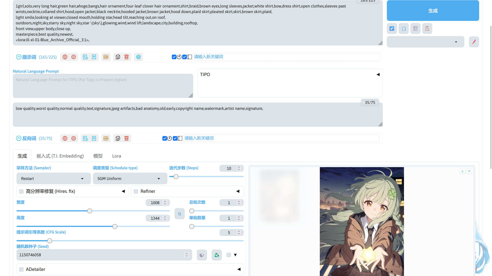

# 概述
下面介绍在 SD WebUI Forge 中常用的功能。


这是 SD WebUI Forge 的界面，因为前基于 SD WebUI，界面操作和 SD WebUI 很相似，使用方法也和 SD WebUI 基本相同，可结合前面的 SD WebUI 教程学习使用。

<!-- TODO: 需要添加从 SD WebUI 教程的引用 -->

!!!note
    SD WebUI Forge 界面使用的翻译扩展：[stable-diffusion-webui-localization-zh_Hans](https://github.com/hanamizuki-ai/stable-diffusion-webui-localization-zh_Hans)

## 文生图
SD WebUI Forge 顶部的模型选项用于选择 Stable Diffusion 模型，VAE / Text Encoder 用于选择 VAE 模型和文本编码器模型，顶部的其他功能在本章节暂不进行说明。

这里就跟着本章节进行选择，UI 选择 xl，模型选择 Illustrious-XL-v0.1.safetensors，其他选项保持默认即可。

!!!note
    Illustrious XL v0.1 模型下载：[Illustrious-XL-v0.1.safetensors](https://modelscope.cn/models/licyks/sd-model/resolve/master/sdxl_1.0/Illustrious-XL-v0.1.safetensors)。  
    模型下载好后放在`stable-diffusion-webui-forge/models/Stable-diffusion`路径中。

正向提示词描述想要模型画出来的内容，负面提示词描述不想让模型画出来的内容。

这里我的正向提示词描写了画风，人物，环境，镜头和模型支持的质量提示词。

```
fuzichoco,torino aqua,rurudo,qys3,azuuru,miyase mahiro,tsunako,
1girl,solo,very long hair,green hair,ahoge,bangs,hair ornament,four-leaf clover hair ornament,shirt,braid,brown eyes,long sleeves,jacket,white shirt,bow,dress shirt,open clothes,sleeves past wrists,necktie,collared shirt,hood,open jacket,black necktie,hooded jacket,brown jacket,hood down,plaid skirt,pleated skirt,skirt,brown skirt,plaid,
light smile,looking at viewer,closed mouth,holding star,head tilt,reaching out,on roof,
outdoors,night,sky,starry sky,night sky,star \(sky\),glowing,wind,wind lift,landscape,city,building,rooftop,
front view,upper body,close up,
masterpiece,best quality,newest,
```

负面提示词描写不想让模型画出来的内容，下面的负面提示词在大部分情况下都使用，可根据自己的需求进行修改。

```
low quality,worst quality,normal quality,text,signature,jpeg artifacts,bad anatomy,old,early,copyright name,watermark,artist name,signature,
```

!!!note
    Natural Language Prompt 选项框由 [z-tipo-extension](https://github.com/KohakuBlueleaf/z-tipo-extension) 提供，该扩展用于对提示词进行扩写，增强模型的出图效果，在本章节不进行说明。

采样方法和调度类型用于设置生成图片时降噪的方法，不同的采样方法和调度类型搭配存在一些出图效果的区别，可自行测试。这里的采样方法选择 Restatt，调度类型选择 SGM Uniform。

迭代步数用于设置生图过程进行的采样次数，不同的采样方法和调度类型组合需要不同的迭代步数，也需要自行测试。这里的迭代步数设置为 10。

高分辨率修复用于增加图片的分辨率，生成的图片质量，本章节暂不进行说明。

宽度和高度用于设置生成图片时使用的分辨率，这里的宽度和高度分别设置为 1008 和 1344。

提示词引导系数用于设置模型对提示词和图像的匹配程度，不同的模型需要的值都不一样，过高的值可能会导致出图质量下降。这里我设置为 5。

随机数种子用于设置在进行采样前初始噪声的样子，当其他参数不变时，同样的种子将生成同样的噪声，最后生成出来的图将会几乎相同（在像素层面可能存在不同）。这里保持 -1 即可。

参数调整完成后就可以点击右上角的生成，生成结束后在右下方可以看到生成好的图片。


## LoRA 使用
在 Stable Diffusion 模型无法直接实现某些效果时，就可以通过 LoRA 模型来实现。

这里我选择使用 Style: Blue Archive Flat Color 这个 LoRA 调整画风。

!!!note
    Style: Blue Archive Flat Color 下载：[ill-xl-01-aaaki_6-000032.safetensors](https://modelscope.cn/models/licyks/sd-lora/resolve/master/sdxl/character/ill-xl-01-aaaki_6-000032.safetensors)([Civitai](https://civitai.com/models/642656/style-blue-archive-flat-color))。  
    模型下载好后放在`stable-diffusion-webui-forge/models/Lora`路径中。

把 LoRA 模型下载到 SD WebUI Forge 后，点击 LoRA 选项卡并点右上角的刷新按钮后就可以看到刚刚放进去的 LoRA 模型，点击这个 LoRA 模型的选项卡就会把调用 LoRA 的提示词写在正面提示词中。


下面是正面提示词。

```
1girl,solo,very long hair,green hair,ahoge,bangs,hair ornament,four-leaf clover hair ornament,shirt,braid,brown eyes,long sleeves,jacket,white shirt,bow,dress shirt,open clothes,sleeves past wrists,necktie,collared shirt,hood,open jacket,black necktie,hooded jacket,brown jacket,hood down,plaid skirt,pleated skirt,skirt,brown skirt,plaid,
light smile,looking at viewer,closed mouth,holding star,head tilt,reaching out,on roof,
outdoors,night,sky,starry sky,night sky,star \(sky\),glowing,wind,wind lift,landscape,city,building,rooftop,
front view,upper body,close up,
masterpiece,best quality,newest,
<lora:ill-xl-01-Blue_Archive_Official_3:1>,
```

!!!note
    提示词中因为要使用画风 LoRA 的画风，所以把提示词第一行的画风提示词删去。在提示词的最后一行为调用 LoRA 的提示词。

调整好后可以点击生成了，生成完成后可以看到生成图片的画风变成 LoRA 的画风。



有些 LoRA 模型在使用时需要触发词，这里使用 Character: aaaki 这个人物 LoRA 进行演示。

!!!note
    Character: aaaki 模型下载：[ill-xl-01-aaaki_6-000032.safetensors](https://modelscope.cn/models/licyks/sd-lora/resolve/master/sdxl/character/ill-xl-01-aaaki_6-000032.safetensors)([Civitai](https://civitai.com/models/890177/character-aaaki))。
    模型下载好后放在`stable-diffusion-webui-forge/models/Lora`路径中。  
    在 Civitai 上模型的说明信息中该 LoRA 的触发词为`aaaki`，并且推荐加上`cat ears,animal ears,animal ear fluff,blonde hair,low twintails,twintails,long hair,bow,hair bow,bow hairband,hairclip,round eyewear,glasses,blue eyes,hair ornament,cardigan,breasts,pink dress,pom pom \(clothes\),`这些提示词来提升还原效果。

下载好后按之前的方法调用 LoRA，并且根据 LoRA 模型说明修改提示词。这是修改后的正面提示词。

```
1girl,aaaki,
cat ears,animal ears,animal ear fluff,blonde hair,twintails,blue eyes,low twintails,cardigan,breasts,long hair,bow,hair bow,bow hairband,hairclip,round eyewear,glasses,hair ornament,
holding pillow,pillow hug,sitting,on couch,looking at viewer,light smile,open mouth,one eye closed,head tilt,::3,
couch,indoors,room,desk,vase,flower,light rays,window,curtains,
close up,upper body,
masterpiece,best quality,newest,
<lora:ill-xl-01-aaaki_6:0.6>,<lora:ill-xl-01-Blue_Archive_Official_3>,
```

!!!note
    在第一行中添加了 LoRA 模型要求的`aaaki`触发词，最后一行为该 LoRA 的调用提示词。通常可以使用多个 LoRA 调整 Stable Diffusion 模型的出图效果，比如现在将 Character: aaaki 和 Style: Blue Archive Flat Color 同时使用。

调整好参数后就可以进行图片生成，生成结束后可以看到 2 个 LoRA 可以共同起作用调整出图效果。

