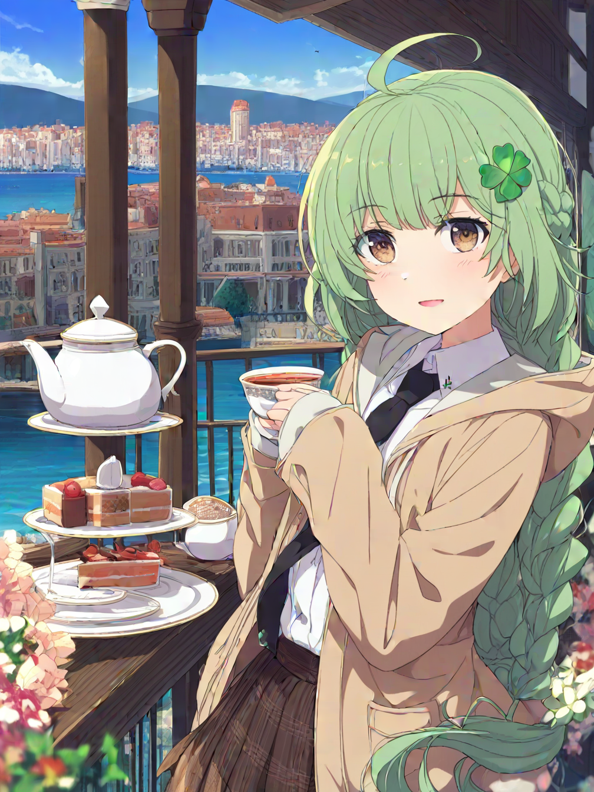
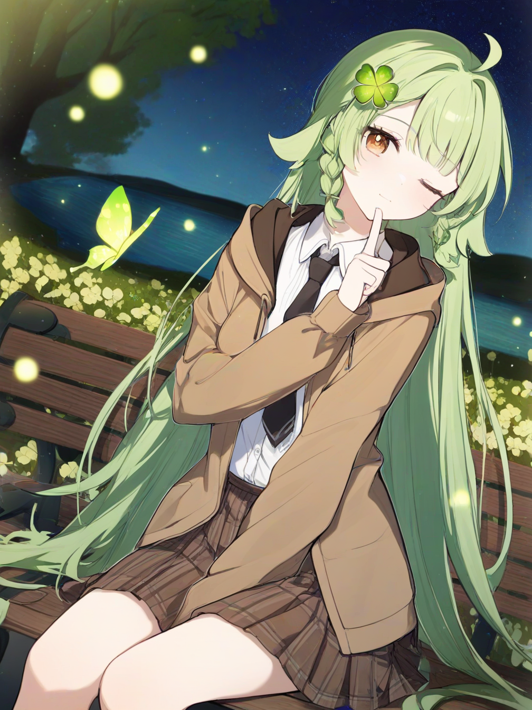
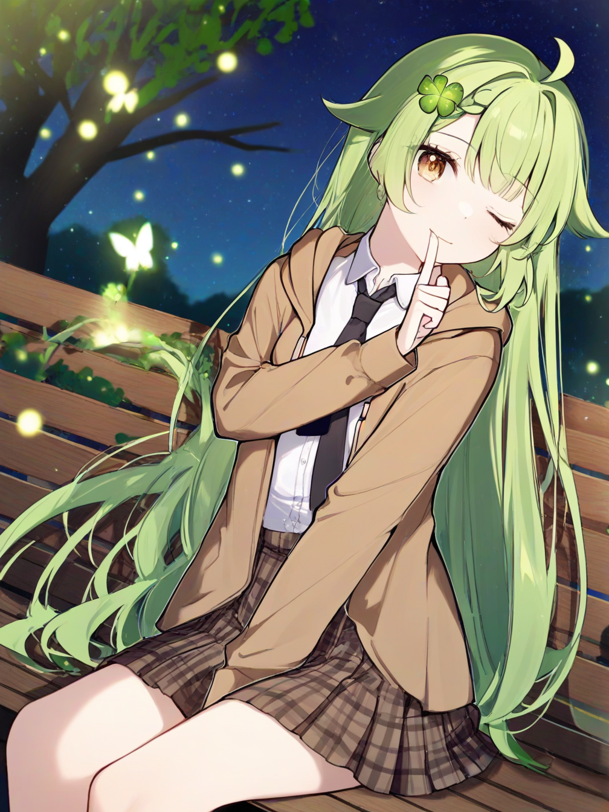
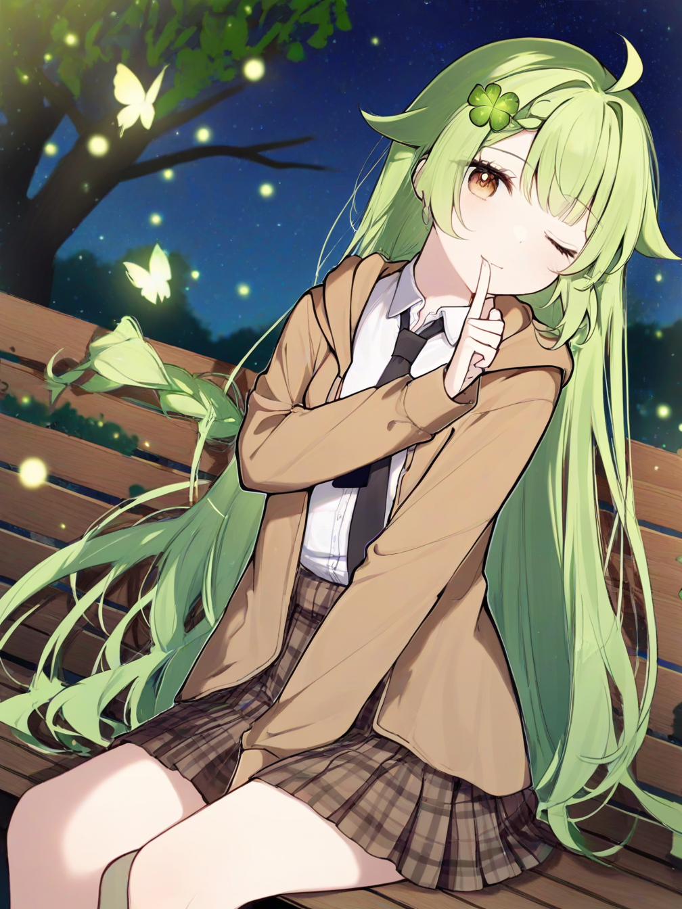
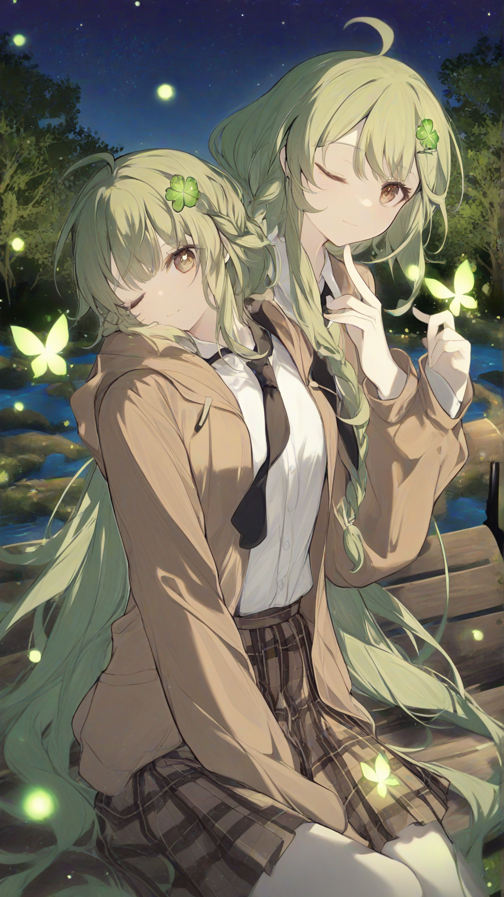
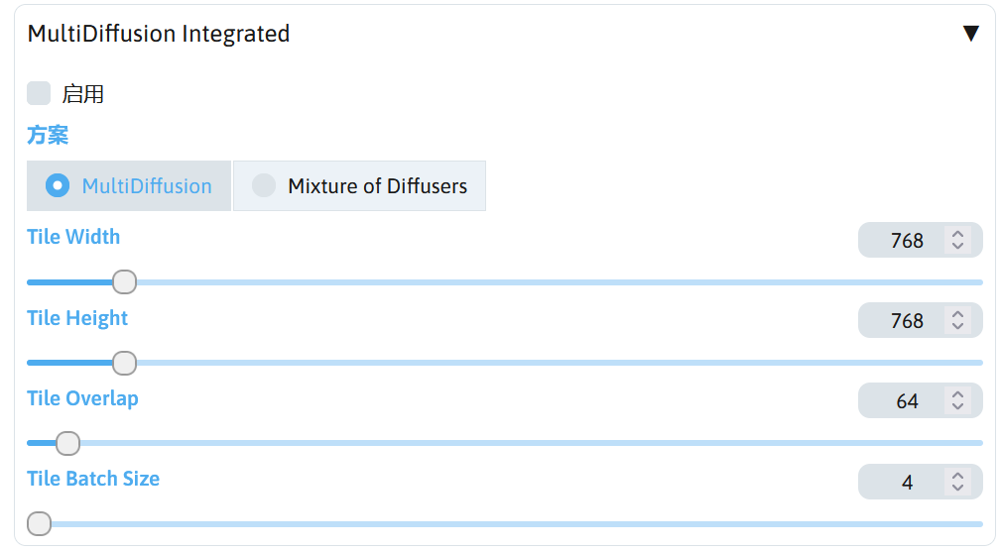
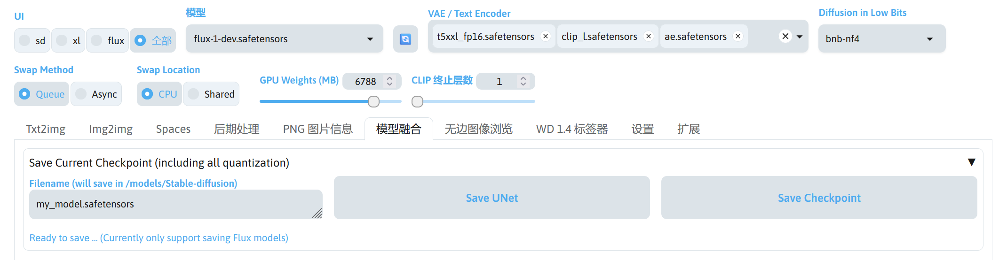

# 概述
SD WebUI Forge 内置了一些扩展可供使用，下面就简单介绍内置扩展的使用。

## Spaces
这是 SD WebUI Forge 其中一个扩展系统，功能类似 HuggingFace Spaces，提供了少量比较有用的扩展。

如果需要其中的某个扩展，点击该扩展右边的安装按钮即可进行安装，在控制台可以看到安装过程，安装完成后 Launch 按钮将可用。

点击 Launch 启动扩展，启动完成后将自动调用浏览器打开扩展的页面，在控制台也能看到扩展对应的页面地址。

如果需要关闭该扩展，点击 Terminate 将关闭该扩展的进程。

如果不再需要该扩展，可以点击 Uninstall 卸载该扩展。

!!!note
    SD WebUI Forge 的 Spaces 功能中的扩展因为需要手动安装，不完全算 SD WebUI Forge 的内置扩展，所以不多介绍 Spaces 扩展的功能。

## ControlNet Integrated
使用图片作为控制图片生成的条件，在前面的章节中讲过如何使用，所以本章将不再进行介绍。

具体介绍请阅读：[ControlNet 应用 - SD Note](../sd_webui/controlnet.md)

## FreeU Integrated
该扩展可以调节出图的效果，提高图片的对比度，改善出图的细节。

启用后，B1，B2，S1，S2 可以调节 FreeU 的作用效果，Start step 和 End step 分别条件 FreeU 起作用的起始时机和结束时机。

在左下角的 (presets) 中可以选择一些参数预设，根据自己使用的模型进行选择。

使用 FreeU 后，可以看到图片的对比度有了提高，在某些细节上效果更好。

|使用 FreeU 前|使用 FreeU 后（使用 SDXL 预设）|
|---|---|
|||

!!!note
    FreeU 相关的论文：[[2309.11497v2] FreeU: Free Lunch in Diffusion U-Net](https://arxiv.org/abs/2309.11497v2)

## DynamicThresholding (CFG-Fix) Integrated
该扩展用于设置动态提示词引导系数，可使在较高的提示词引导系数下颜色能够保持正常。

下面提供一个预设值可供参考。

|选项|值|
|---|---|
|Mimic Scale|5|
|Threshold Percentile|0.95|
|Mimic Mode|Half Cosine Up|
|Mimic Scale Min|4|
|Cfg Mode|Half Cosine Up|
|Cfg Scale Min|4|
|Sched Val|4|
|Separate Feature Channels|enable|
|Scaling Startpoint|MEAN|
|Variability Measure|AD|
|Interpolate Phi|1|

启用后，可以避免高提示词引导系数下颜色异常。

|提示词引导系数|5|30（启用 DynamicThresholding）|30|
|---|---|---|---|
|效果图||||

!!!note
    DynamicThresholding 相关的说明：[mcmonkeyprojects/sd-dynamic-thresholding Wiki](https://github.com/mcmonkeyprojects/sd-dynamic-thresholding/wiki)

## SelfAttentionGuidance Integrated (SD 1.x, SD 2.x, SDXL)
该扩展用于提升生成图片的细节，改善出图效果。

启用后使用默认值可得到比较好的效果，也可以自己调整这些值，测试哪些参数更好。

|启用前|启用后|
|---|---|
|||

!!!note
    Self-Attention Guidance 相关论文：[[2210.00939] Improving Sample Quality of Diffusion Models Using Self-Attention Guidance](https://arxiv.org/abs/2210.00939)

## PerturbedAttentionGuidance Integrated
该扩展用于优化图片细节，增加图片对比度，提高图片质量。

通常使用默认值就有比较好的效果，当然可以尝试调整参数测试哪个参数效果较好。

|PerturbedAttentionGuidance|无|3|5|
|---|---|---|---|
|效果图||||

!!!note
    Perturbed Attention Guidance 相关论文：[[2403.17377] Self-Rectifying Diffusion Sampling with Perturbed-Attention Guidance](https://arxiv.org/abs/2403.17377)

## Kohya HRFix Integrated
当想要直出 1920x1080 这样的高分辨率，但是所使用的 SDXL 模型是在 1024x1024 分辨率下进行训练的，这可能会出现画面崩坏，此时可以通过该扩展修复该问题。

使用默认值就可以得到比较好的效果，也可以尝试自己调整参数，有些参数组合可以提高画面的细节。

|禁用 Kohya HRFix|启用 Kohya HRFix|
|---|---|
|||

!!!note
    Kohya HRFix 实现源码：[SDXLで高解像度での構図の破綻を軽減する](https://gist.github.com/kohya-ss/3f774da220df102548093a7abc8538ed)

## LatentModifier Integrated
该扩展可将滤镜应用于潜空间图像中，调整出图效果，可调节的效果有锐化等。

使用时根据自己需求调整参数即可。

## StyleAlign Integrated
该扩展用于同时生成多张图片中，即单批数量大于 1 时能够起作用。

启用该扩展后，如果设置单批数量同时生成多张图片，则该扩展将会在批次中分享注意力，使批次中每张图片的风格相似。

|禁用 StyleAlign|启用 StyleAlign|
|---|---|
|||

## MultiDiffusion Integrated
该插件将潜空间图像进行分块，进行采样后再合并成一张完成的潜空间图像，可用于文生图生成超高分辨率图像或者在图生图中对图片进行放大。

下面给出一些 MultiDiffusion 的参数配置。

|参数 1||
|---|---|
|方案|MultiDiffusion|
|Tile Width|1024|
|Tile Height|1024|
|Tile Overlap|256|
|Tile Batch Size|8|

|参数 2||
|---|---|
|方案|Mixture of Diffusers|
|Tile Width|1024|
|Tile Height|1024|
|Tile Overlap|96|
|Tile Batch Size|8|

Tile Width 和 Tile Height 为分割图像的分辨率，Tile Overlap 为每个分块图像之间重叠的分辨率，较高的值可以减少接缝的产生，但是会增加图片生成的时长。

如果出现显存不足的情况，需要将 Tile Batch Size 的值调低。

### 文生图
在文生图可以用来生成超大分辨率图像，但单纯使用 MultiDiffusion 生成超大图像不适合生成单人物图像，因为分块会导致出现多人的情况，需要通过 ControlNet Canny / Lineart 进行控制。

如果单纯使用 MultiDiffusion 生成超大分辨率图像。比较适合生成风景图，不过画面的连贯性可能不是很好。

### 图生图
MultiDiffusion 用在图生图中放大图片比较好。

导入图片后并写上提示词，在重绘尺寸倍数设置好倍数，重绘幅度设置为 0.35，启用 MultiDiffusion Integrated 并设置好参数就可以进行图片放大了。

如果放大后的图片出现了鬼影，可以尝试将提示词中具体描述画面元素的提示词删去，或者加上 ControlNet Tile，重绘幅度修改为 0.6。如果 MuitlDiffusion Integrated 的方案选择 MultiDiffusion，则 Tile Overlap 调成 64，如果选择的是 Mixture of Diffusers，则 Tile Overlap 调成 32。这样就可以进行图片放大了。

对图片进行放大时，建议把 Never OOM Integrated 的 Enabled for VAE (always tiled) 勾选上，防止 VAE 阶段出现显存不足。

!!!note
    MultiDiffusion 扩展的说明：[分片扩散 · pkuliyi2015/multidiffusion-upscaler-for-automatic1111 Wiki](https://github.com/pkuliyi2015/multidiffusion-upscaler-for-automatic1111/wiki/%E5%88%86%E7%89%87%E6%89%A9%E6%95%A3)。  
    MultiDiffusion 算法：[MultiDiffusion: Fusing Diffusion Paths for Controlled Image Generation](https://multidiffusion.github.io/)。  
    Mixture of Diffusers 算法：[albarji/mixture-of-diffusers: Mixture of Diffusers for scene composition and high resolution image generation](https://github.com/albarji/mixture-of-diffusers)。

## 模型融合
该扩展可用于将两个融合在一起，或者将模型中的 VAE 进行替换。

在 SD WebUI Forge 中，模型融合扩展支持将 FLUX 模型进行量化并保存。模型选择 flux-1-dev.safetensors，VAE / Text Encoder 选择 t5xxl_fp16.safetensors、clip_l.safetensors、ae.safetensors，Diffusion in Low Bits 选择 bnb-nf4 后，在模型融合的 Save Current Checkpoint (including all quantization) 选项点击 Save Checkpoint 将选中的模型量化成 nf4 精度并保存成一个模型文件。

!!!note
    该扩展的相关说明：[(Save Flux BitsandBytes UNet/Checkpoint)](https://github.com/lllyasviel/stable-diffusion-webui-forge/discussions/1224#discussioncomment-10384104)。