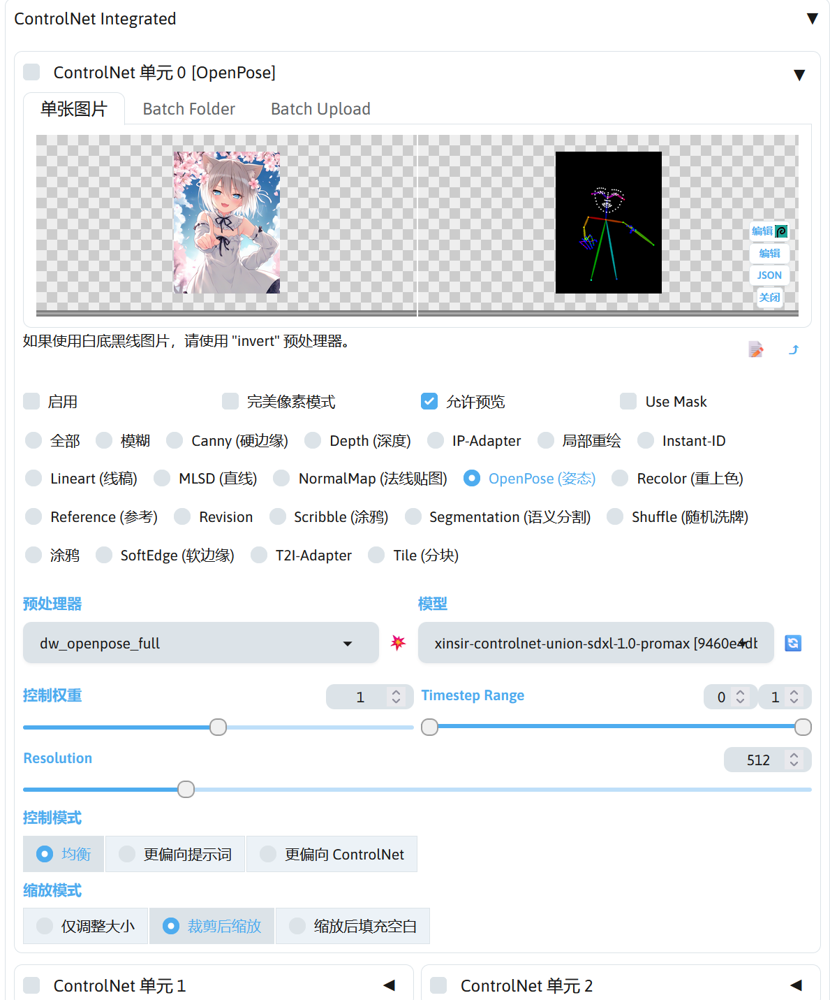

# 概述
SD WebUI Forge 内置了一些扩展可供使用，下面就简单介绍内置扩展的使用。

## Spaces
这是 SD WebUI Forge 其中一个扩展系统，功能类似 HuggingFace Spaces，提供了少量比较有用的扩展。

如果需要其中的某个扩展，点击该扩展右边的安装按钮即可进行安装，在控制台可以看到安装过程，安装完成后 Launch 按钮将可用。

点击 Launch 启动扩展，启动完成后将自动调用浏览器打开扩展的页面，在控制台也能看到扩展对应的页面地址。

如果需要关闭该扩展，点击 Terminate 将关闭该扩展的进程。

如果不再需要该扩展，可以点击 Uninstall 卸载该扩展。

!!!note
    SD WebUI Forge 的 Spaces 功能中的扩展因为需要手动安装，不完全算 SD WebUI Forge 的内置扩展，所以不多介绍 Spaces 扩展的功能。

## ControlNet Integrated
使用图片作为控制图片生成的条件，在前面的章节中讲过如何使用，所以本章将不再进行介绍。

具体介绍请阅读。

<!-- TODO: 引用前面关于 ControlNet 的说明 -->

## FreeU Integrated
该扩展可以调节出图的效果，提高图片的对比度，改善出图的细节。

启用后，B1，B2，S1，S2 可以调节 FreeU 的作用效果，Start step 和 End step 分别条件 FreeU 起作用的起始时机和结束时机。

在左下角的 (presets) 中可以选择一些参数预设，根据自己使用的模型进行选择。

使用 FreeU 后，可以看到图片的对比度有了提高，在某些细节上效果更好。

|使用 FreeU 前|使用 FreeU 后（使用 SDXL 预设）|
|---|---|
|||

!!!note
    FreeU 相关的论文：[[2309.11497v2] FreeU: Free Lunch in Diffusion U-Net](https://arxiv.org/abs/2309.11497v2)

## DynamicThresholding (CFG-Fix) Integrated
该扩展用于设置动态提示词引导系数，可使在较高的提示词引导系数下颜色能够保持正常。

下面提供一个预设值可供参考。

|选项|值|
|---|---|
|Mimic Scale|5|
|Threshold Percentile|0.95|
|Mimic Mode|Half Cosine Up|
|Mimic Scale Min|4|
|Cfg Mode|Half Cosine Up|
|Cfg Scale Min|4|
|Sched Val|4|
|Separate Feature Channels|enable|
|Scaling Startpoint|MEAN|
|Variability Measure|AD|
|Interpolate Phi|1|

启用后，可以避免高提示词引导系数下颜色异常。

|提示词引导系数|5|30（启用 DynamicThresholding）|30|
|---|---|---|---|
|效果图||||

!!!note
    DynamicThresholding 相关的说明：[mcmonkeyprojects/sd-dynamic-thresholding Wiki](https://github.com/mcmonkeyprojects/sd-dynamic-thresholding/wiki)