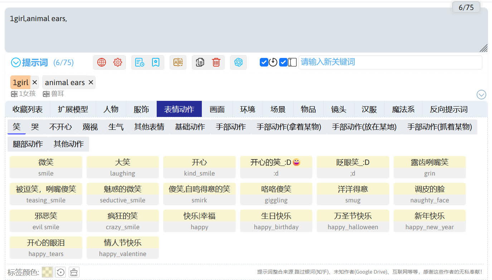

# 文生图
这里我使用以下模型进行演示。

!!!note
	演示界面包含外置扩展，您的界面可能与我的有一定的区别。

|模型（点击即可下载）|放置路径|
|---|---|
|[cetusMix_Whalefall2](https://modelscope.cn/api/v1/models/licyks/sd-model/repo?Revision=master&FilePath=sd_1.5%2FcetusMix_Whalefall2.safetensors)|stable-diffusion-webui/models/Stable-diffusion|
|[vae-ft-mse-840000-ema-pruned](https://modelscope.cn/api/v1/models/licyks/sd-vae/repo?Revision=master&FilePath=sd_1.5%2Fvae-ft-mse-840000-ema-pruned.safetensors)|stable-diffusion-webui/models/VAE|

将模型放置到对应的路径后，启动 SD WebUI，启动完成后浏览器将会跳转到 SD WebUI 的界面，在界面最上方的模型选择切换成刚刚放进去的模型。


## 界面介绍
SD WebUI 的界面大致分为几个部分。

- 模型切换


- 提示词输入


- 参数调整


- 生成按钮和其他按钮


- 图片预览


## 提示词输入
大致认识了界面后，现在来调整生成图片的参数。

在正面提示词中输入你想要 AI 生成的东西（必须是英文），这里我们可以利用 a1111-sd-webui-tagcomplete 扩展来辅助我们输入提示词。使用方向键选择要补全的提示词，Tab 键 / Enter 键补全提示词。


!!!note
    a1111-sd-webui-tagcomplete 扩展：https://github.com/DominikDoom/a1111-sd-webui-tagcomplete

如果对英文不熟悉，也可以通过 sd-webui-prompt-all-in-one 扩展输入提示词。点击左下角的按钮即可展开提示词列表，单击列表中的其中一个提示词就可以把输入到提示词框中。



右侧的小框是 sd-webui-prompt-all-in-one 扩展的输入翻译框，这里可以输入中文并由扩展翻译成英文。


回车后中文被输入到提示词框中并自动翻译成英文。


!!!note
    sd-webui-prompt-all-in-one 扩展：https://github.com/Physton/sd-webui-prompt-all-in-one

下面是我输入的正向提示词，描写了人物、动作、场景、镜头。
```
1girl,animal ears,animal ear fluff,cat ears,pink hair,short hair,bangs,blush,closed mouth,light smile,purple eyes,hair between eyes,collar,white hoodie,flat chest,
looking at viewer,waving,under the tree,
tree,landscape,grass,flower,blue sky,cirrocumulus,moody lighting,
close-up,upper body,dynamic_angle,
```

接下来输入反向提示词，一般反向提示词在大部分情况下通用，无需修改，这里可以直接复制我给的反向提示词。
```
lowres,bad anatomy,bad hands,text,error,missing fingers,extra digit,fewer digits,cropped,worst quality,low quality,normal quality,jpeg artifacts,signature,watermark,username,blurry,bad feet,
```


## 生图参数调整
填完了提示词，我们还需要调整一下左下角的生图参数，因为现在我使用的 cetusMix_Whalefall2 模型为 SD 1.5 的模型，适合的分辨率范围为 512 ~ 1024，所以我把宽度和高度分别设置为 768 和 1024。接下来来调整采样方法和迭代步数，下面为我个人比较喜欢的搭配。

|采样方法（Sampler）|调度器（Schedule type）|迭代步数（Step）|
|---|---|---|
|Eular a|Uniform / Exponential|20|
|DPM++ 系|Exponentia|20|
|Restart|Autumatic|10|
|Unipc|Autumatic|13|


## 生图
调整完这些参数后，点击右侧的生成按钮就开始生图了，生成完成后即可在图片预览区域看见生成好的图片。


