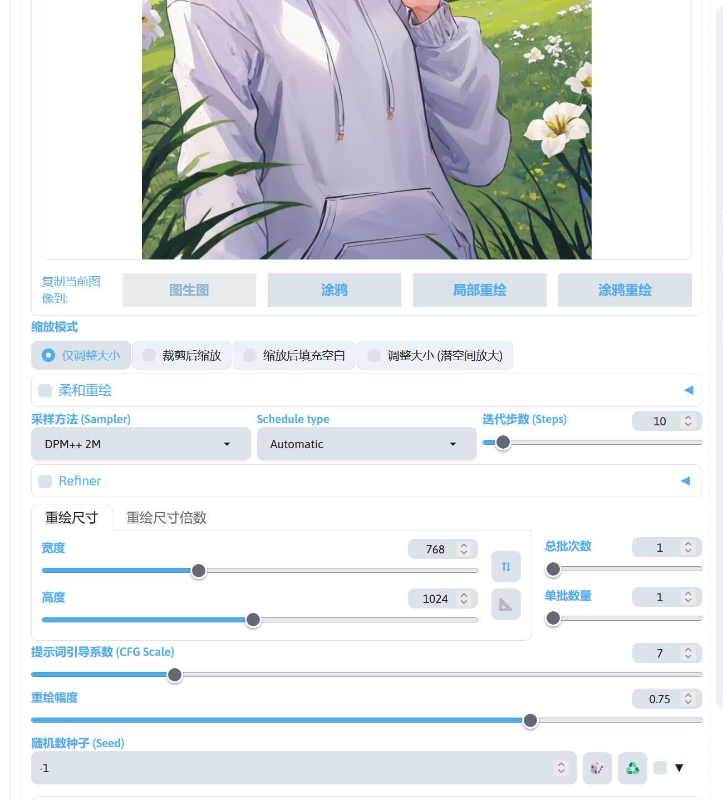

# 图片放大

一般 Stable Diffusion 生成出来的图片因为分辨率太低（768x1024 之类的），造成图片比较糊，观感，此时就可以通过放大的方式来提高图片的清晰度。这里介绍几种放大图片的方式。

## 后期处理的放大

在 SD WebUI 的后期处理选项卡中，也有一个放大功能。

不过这个放大功能使用的仅仅是 GAN ，并没有用到 Stable Diffusion，所以直接用这个功能来放大低分辨率的图片，放大后效果不是很行。如果去放大高分辨率的图片（比如从
1080p 放大到 4k），效果就会比较好。

!!!note
下面介绍的放大方法都在图生图选项卡中进行。

## 图生图直接放大

在图生图界面中，可以直接调整重绘尺寸或者重绘尺寸倍数来实现图片放大。

不过在 SD WebUI 的默认设置下，放大后的图片效果可能不如意，此时可以在 SD WebUI 的`设置`->`放大`->`图生图放大算法`
，选择一个算法，这样出图的效果就会比较好。

## 放大方案的组合

这些图片放大方法可以互相组合，不同的组合可能会获得不一样的放大效果。下面列出一些放大方法组合：

- Tiled Diffusion + StableSR
- Tiled Diffusion + ControlNet Tile
- Tiled Diffusion + 噪声反转 + ControlNet Tile
- Tiled Diffusion + ControlNet Tile
- Ultimate SD Upscaler + ControlNet Tile

实际哪种放大方法更好可自行测试。
!!!note
    部分放大器在插件教程中[放大插件](../plugs/hires_fix.md)