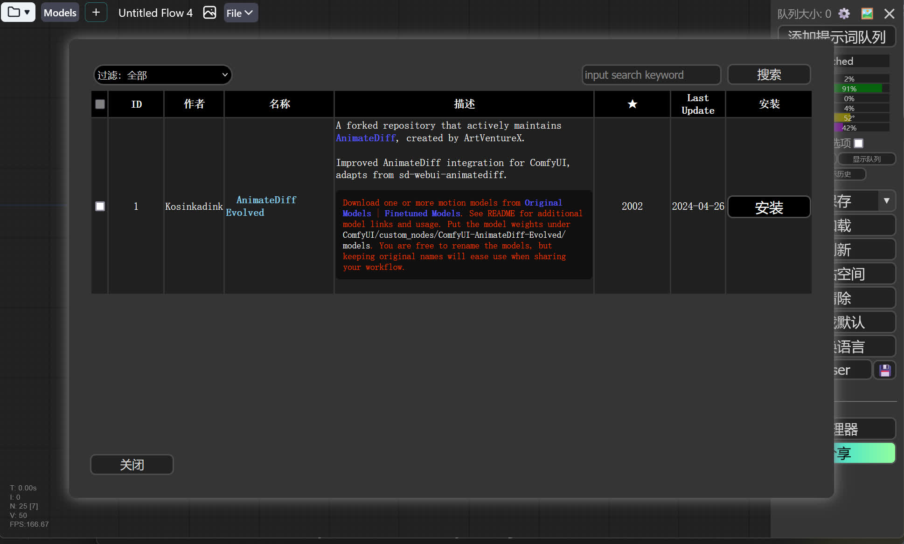

# ComfyUI
这里是有关 ComfyUI 的报错收集。


## 关于 ComfyUI
ComfyUI 并没有比 SD WebUI 快多少，而 ComfyUI 的显存策略和 SD WebUI 不同，所以 ComfyUI 在很多时候显存占用会比 SD WebUI 低一点，所以没有所谓的 ComfyUI 比 SD WebUI 好。在 SD WebUI 中也有 [LightDiffusionFlow](https://github.com/Tencent/LightDiffusionFlow) 扩展实现 ComfyUI 的保存工作流，工作流可在 [LIGHTFLOW](https://www.lightflow.ai/) 寻找。

ComfyUI 的扩展生态一直存在着问题，各种扩展的环境依赖要求经常互相冲突，甚至和 ComfyUI 的环境依赖要求冲突，部分扩展可能还会互相冲突，导致 ComfyUI 无法正常运行，出现各种报错，所以入门 ComfyUI 需要做好面对报错的准备。

关于 ComfyUI 扩展生态的问题：[A rant about current custom nodes ecosystem · comfyanonymous/ComfyUI · Discussion #2635](https://github.com/comfyanonymous/ComfyUI/discussions/2635)。

这是避免 ComfyUI 环境坏掉的方法（来自绘世启动器开发者[喵喵hmkai](https://space.bilibili.com/2082155)）。

0. 远离官方整合包和官方整合包的派生；如果不能远离，就远离里边自带的更新脚本，除非你不安装任何插件
1. 少装插件
2. 不要直接把插件压缩包或者文件夹拷进去，这不是 WebUI
3. 不要直接 git clone 插件，这不是 WebUI
4. 只有在用官方整合包的情况下使用 install.bat，其他情况均不使用
5. 插件能用列表装就别用链接装，有些额外的部件只有列表里装才会下载，这不是 WebUI

***

## 为 ComfyUI 安装扩展
为 ComfyUI 安装扩展有几种方式。

1. 使用绘世启动器的版本管理：在绘世启动器的`版本管理`->`安装新扩展`，在扩展列表中选择扩展安装或者输入扩展地址进行安装。
2. 使用 [Comfyui-Manager](https://github.com/ltdrdata/ComfyUI-Manager)：在安装 [Comfyui-Manager](https://github.com/ltdrdata/ComfyUI-Manager) 扩展后，使用 ComfyUI-Manger 的扩展安装功能安装扩展。
3. 使用 Git 命令：在 ComfyUI/custom_nodes 目录下使用`git clone 扩展地址`命令安装。
4. 手动从 Github 下载压缩包：在 Github 扩展项目中下载扩展的压缩包并解压到 ComfyUI/custom_nodes 目录中。（极不推荐！！！！！！）

在安装和使用扩展前，请仔细阅读扩展作者的说明文档，并按照扩展作者的说明进行操作！！！

***

## 环境依赖存在冲突
这是因为某些扩展的依赖关系出现了冲突。


这个通常可以选择忽略警告并继续运行。如果想要修复，可尝试选择按顺序安装冲突依赖，只不过无法彻底解决问题。

你可以尝试卸载发生环境依赖冲突的扩展，以上图为例，可以看到 was-node-suite-comfyui 和 ComfyUI-PhotoMaker-ZHO 的依赖要求中只用了`==`来注明版本号，可以在绘世启动器的`版本管理`->`扩展`中，将这两个扩展卸载。

***

## the following node types were not found，导入节点流爆红
这可能是所加载的节点流缺少了包含了缺失的扩展。


可以在你下载工作流的地方查找作者的说明，查看作者使用了哪些扩展，然后在绘世启动器的`版本管理`->`安装新扩展`，搜索对应的扩展或者输入扩展的下载链接进行安装。

或者使用 [ComfyUI-Manager](https://github.com/ltdrdata/ComfyUI-Manager) 扩展管理工具安装缺失的扩展（前提是安装了 [ComfyUI-Manager](https://github.com/ltdrdata/ComfyUI-Manager) 扩展）。在 ComfyUI 右下角点击管理器，在 ComfyUI-Manager 界面点击安装缺失节点。


等待 ComfyUI-Manager 扫描缺失的扩展。扫描完成后将列出缺失的扩展。



点击安装这些扩展，然后重启 ComfyUI 后生效。

!!!note
    如果这里没有显示扩展，可能有以下原因。

    1. 扩展不在 ComfyUI-Manager 的扩展数据库中，无法被查找到。
    2. 扩展已经安装了，但是在 ComfyUI 启动的时候加载失败了，在 ComfyUI 的启动信息中可以查看 Import times for custom nodes 这部分的信息，如果看到 IMPORT FAILED 就说明加载失败了。
    3. 扩展出现了破坏性更新，扩展内带的节点出现过大的改动，导致原来使用该扩展搭建出的节点无法使用，需要重新搭建。比如 [ComfyUI_IPAdapter_plus](https://github.com/cubiq/ComfyUI_IPAdapter_plus) 扩展，在 2024.3.23 时将扩展重写了（破坏性更新），导致之前使用这个扩展的工作流需要重新搭建。

***

## ComfyUI 启动时显示 IMPORT FAILED
在 ComfyUI 启动完成后显示的 Import times for custom nodes 信息中出现了 IMPORT FAILED，这是因为扩展因为某些原因导致导入失败，可能有以下几种原因。

1. 扩展有子模块未正确克隆下载，请使用绘世启动器的[扩展安装功能](../sd_launcher/ver_manager/install.md)或者 [ComfyUI-Manager](https://github.com/ltdrdata/ComfyUI-Manager) 重新安装该扩展。
2. 扩展版本和 ComfyUI 版本未对齐，请在绘世启动器的版本中将内核和扩展都更新一遍。
3. 扩展所需的依赖环境缺失，需要在绘世启动器的`高级选项`->`环境维护`，使用[环境修复](../sd_launcher/advance/env.md#_2)功能修复扩展所需的依赖环境。

***

## Please check your connect and try again or make sure your Internet connection is on
这是因为网络问题导致无法下载一些缺失文件，尝试配置代理解决。

!!!note
    有些报错也和网络问题有关，比如报错中有`Internet`、`connection`、`ConnectTimeout`这些关键词，或者是`由于目标计算机积极拒绝，无法连接` / `信号灯超时时间已到`，就有可能是网络问题。配置绘世启动器的代理参看：[绘世启动器 - 配置绘世启动器的代理 - SD Note](../help/sd_launcher.md#_6)

***

## 'UNetModel' object has no attribute 'default_image_only_indicator'
在绘世启动器的`版本管理`->`扩展`，更新或者卸载 [FreeU_Advanced](https://github.com/WASasquatch/FreeU_Advanced) 扩展。

***

## ComfyUI 设置中文
有以下两种方式设置中文。

- 使用 [AIGODLIKE-COMFYUI-TRANSLATION](https://github.com/AIGODLIKE/AIGODLIKE-COMFYUI-TRANSLATION) 扩展

1. 在绘世启动器的`版本管理`->`安装新扩展`，搜索 AIGODLIKE-COMFYUI-TRANSLATION 扩展并安装。
2. 在 ComfyUI 的界面点击右上角的齿轮图标进入 ComfyUI 设置。
3. 在 ComfyUI 设置中找到 AGLTranslation-langualge 选项，然后选择 [中文] Chinese Simplified。

- 使用绘世启动器的云端汉化功能

1. 打开绘世启动器的高级选项。
2. 在启动器特性设置中找到启用云端页面汉化选项，启用即可。

***

## 配置代理
参考该教程：[绘世启动器 - 配置绘世启动器的代理 - SDNote](../help/sd_launcher.md#_6)

***

## insightface model is required for FaceID models
缺失对应的模型，参看扩展说明自行下载模型，放到对应的目录。在 ComfyUI-Manager 中，可以在`安装模型`选项找到缺失的模型。

***

## ComfyUI too old, can't autodecet properly.
在绘世启动器的版本管理里更新 ComfyUI。

***

## [AinmateDiffEvo] - ERROR - No motion models found.Please download one and place in ...
这是缺少 AnimateDiffEvo 扩展对应的动作模型，如果不使用 AnimateDiffEvo 扩展，可以忽略这个报错。如果要解决这个报错，请下载对应的模型并放到报错提示的路径中，参考：[Kosinkadink/ComfyUI-AnimateDiff-Evolved - Model Setup](https://github.com/Kosinkadink/ComfyUI-AnimateDiff-Evolved?tab=readme-ov-file#model-setup)。

***

## mat1 and mat2 shapes cannot be multiplied
ControlNet 模型和大模型（SD）的版本不匹配，ControlNet 1.5 的模型需要搭配 SD 1.5 模型，ControlNet XL 的模型需要搭配 SDXL 模型。

ControlNet 模型下载：https://modelscope.cn/models/licyks/controlnet_v1.1

***

## ComfyUI 共享 SD WebUI 的模型
在 ComfyUI 启动一次后，在 ComfyUI 的根目录会生成一个 extra_model_paths.yaml.example 共享目录示例文件，通过修改这个文件可以使 ComfyUI 共享 SD WebUI 的模型文件。

这是一个例子，我的 SD WebUI 路径在 E:/Softwares/stable-diffusion-webui，则将这个示例文件的 base_path: 后面的路径改成 SD WebUI 的路径。

```yaml
#Rename this to extra_model_paths.yaml and ComfyUI will load it


#config for a1111 ui
#all you have to do is change the base_path to where yours is installed
a111:
    base_path: E:/Softwares/stable-diffusion-webui # 填写 SD WebUI 的路径, 注意冒号后面必须有空格

    checkpoints: models/Stable-diffusion # 大模型
    configs: models/Stable-diffusion # 大模型配置文件
    vae: models/VAE # VAE 模型
    loras: | # LoRA 模型
         models/Lora
         models/LyCORIS
    upscale_models: | # 放大模型
                  models/ESRGAN
                  models/RealESRGAN
                  models/SwinIR
    embeddings: embeddings # Embedding 模型
    hypernetworks: models/hypernetworks # Hypernetwork 模型
    controlnet: models/Controlnet # ControlNet 模型
    ipadapter: models/Controlnet # IP Adapter 模型
    clip_vision: extensions/sd-webui-controlnet/annotator/downloads/clip_vision # clip_vision 模型
    # animatediff模型共享的说明: https://github.com/Kosinkadink/ComfyUI-AnimateDiff-Evolved?tab=readme-ov-file#model-setup
    animatediff_models: extensions/sd-webui-animatediff/model # AnimateDiff 模型
    animatediff_motion_lora: extensions/sd-webui-animatediff/model # AnimateDiff LoRA 模型


#config for comfyui
#your base path should be either an existing comfy install or a central folder where you store all of your models, loras, etc.

comfyui:
#     base_path: path/to/comfyui/
#     checkpoints: models/checkpoints/
#     clip: models/clip/
#     configs: models/configs/
#     controlnet: models/controlnet/
#     embeddings: models/embeddings/
#     loras: models/loras/
#     upscale_models: models/upscale_models/
#     vae: models/vae/


#other_ui:
#    base_path: path/to/ui
#    checkpoints: models/checkpoints
#    gligen: models/gligen
#    custom_nodes: path/custom_nodes
```

修改并保存文件完成后，将 extra_model_paths.yaml.example 文件名改成 extra_model_paths.yaml，重新启动 ComfyUI 后就能看到 SD WebUI 里的模型了。

!!!note
    如果看不到文件名的后缀，需要将显示文件名后缀打开，参看：[杂项 - 显示隐藏的文件和文件后缀名 - SDNote](../help/other.md#_4)

***

## 运行节点流时某个节点报错
运行节点流时 ComfyUI 会使用颜色标记正在执行的节点，出现报错时，某个节点会爆红或者爆紫。

1. 如果这个节点的前面没有连接其他节点，就属于这个节点的问题，根据报错信息调整这个节点的参数后再试。
2. 如果这个节点的前面连接了其他节点（节点处在节点流的中间部分），这可能是这个节点的问题，也可能是这个节点之前的节点出现了问题（前面的节点给这个报错的节点传了错误的参数导致报错），这时需要检查前面的节点是否有参数错误，重新跳转后再试。

~~ComfyUI 的报错有时候让人捉摸不透。~~

***

## 修改 ComfyUI 的共享模型的配置文件后导致报错
修改 extra_model_paths.yaml 文件后出现下面类似的报错导致 ComfyUI 无法启动。

```
yaml.scanner.ScannerError: mapping value are not allowed here
    in "…\…\extra_model_paths.yaml", line x, column y
```

这是因为文件中出现了语法错误，举个例子。

```yaml
# 错误的写法，冒号后面缺少空格
base_path:E:/sd_webui

# 正确的写法
base_path: E:/sd_webui
```

检查 extra_model_paths.yaml 文件中是否有语法错误并修改。如果需要重置该文件，可以将 extra_model_paths.yaml 文件删除，并将 ComfyUI 自动生成的 extra_model_paths.yaml.example 文件改名成 extra_model_paths.yaml，再重新修改里面的配置。

