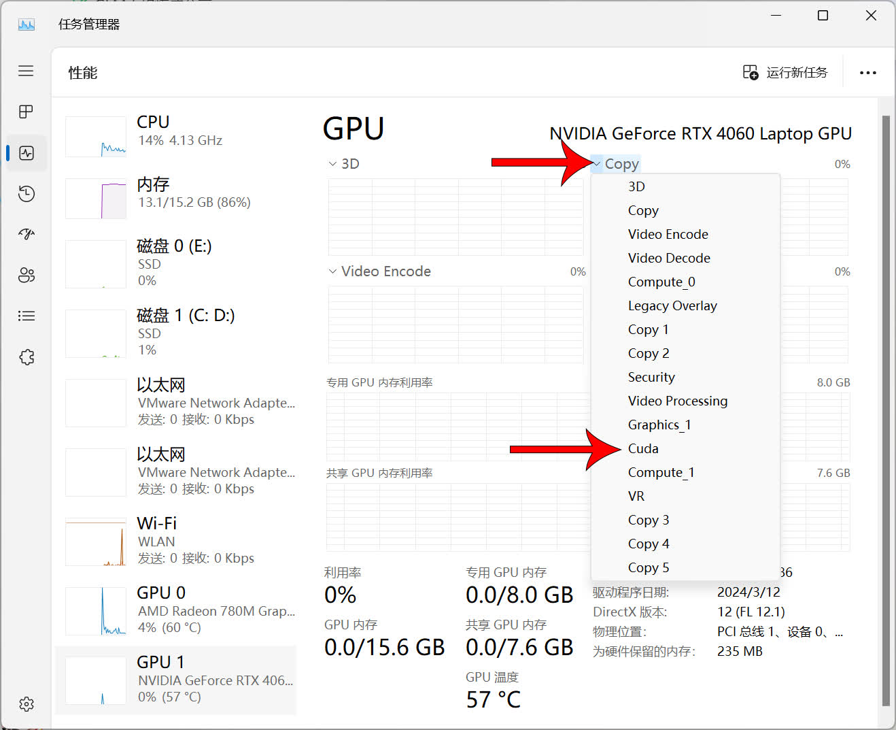

# 杂项
这里是其他的教程。

### 安装 Linux 系统
参考该教程：[Linux系统安装原来这么容易？还能与Windows系统共存？手把手教你安装_哔哩哔哩_bilibili](https://www.bilibili.com/video/BV1Dj421X7XZ)


### 重装 Windows 系统
1. 前往 [Windows 11](https://www.microsoft.com/zh-cn/software-download/windows11) 系统官网下载系统镜像。
2. 下载完成后右键镜像文件，选择挂载。
3. 在挂载好的镜像中找到 setup 程序，双击打开。
4. 根据安装程序的提示进行重装系统。


### 解决 Windows 系统出现程序乱码
这可能是 Windows 系统中启用了 UTF 8 编码，但是部分比较老的程序并不支持 UTF 8，所以导致的乱码，可以按照下列方法解决。

1. 按下`Win + R`键，输入`control`后回车启动控制面板。
2. 点击`时钟和区域`->`区域`
3. 在弹出的区域设置窗口中点击顶部的`管理`，再点击`更改系统区域设置`.
4. 在弹出的窗口中将`使用 Unicode UTF-8 提供全球语言支持`取消勾选，然后一直点击确定保存设置，并重启电脑。


### 激活 Windows 系统
1. 按下`Win + R`键，输入`powershell`后回车启动 PowerShell。
2. 输入下面的命令启动 [Microsoft-Activation-Scripts](https://github.com/massgravel/Microsoft-Activation-Scripts)。
```
irm https://massgrave.dev/get | iex
```
3. 在 Microsoft-Activation-Scripts 启动完成后将弹出一个窗口，这时候按下键盘的 1 使用 HWID 激活方法
4. 激活完成后将显示绿色的提醒，这时候就是激活完成了，显示 press any key to Go back ... 时就可以把窗口关闭。


### 查看跑图时显卡的占用
使用 Nvidia 显卡跑图时，任务管理器显示的显卡占用信息并不准确，这时需要将占用信息显示改成 CUDA。



如果没有看到这个选项，则需要在 Windows 设置中关闭硬件加速 GPU 计划。


!!!note
    关闭硬件加速 GPU 计划后将无法使用 DLSS 3 技术提升游戏画面体验。


### 调整虚拟内存
1. 按下`Win + R`快捷键，输入`sysdm.cpl`，回车运行，打开`高级系统设置`
2. 在打开的窗口中，点击`高级`选项卡下`性能`选项组的`设置`按钮
3. 打开性能选项窗口后，点击`高级`选项卡中的`更改`按钮
4. 在打开的窗口中，首先取消勾选`自动管理所有驱动器的分页文件大小`
5. 接下来选择`自定义大小`，然后手动设置初始大小以及最大值，建议初始值为 10240，最大值为 30720（或者更高的值）。设置完后，先点`设置`，然后点击`确定`按钮保存设置，设置好后重启电脑。


### 显示隐藏的文件和文件后缀名
在文件管理器中点击`查看`->`显示`，勾选`文件扩展名`和`隐藏的项目`。


### 浏览器推荐
- Microsoft Edge：https://www.microsoft.com/zh-cn/edge/download
- Chrome：https://www.google.cn/chrome
- Firefox：https://www.mozilla.org/zh-CN/firefox/all/#product-desktop-release


### 解压缩软件推荐
- 7-Zip：https://7-zip.org
- Bandizip：https://www.bandisoft.com/bandizip