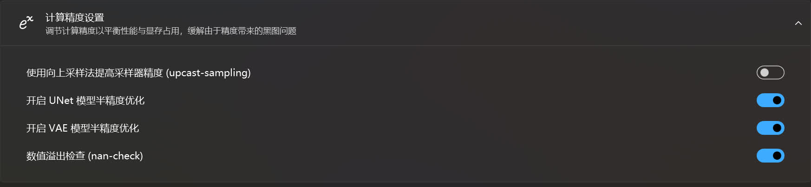
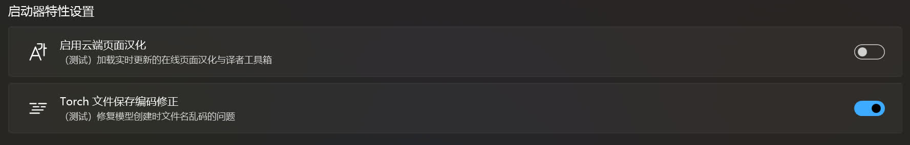
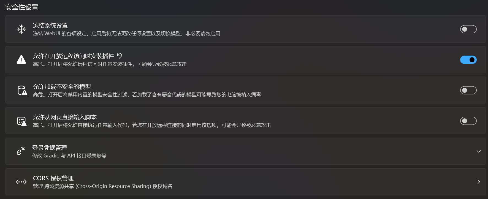

# 高级选项
!!!warning
    如果你是整合包用户，非必要情况下请勿使用启动器的 ***高级*** / ***专家*** 模式。如有必要，请务必在调整设定前记录好原本设定的值（除非您的 SD WebUI 已无法正常使用）。
	
一般绘世启动器常用的功能就是一键启动，而且高级选项里的参数默认已经被绘世启动器设置好。但是有时候需要调整一些关于 SD WebUI / ComfyUI / ... 的设置，这时候就可以通过修改高级选项来调整。

修改高级选项需谨慎，如果因为修改了高级选项导致出现问题，请点击高级选项右上角的恢复默认设置，这样就会把所有的设置恢复成默认。

如果只想恢复单个设置，可以点击设置旁边的箭头。

!!!note
    以下选项在绘世启动器的默认配置模式中有部分不会显示，需要在绘世启动器的`设置`->`配置模式`将新手改为专家。

## 性能设置

### 生成引擎

这是选择跑图是所使用的设备（CPU / 显卡），可以使用的设备将会被列举出来，并且只能选择一个。如果在这个列表中看不到自己想要选择的设置，可能有以下几种可能。

1. 显卡驱动未正确安装或者显卡驱动未更到最新，建议前往显卡驱动官网下载最新的驱动并安装。
2. PyTorch 版本不对或者未正确安装，需要在绘世启动器的`高级选项`->`环境维护`->`安装 PyTorch`重新安装 PyTorch。
3. Stable Diffusion 项目的分支不对，需要在绘世启动器的`版本管理`->`内核`->`切换分支`，选择正确的分支并切换。比如显卡型号是 AMD，并且只支持使用 DirectML，但是分支是`AUTOMATIC1111/stable-diffusion-webui`，此时就需要将分支切换至`lshqqytiger/stable-diffusion-webui-directml`或者`vladmandic/automatic`。
4. 设备（显卡）本身不支持，这种情况只能更换设备了（CPU 跑图那么慢，应该没人愿意用 CPU 跑图吧）。

### 显存优化

这是调整 SD WebUI / ComfyUI / ... 对显存的优化方案，一般要根据自己显卡的显存来选择。

比如显卡的显存为 8 GB，这时候就要选择对应的`仅 SDXL 中等显存 (8 GB 以上)`选项，或者比这个选项更低的选项，不然容易出现爆显存的问题。

### Cross Attension 优化方案

这是调整在跑图时使用的优化方案，不同的方案对显存占用的优化不同，出图的速度也不同，xFormers 方案减少显存占用比较低，SDP 方案占用显存会高点，但是速度比 xFormers 方案快一点。

!!!note
    更多对 Cross Attension 优化方案的说明可以参考 SD WebUi wiki：https://github.com/AUTOMATIC1111/stable-diffusion-webui/wiki/Optimizations

### 计算精度设置

这是用于调节 AI 在运算时使用的精度。

如果在跑图时经常报错提示在 UNet / VAE 中出现 NaN，可以选择关闭对应的模型半精度优化来缓解，但这可能会大大增加显存的占用量，出图的速度也会降低。通常通过更换模型来解决 NaN 更好。

数据溢出检查用于检测是否出现 NaN，如果想禁用 NaN 提示，可选择关闭该选项，这样即使偶尔出现 NaN 时也不会中断生图（这时会直接输出一张黑图）。

在对半精度不支持或支持太差的硬件上启用向上采样法提高采样器精度可能会提高速度。

!!!note
    关闭 `开启 UNet 模型半精度优化` 选项后，`使用向上采样法提高采样器精度(upcast-sampling)` 选项会被自动禁用。

!!!note
    关于向上采样法的说明：[--upcast-sampling support for CUDA by FNSpd · Pull Request #8782 · AUTOMATIC1111/stable-diffusion-webui](https://github.com/AUTOMATIC1111/stable-diffusion-webui/pull/8782)

### 使用共享显存
在 Nvidia 显卡公版驱动 大于等于 536.40 版本中，支持在专用 GPU 显存不足时使用共享 GPU 显存来补足，降低爆显存的概率。但是调用了共享显存后将会显著地降低出图速度，这时可以关闭共享显存来解决。

!!!note
    关闭共享显存的前提是 Nvidia 显卡公版驱动的版本大于 546.01 或小于 536.40 版的公版驱动，非必要不建议使用旧版驱动。

### Channels-last 内存优化
这个功能可能可以在一定的限度内提升性能。

!!!warning
    Channels-last 目前存在问题，启用后可能会带来减速。

### 模型哈希计算
在 SD WebUI 启动过程中，会计算 SD WebUI 模型文件夹中模型的哈希值并记录下来，但这个过程会花费一定的时间，在低速的硬盘上花费的时间更多，导致启动 SD WebUI 的时间增加。关闭这个选项可以加快 SD WebUI 的启动速度，但可能会导致 SD WebUI 的模型信息查看页面无法正常显示哈希值。

### Accelerate 多卡训练加速
这个设置是为了让 [Dreambooth](https://github.com/d8ahazard/sd_dreambooth_extension) 模型训练插件支持多卡训练，但目前非常不建议在 SD WebUI 中进行任何的模型训练，如需训练模型，请使用专门的模型训练器。

!!!note
    以下为专门的模型训练器：  
    SD-Trainer：https://github.com/Akegarasu/lora-scripts  
    Kohya GUI：https://github.com/bmaltais/kohya_ss  
    Kohya Scripts：https://github.com/kohya-ss/sd-scripts  
    OneTrainer：https://github.com/Nerogar/OneTrainer

### CUDA 内存分配方案
这个设置用于更换 Nvidia 显卡的 CUDA 内存分配方案，使用 CUDA 内置异步分配器可以提高性能，但需要 CUDA 版本大于 11.4。也就是说不仅 Nvidia 显卡驱动支持的 CUDA 版本要大于这个值，PyTorch 中所带的 CUDA 版本也要大于这个值。

注意：CUDA 内存分配方案主要涉及在 GPU 上如何有效地管理内存。CUDA 提供了多种内存类型，包括全局内存、共享内存、常量内存和纹理内存等，每种内存类型都有其特定的用途和性能特点。

全局内存（Global Memory）：这是 GPU 上最大的内存空间，所有线程都可以访问。全局内存的访问速度相对较慢，因此需要尽量减少全局内存的访问次数，并尽量对全局内存进行连续访问以利用缓存机制。

共享内存（Shared Memory）：共享内存是线程块（block）内所有线程共享的内存，访问速度比全局内存快得多。共享内存非常适合用于线程块内的数据交换和临时存储。合理使用共享内存可以显著提高程序的性能。

常量内存（Constant Memory）：常量内存也是所有线程共享的，但只能用于只读操作。常量内存的访问速度对于相同的地址访问是很快的，但由于其只读特性，不适合用于需要频繁更新的数据。

纹理内存（Texture Memory）：纹理内存也是一种只读存储，但它是为纹理查找操作优化的。它支持缓存和线性过滤，适用于访问具有二维或多维结构的数据，如图形、图像处理等领域。

寄存器（Registers）：每个线程都有一定数量的寄存器用于存储变量。寄存器的访问速度最快，但由于数量有限，需要合理规划变量的使用以避免寄存器溢出。

局部内存（Local Memory）：当寄存器不足时，变量会被自动分配到局部内存中。局部内存实际上是全局内存的一部分，但通过特定的硬件机制进行访问，因此速度比直接访问全局内存快一些。不过，使用局部内存也会增加内存占用和访问延迟，因此应尽量减少局部内存的使用

!!!note
    查看显卡驱动支持的 CUDA 的版本：  
    在绘世启动器的高级选项中点击右上角的启动命令提示符，输入`nvidia-smi`并回车，此时看到 CUDA Version 后面的数字为 Nvidia 显卡驱动最高支持的 CUDA 版本，当然 CUDA 支持向下兼容，低于这个版本的 CUDA 也能使用。

### 预览图生成模式
设置生成图片过程中图片的预览算法。

!!!note
    这个选项仅存在于 ComfyUI / Fooocus 中。

### 智能显存优化
使模型尽量保留在显存中而不是自动从显存中卸载，以节省显存和内存的交换时间。

!!!note
    这个选项仅存在于 ComfyUI / Fooocus 中。

### 稳定计算
使用速度较慢的稳定算法以尽量保持图片的一致性。

!!!note
    这个选项仅存在于 ComfyUI / Fooocus 中。

## 网络设置

### 监听设置
这是用于调整 SD WebUI / ComfyUI / ... 的网页界面地址和远程连接的设置。

监听地址为网页界面的地址，默认值为 127.0.0.1，这个设置绝大多数情况下不需要调整，调整后有可能会造成电脑的防火墙拦截导致无法访问。

监听端口为网页界面地址所对应的端口，如果这里填写的端口被某个软件占用，将会导致无法正常启动网页界面。可尝试关闭占用端口的软件或者调整监听端口。

启用开放远程链接后可以使和该设备处在同一个局域网的设备能够访问网页界面，使用该设备的局域网IP + 监听端口即可访问。

通过 Gradio 共享是通过 Gradio 官方的内网穿透服务，使该设备的网页界面能够被非局域网的设备访问。启用后在绘世启动器的控制台中可以看到对应的访问地址，一般为 https://xxxxxxxxxxxxxxxxxx.gradio.live。

!!!note
    开放远程链接后启动时控制台内显示的IP为 0.0.0.0，且启动完成后不会自动打开浏览器。

### 启用 API
开放 SD WebUI 的 API 接口以提供给其他软件扩展使用。

### 不加载 Gradio 网页界面
禁用加载网页界面，只开放 API 接口，用于开设服务器。

### Huggingface 离线模式
禁用从 Huggingface 上下载模型，启用后 SD WebUI 将无法自动下载缺失的必要模型。

### 跳过内部组件同步 (快速启动流程)
禁用 SD WebUI 内部组件同步，可加快启动速度，但会影响 SD WebUI 的版本切换和扩展更新。

## 用户体验设置
这是有关使用体验的设置。

### 启动完毕后自动打开浏览器
这个就不用多说了。

!!!note
    该选项仅在较低版本的SDWebUI中有效。

### 界面样式
调整网页界面的主题，如浅色主题和深色主题。

### 停用 Gradio 内置队列
用于关闭 Gradio 内置的请求队列功能，可能可以缓解部分界面的问题，不过有时候关闭后可能会造成新的问题。

!!!note
    SD WebUI，Fooocus 的界面基于 Gradio 制作，所以有 Gradio 内置队列这个功能。Gradio 为了让多设备同时访问同一个网页界面，设计了队列功能以保证多设备访问时任务能够有序的运行。

### 控制台输出安装细节信息
显示启动过程中 Pip 安装依赖时的具体信息，一般用于调试。

!!!note
    SD WebUI 在启动时会检查自身和扩展的依赖是否齐全并安装，但是在默认情况下并不会显示出来。

### 多用户模式
允许多个用户同时使用同一个实例，提供类似 SD WebUI 的多用户功能。

!!!note
    这个选项仅存在于 ComfyUI / Fooocus 中。

## 启动器特性设置
这是绘世启动器的特性设置。

### 启用云端页面汉化
为网页界面进行汉化，当 SD WebUI / ComfyUI 未安装汉化扩展时可使用该功能进行汉化。

### Torch 文件保存编码修正
解决 PyTorch 保存模型文件时出现文件名乱码的问题。

## 安全性设置
这是有关安全的设置。

### 冻结系统设置
禁用 SD WebUI 的修改设置功能。当在启动开放远程连接后将网页界面共享给他人使用，但是又不想网页界面的设置被他人修改，就可以启用这个设置。

### 允许在开放远程访问时安装插件
解除在启动开放远程访问后对安装扩展的限制。

!!!note
    这个限制是 SD WebUI 设计的安全措施，当在绘世启动器的`高级选项`->`监听设置`里启用`开放远程连接`或者`通过 Gradio 共享`时，SD WebUI 为了防止他人访问网页界面后通过安装恶意插件来实现攻击，将禁用 SD WebUI 的安装扩展功能。

### 允许加载不安全的模型
禁用加载模型时的安全检查。SD WebUI 在加载模型时将检查模型的安全性，若该模型不安全则停止加载。禁用安全检查后 SD WebUI 将不会检查模型的安全性，但可嫩会导致加载模型后被模型内的恶意代码攻击。

!!!note
    在早期的模型中，模型的格式一般是`pt`或者`ckpt`等，但是这些模型格式可能会被植入恶意代码，当这样的模型被加载的时候，里面内置的恶意代码将被执行，导致不良的后果。为了解决模型安全问题，HuggingFace 开发了`safetensors`格式，解决模型被恶意代码的问题。个人建议下载模型的时候最好选择`safetensors`格式的模型。

### 允许加载从网页直接输入脚本
允许在 SD WebUI 中运行任意的代码。但是当在启动开放远程连接后可能会出现他人在 SD WebUI 界面执行恶意代码，使设备受到恶意攻击。

### 登陆凭证管理
为 Gradio 共享的网页设置账号密码验证，防止他人随意访问 Gradio 共享的链接。

### CORS 授权管理
管理跨域资源共享授权域名。

## 其他设置
这是调整其他设置的地方。

### 无模型模式启动 (UI 调试)
在不加载模型的情况下启动 SD WebUI，用于调试，启用后将无法正常使用功能。

### 自定义参数
这是用于自定义 SD WebUI / ComfyUI / ... 的启动参数。

!!!note
    关于启动参数的说明：  
    AUTOMATIC1111/stable-diffusion-webui：https://github.com/AUTOMATIC1111/stable-diffusion-webui/wiki/Command-Line-Arguments-and-Settings  
    vladmandic/automatic：https://github.com/vladmandic/automatic/wiki/CLI-Arguments  
    lllyasviel/Fooocus：https://github.com/lllyasviel/Fooocus?tab=readme-ov-file#all-cmd-flags  
    ComfyUI 需要在命令提示符中输入`python main.py -h`并回车来查看