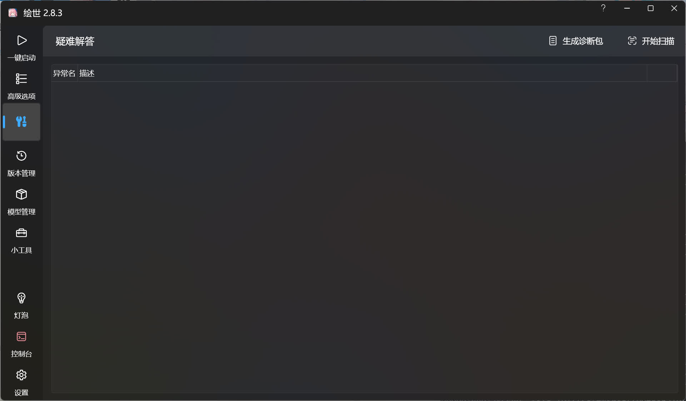
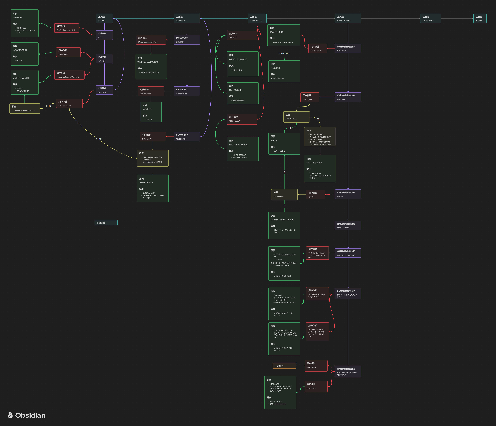

# 简述
[绘世启动器](https://www.bilibili.com/video/BV1ne4y1V7QU)是由[秋葉aaaki](https://space.bilibili.com/12566101)和[喵喵hmkai](https://space.bilibili.com/2082155)共同开发的 Stable Diffusion WebUI 启动器，用于 Stable Diffusion 项目，简化了 Stable Diffusion 项目的启动和管理，同时还拥有疑难解答系统用于诊断常见的错误，解决用户使用时产生的部分问题，是一个非常实用的工具。

!!!note
    运行绘世启动器前请确保您的系统内已经安装最新版的 [.NET 6 Desktop Runtime](https://dotnet.microsoft.com/en-us/download/dotnet/6.0) ，没有安装及安装早期版本的 .NET 6 会导致绘世启动器无法运行，通常来说绘世启动器在缺失 .NET 6 时会弹窗提示安装，根据提示安装即可。

## 界面预览
- 启动界面

- 高级选项

- 疑难解答

- 版本管理

- 模型管理

- 小工具

- 控制台

- 设置

## 启动流程
下图展示了绘世启动器的启动流程，列举了可能产生的问题和对应的解决方法。

!!!info
    图片待完成。

<!-- TODO: 需要补充启动器和 WebUI 的关系 -->