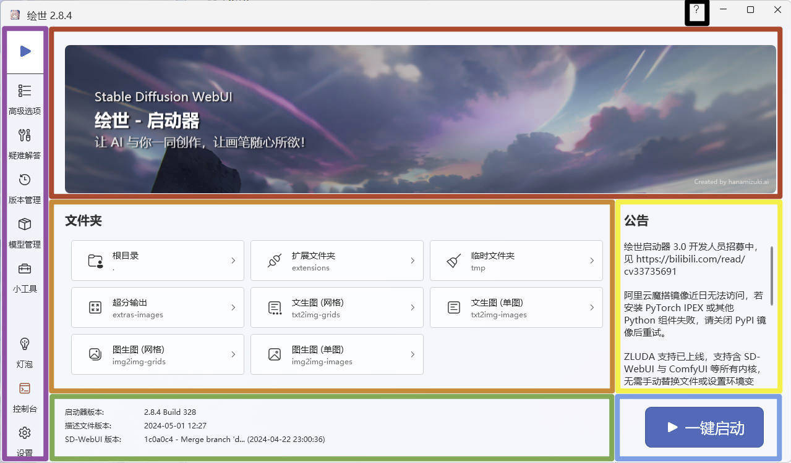

# :fontawesome-solid-play: 一键启动

## 界面简介
运行 启动器 后，程序会显示 一键启动 界面，该界面大致分成7部分。

<figure markdown="span">
    
    <figcaption>一键启动 界面</figcaption>
</figure>

### Banner（红框）
仅是一个图片，每次启动后图片的内容可能会变化。

!!! info "不要在意颜色"
    有时该部分的图片是黑白的，可能有些用户在点击 一键启动 按钮后以为内核没有运行。

### 文件夹（橙色）
每个按钮能快速打开程序内对应的文件夹。

### 公告（黄色）
告知 启动器 相关的事项。

### 版本信息（绿色）
显示 启动器程序版本 / 启动器描述文件版本 / SD WebUI 程序版本。

### 一键启动（蓝色）
点击 <small>[:fontawesome-solid-play:一键启动](#){ .md-button .md-button--primary }</small> 后启动 SD WebUI 内核，同时界面会跳转到 控制台。

### 一级菜单（紫色）
启动器 软件的主菜单栏。

### 启动器帮助（黑色）
如果你对 启动器 使用有问题可以点击 <small>[:fontawesome-solid-question:](#){ .md-button }</small> 打开 启动器 的帮助页面。