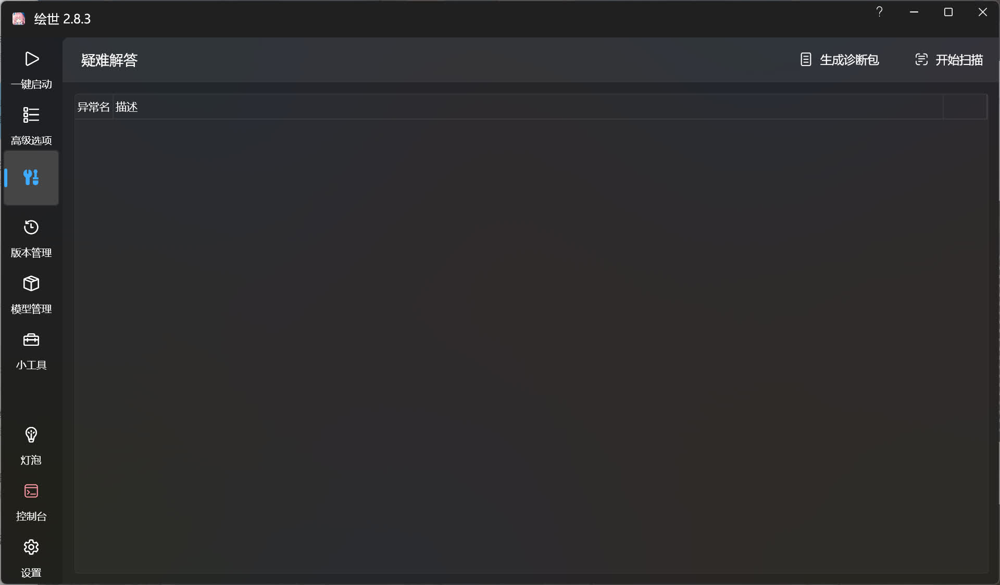
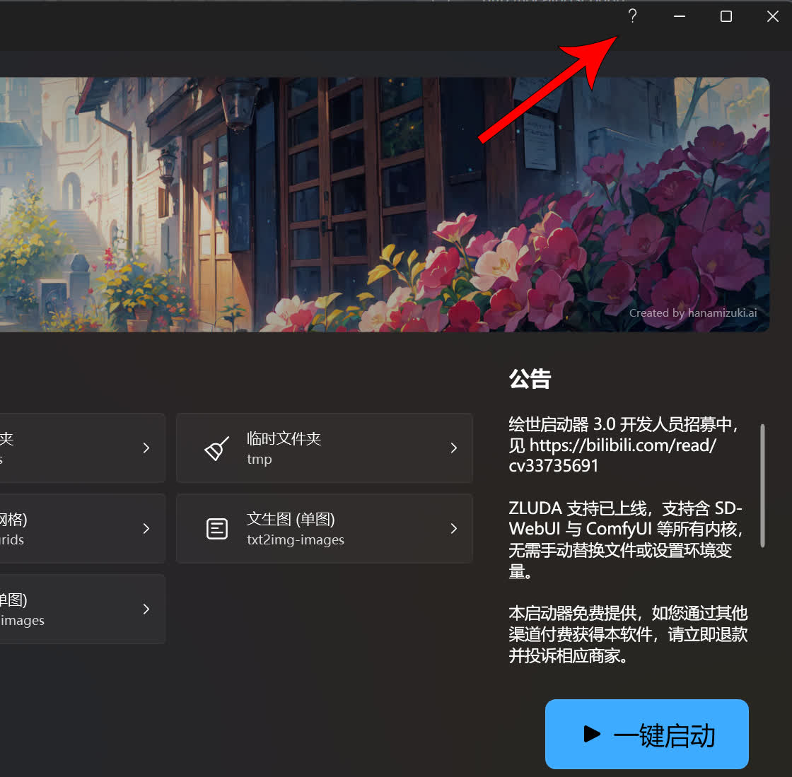

# 疑难解答
这个功能用于自己诊断 SD WebUI / ComfyUI 出现的问题，并提供修复修复按钮或者修复方案。

## 问题扫描
如果 SD WebUI / ComfyUI 在运行的时候出现了错误，此时控制台将显示相对应的报错，这时候就可以前往绘世启动器的疑难解答界面中，点击右上角的开始扫描按钮进行问题扫描。

当扫描发现问题后，可看到异常名和对应的描述，可根据描述自行解决问题。如果问题支持一键修复，可在描述的右侧看到修复按钮，点击修复可修复问题。

!!!note
    疑难解答仅能扫描出绘世启动器数据库中已注册问题已知问题，其他在控制台中出现的问题请使用浏览器搜索引擎进行搜索。

## 生成诊断包
如果想要他人帮助解决问题，可以点击右上角的生成诊断包，再将诊断包发送给他人来诊断问题。如果没有具体的日志信息，他人是无法帮助解决问题。

## 绘世启动器帮助
在绘世启动器的界面中点击键盘上的`F1`或者点击绘世启动器右上角的问号按钮，可前往绘世启动器的[帮助和反馈页面](https://support.qq.com/product/488228)。

