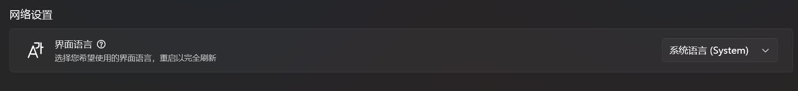
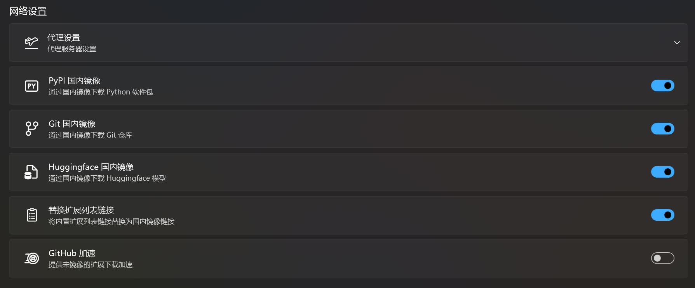
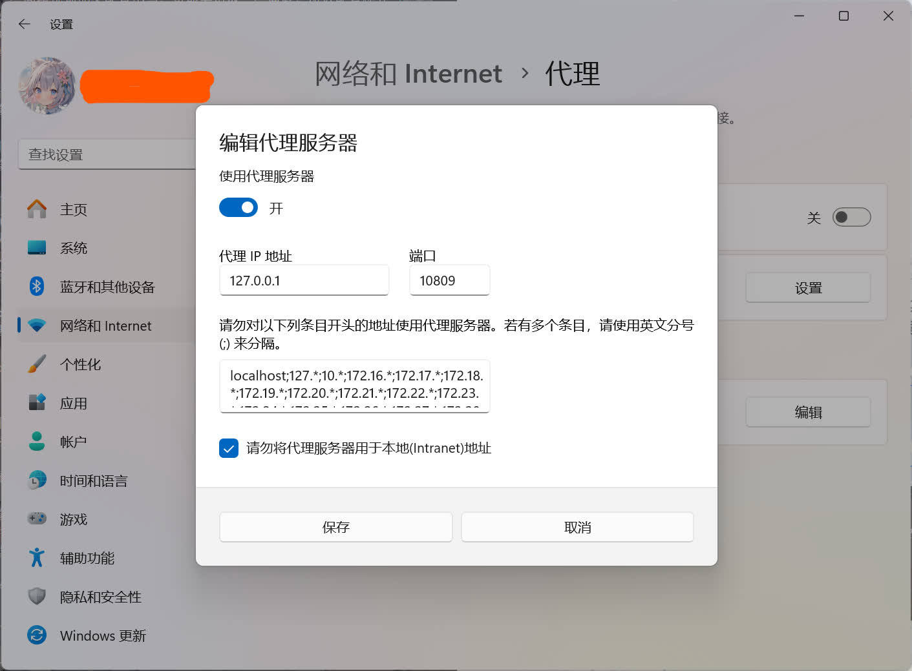

# 启动器设置
这里是绘世启动器的设置。

## 配置模式
调整绘世启动器的设置显示，默认为新手模式，将隐藏部分高级选项。选择更高级的配置模式后将显示更多被隐藏的高级选项。

!!!warning
    一些高级选项如果配置不当，可能会造成一些问题，所以配置模式为新手时会把这些选项隐藏。注意，如果您的水平没达到专家，非常不建议将配置模式改成专家。改成专家模式对于新手来说并不会带来更多的好处。

## 用户界面设置
设置绘世启动器界面的语言。

## 网络设置
配置绘世启动器的和网络相关的设置。

### 代理设置
用于配置绘世启动器的代理。有些情况 SD WebUI / ComfyUI / ... 需要从 Huggingface 等网站下载缺失的模型，而此时绘世启动器的 Huggingface 国内镜像中没有对应的镜像文件，这时候只能通过配置绘世启动器的代理来解决。

!!!note
    要配置代理的前提是你有代理软件。

代理服务器地址用于连接代理软件。当代理软件的代理模式设置为系统代理时，在 Windows 系统中的代理设置中可以看见代理服务器地址。

此时绘世启动器会读取该地址并填写到绘世启动器的代理服务器地址输入框中，如果要刷新这个地址，可以点击输入框右边的 X 按钮，代理服务器地址将重新读取进输入框。

下方的 4 个按钮用于设置将代理应用于哪个部分。

1. 将代理应用到 Git
2. 将代理应用到 Pip
3. 将代理应用到环境变量
4. 将代理应用到模型下载

要配置绘世启动器的代理就需要将这 4 个按钮打开。

!!!warning

    注意，当配置绘世启动器的代理设置后，需要保持代理软件一直打开。如果代理软件关闭了，需要将绘世启动器的代理设置关闭，防止出现绘世启动器无法访问网络的问题。

下面是有关镜像的设置。

!!!note
    1. 当在绘世启动器的代理设置配置代理后（或者使用代理软件的 TUN 模式后），需要将`PyPI 国内镜像`、`Git 国内镜像`、`Huggingface 国内镜像`、`替换扩展远端地址`这 4 个选项关闭，防止不必要的减速。反之，则把这 4个选项打开。
    2. 当处于非国内网络环境时，请将`PyPI 国内镜像`、`Git 国内镜像`、`Huggingface 国内镜像`、`替换扩展远端地址`这 4 个选项关闭，防止不必要的减速。

### PyPI 国内镜像

将 PyPI 的下载源设置为国内的镜像，加快国内网络的访问速度。

### Git 国内镜像

调用 Git 命令进行克隆时使用 Git 国内镜像，解决国内网络访问 Github 速度慢或者无法访问的问题。

### Huggingface 国内镜像

使用 Huggingface 国内镜像下载 Huggingface 上的文件，在没有代理的情况下解决国内无法 Huggingface 的问题。

!!!note
    `Git 国内镜像`、`Huggingface 国内镜像`仅支持镜像部分地址，因为这两个镜像并不能完全覆盖所有的 Github 的文件和 Huggingface 的文件。

### 替换扩展远端地址

将内核和扩展的远端地址替换成 Git 国内镜像的地址，解决在国内网络环境更新内核或者扩展时速度慢或者无法访问的问题。

### Github 加速
提供未镜像的扩展下载加速。

!!!note
    这个功能比较鸡肋，只在部分地区的网络环境生效，所以没必要开。

## 偏好设置
调整一些使用偏好。

### 默认浏览器
设置 SD WebUI / ComfyUI / ... 启动完成后选择打开的浏览器。

### 崩溃自动重启
当内核因某些问题导致崩溃后自动重启内核。

## 兼容性设置
解决绘世启动器自身的兼容性问题。

### 使用经典控制台控件
解决绘世启动器的控制台无法渲染或交互的问题。

### 使用经典控制台驱动
解决绘世启动器的控制台无法正常输出字符的问题。

## 环境检测设置

### 生成引擎一致性检测
在启动 SD WebUI / ComfyUI / ... 前检测当前选择的生成引擎（设备）是否和软件环境中的 PyTorch 一致，如果出现不一致，将弹窗提醒修复该问题。

### 软件依赖完整行检测
在启动 ComfyUI / Fooocus /... 前检测依赖是否完整，如果依赖不完整将自动安装缺失的依赖。

### 检测并提示组件冲突
在启动 ComfyUI 前检测当前环境是否存在组件冲突的情况（如多个扩展依赖和内核依赖出现版本冲突），并弹窗提醒。

### 重复插件检测
检测是否安装了重复的扩展，并弹窗提示。

## 安全性设置
防范软件可能存在对设备的恶意攻击。

### 应用隔离沙盒
限制软件对系统及其他文件的访问权限，避免病毒渗透。

!!!note
    在 ComfyUI 中曾出现过 ComfyUI_LLMVISION 扩展攻击设备的事件，安装该扩展后设备中保存的隐私信息将被泄露出去，有关的消息：[PSA: If you've used the ComfyUI_LLMVISION node from u/AppleBotzz, you've been hacked - Reddit](https://www.reddit.com/r/comfyui/comments/1dbls5n/psa_if_youve_used_the_comfyui_llmvision_node_from/)。  
    启用该功能后可防范类似的恶意攻击。

## 环境设置
自定义组件的路径。

### Python 路径覆盖
手动选择 Python 解释器的路径。

### Git 路径覆盖
手动选择 Git 版本管理器的路径。