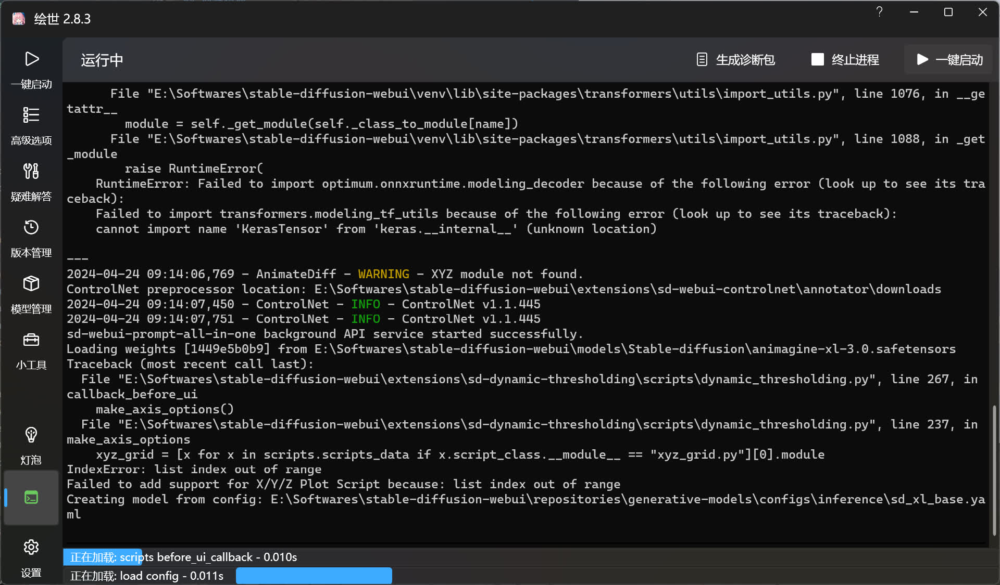

# 控制台
这是用于显示 SD WebUI / ComfyUI / ... 运行时输出的信息，可以查看具体的运行状况。

## 功能

生成诊断包可以将控制台中的信息和相关的诊断信息保存在一个文件中。

终止进程和一键启动用于终止 / 启动进程。

下方的进度条用于显示当前已完成的任务或者正在进行的任务。

## 提示信息
左侧栏的控制台图标显示当前的启动状态。

如果控制台图标为绿色，则说明正在运行。

如果控制台图标为红色，则说明未运行。

