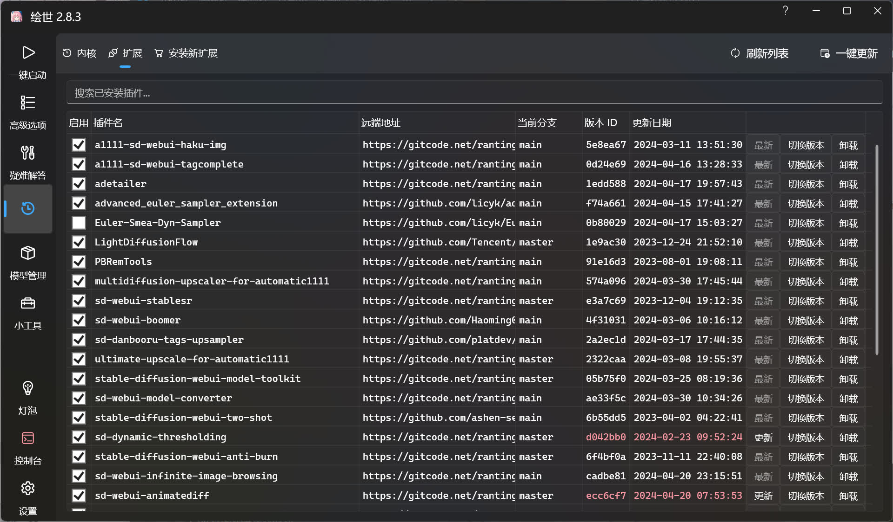
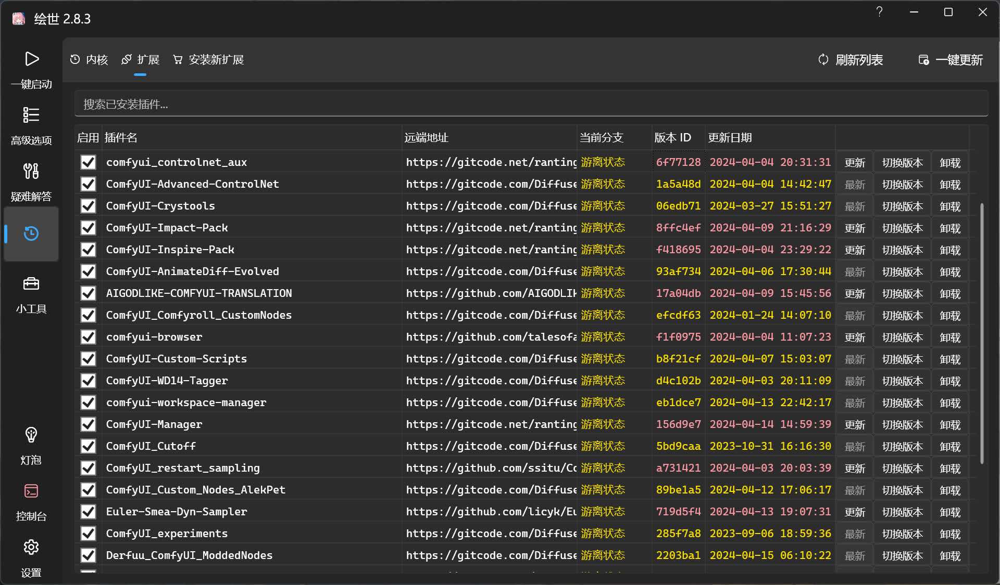

# 扩展
该功能用于管理内核中安装的扩展。

刷新列表可用于刷新列表中的版本信息，一键更新可用于将内核的版本更到最新的版本。

上方的搜索框可用于搜索已安装的扩展。

这里可以发现版本 ID 和更新日期有不同的颜色显示，这里列出这些颜色代表的意思。

- 白色：已完成检查扩展的更新并且扩展的版本为最新的。
- 黄色：正在检查扩展的更新。
- 红色：已完成检查扩展的更新并且有新版本可以更新，点击扩展名右侧的更新按钮即可更到最新。

## 扩展启用与禁用
在插件名的左侧可看到勾选框，可通过这个勾选框来启用或者禁用扩展。

!!!note
    在 ComfyUI 中无法通过绘世启动器来禁用扩展，需要使用 [ComfyUI-Manager](https://github.com/ltdrdata/ComfyUI-Manager) 扩展来禁用 / 启用扩展。

## 切换版本
插件名的右侧有切换版本的按钮，点击按钮即可看见版本选择列表。

点击某个版本的右侧即可将扩展切换到对应的版本。

## 卸载
如果要卸载某个扩展，点击插件名右侧的卸载按钮即可。

## 分支游离
如果扩展的当前分支显示游离状态，如图下情况。

鼠标双击黄色字体的游离状态即可修复。
